# 00. GPT-Researcher 总览与学习路线

> 面向"想真正吃透一个生产级 Deep Research Agent"的工程学习者。
> 全部 **13 篇**文档以"概念 → 源码 → 原理 → 设计 → 实操"为骨架，
> 阅读总时长约 18～25 小时；前置最低要求：Python 异步、LLM 基本概念、LangChain/LangGraph 入门。

---

## 一、项目是什么

**GPT-Researcher** 是 [assafelovic/gpt-researcher](https://github.com/assafelovic/gpt-researcher) 开源的"开放式深度研究 Agent"。它给定一个用户问题（例如"AI 是否处在炒作周期？"），自动完成：

1. **任务规划**：选 Agent 角色（财经分析师 / 法律研究员 / …），生成子查询。
2. **多源检索**：通过 17+ 检索引擎（Tavily / Google / Bing / Exa / arXiv / PubMed / SemanticScholar / DuckDuckGo / 自建 MCP …）拿候选 URL。
3. **并发抓取**：BeautifulSoup / Playwright / Firecrawl / pymupdf / nodriver 等 8 种 scraper 适配。
4. **上下文构建**：embedding 向量化 → ChromaDB 存储 → 相似度过滤 → 上下文压缩。
5. **报告生成**：分章节 / 子主题并行写作 → 引用注入 → 成文。
6. **多形态输出**：Markdown / PDF / Word / 实时 WebSocket 流式推送 / 内嵌 AI 生成插图。

它同时提供**两套 Agent 形态**：

| 形态 | 入口 | 内核 | 适用场景 |
|---|---|---|---|
| 单 Agent | `gpt_researcher/agent.py:GPTResearcher` | 自研协调器 + Skills 模式 | 快速查询、嵌入到自家应用 |
| 多 Agent | `multi_agents/agents/orchestrator.py:ChiefEditorAgent` | LangGraph `StateGraph` | 长报告、需要 Editor/Reviewer/Reviser 反复打磨 |

底层共享同一套 Retrievers / Scrapers / Memory / VectorStore / Prompts，因此理解了单 Agent 形态，多 Agent 形态只是一层"角色编排 + 状态机"包装。

---

## 二、整体架构图

```mermaid
flowchart TB
    subgraph User["用户层"]
        CLI[cli.py / main.py]
        Web[FastAPI + WebSocket<br/>backend/server/app.py]
        Skill[npx skills add ...<br/>Claude Skill]
    end

    subgraph Orchestrator["编排层"]
        SA[GPTResearcher<br/>单 Agent]
        MA[ChiefEditorAgent<br/>LangGraph 多 Agent]
        DR[DeepResearchSkill<br/>递归深挖]
    end

    subgraph Skills["技能层 gpt_researcher/skills/"]
        R[ResearchConductor<br/>研究主循环]
        W[ReportGenerator<br/>分章/合章写作]
        B[BrowserManager<br/>抓取并发]
        C[SourceCurator<br/>来源筛选]
        CM[ContextManager<br/>上下文压缩]
        IG[ImageGenerator<br/>插图]
    end

    subgraph Actions["原子能力 gpt_researcher/actions/"]
        QP[query_processing<br/>查询改写]
        RT[retriever<br/>引擎选择]
        WS[web_scraping<br/>抓取调度]
        RG[report_generation<br/>分章生成]
        AC[agent_creator<br/>角色选择]
        MD[markdown_processing<br/>引用/分节]
    end

    subgraph Adapters["适配层"]
        Ret[Retrievers x17<br/>Tavily/Google/MCP/...]
        Scr[Scrapers x8<br/>bs/browser/firecrawl/...]
        LLM[GenericLLMProvider<br/>通过 langchain init_chat_model]
        Emb[Memory.Embeddings<br/>OpenAI/HF/Cohere/...]
        VS[VectorStoreWrapper<br/>InMemory/Chroma/...]
        MCP[mcp/ Client+ToolSelector]
    end

    User --> Orchestrator
    Orchestrator --> Skills
    Skills --> Actions
    Actions --> Adapters
    Adapters -->|外部| Net[(Web / API / MCP)]
```



**信息流**（一次 Web 研究的简化时序）：

```
User Query
  → choose_agent (LLM 选 role + system prompt)
  → plan_research_outline (LLM 生成 N 个 sub-query)
  → 并发: for each sub-query
        → retriever.search() → URLs
        → scraper.scrape_urls() → raw_content
        → context_manager.get_similar_content_by_query()
              (embed → InMemoryVectorStore → similarity_search)
  → ReportGenerator.write_report() (LLM 流式生成)
  → add_references / extract_headers
  → 写文件 / WebSocket 推送
```

---

## 三、目录速查表

```
gpt-researcher/
├─ gpt_researcher/        单 Agent 核心库（可 pip 安装）
│  ├─ agent.py            GPTResearcher 类（API 入口）
│  ├─ config/             配置中心（default.py + env 覆盖）
│  ├─ prompts.py          Prompt 模板族（PromptFamily 抽象）
│  ├─ skills/             6 个高层技能（Researcher/Writer/Browser/Curator/ContextManager/DeepResearch/ImageGenerator）
│  ├─ actions/            8 个原子动作（query_processing/retriever/web_scraping/report_generation/agent_creator/...）
│  ├─ retrievers/         17 个搜索引擎适配
│  ├─ scraper/            8 种网页/PDF 抓取器
│  ├─ context/            retriever（向量召回）+ compression（上下文压缩）
│  ├─ memory/embeddings.py 多 provider Embedding 工厂
│  ├─ vector_store/       LangChain VectorStore 包装
│  ├─ document/           本地/Azure/在线文档加载
│  ├─ mcp/                MCP Client + Tool Selector + Streaming
│  ├─ llm_provider/       LangChain init_chat_model 统一封装
│  └─ utils/              llm 调用 / 成本统计 / 限流 / 校验
│
├─ multi_agents/          LangGraph 多 Agent（独立子项目）
│  ├─ agent.py            最小 graph.compile() 示例
│  ├─ main.py             读 task.json 跑全流程
│  ├─ memory/             ResearchState / DraftState (TypedDict)
│  └─ agents/             ChiefEditor/Editor/Researcher/Writer/Reviewer/Reviser/Publisher/Human
│
├─ multi_agents_ag2/      同一拓扑，AG2(autogen) 实现版本
├─ backend/               FastAPI 服务 + WebSocket + 报告存储
│  ├─ server/app.py
│  ├─ server/websocket_manager.py
│  ├─ server/multi_agent_runner.py
│  ├─ chat/chat.py        基于已生成报告的对话
│  └─ report_type/        basic_report / detailed_report / deep_research
│
├─ mcp-server/            把本项目反向暴露成 MCP Server（npx 可用）
├─ evals/
│  ├─ hallucination_eval/ judges 库 → 幻觉评分
│  └─ simple_evals/       SimpleQA 评估
├─ frontend/              lite (vanilla) + nextjs 两套 UI
├─ docs/                  Docusaurus 官方文档
├─ cli.py / main.py       命令行入口
├─ langgraph.json         LangGraph Studio 配置
└─ pyproject.toml         依赖与 entry point
```

---

## 四、核心技术全景图

| 维度 | 用到的关键技术/概念 | 实现位置 |
|---|---|---|
| **Agent 范式** | Plan-and-Solve、STORM、Editor-Reviewer-Reviser | `multi_agents/agents/*` |
| **Function Call** | LangChain `bind_tools` + JSON Schema、MCP Tool 自动选择 | `gpt_researcher/mcp/tool_selector.py` |
| **Structured Output** | Pydantic + `with_structured_output`、严格 JSON 模式 | `gpt_researcher/actions/query_processing.py` |
| **状态管理** | LangGraph `StateGraph` + `TypedDict` State | `multi_agents/memory/research.py` |
| **HITL** | `add_conditional_edges` + Human node | `multi_agents/agents/human.py` |
| **并行 Map-Reduce** | LangGraph `Send` API、`asyncio.gather` 子主题并发 | `multi_agents/agents/editor.py:run_parallel_research` |
| **RAG 全链路** | sub-query 改写 → 多源检索 → BS/Browser 抓取 → embed → 相似度过滤 → 上下文压缩 | `actions/query_processing.py` + `skills/context_manager.py` + `context/compression.py` |
| **VectorDB** | LangChain `InMemoryVectorStore`、可替换 Chroma/Pinecone/Qdrant | `vector_store/vector_store.py` |
| **Embedding 选型** | OpenAI / Cohere / HuggingFace / Bedrock / Ollama / Gigachat / Google / Voyage / Azure / Dashscope / Custom | `gpt_researcher/memory/embeddings.py` |
| **MCP** | langchain-mcp-adapters，多服务器并行加载、LLM 自动选 tool | `gpt_researcher/mcp/` |
| **Prompt 工程** | PromptFamily 抽象、JSON 输出格式约束、CoT 子主题、动态拼装 | `gpt_researcher/prompts.py` |
| **可观测性** | LangSmith Tracing（环境变量驱动）+ 自研 cost/log 模块 | `utils/costs.py` + `utils/logger.py` |
| **评估** | judges 幻觉评分、SimpleQA 集、可扩展 RAGAS | `evals/` |
| **异步并发** | `asyncio` + `aiohttp` + `ThreadPoolExecutor` 三层、限流 `RunnableRetry` | `utils/workers.py` + `utils/rate_limiter.py` |
| **流式输出** | LangChain `astream`、自研 WebSocket 包装、MCP streaming | `mcp/streaming.py` + `backend/server/websocket_manager.py` |
| **报告渲染** | md2pdf + python-docx + Markdown 表格/标题抽取 | `multi_agents/agents/utils/file_formats.py` |
| **部署** | Dockerfile / Dockerfile.fullstack / docker-compose / Procfile / Terraform (ECR) | 根目录 + `terraform/` |

---

## 五、文档清单与建议阅读顺序

> 每篇文档保持自包含；标 ★ 的是"必读骨架"。

| 序号 | 文件 | 标题 | 估时 | 难度 | 前置 |
|---|---|---|---|---|---|
| ★ | `00_overview.md` | 总览与学习路线（本文） | 30 min | ★☆☆☆☆ | 无 |
| ★ | `01_config_and_entry.md` | 配置体系、入口编排与异步并发架构 | 1.5 h | ★★☆☆☆ | Python async、env vars |
| ★ | `02_single_agent_skills.md` | 单 Agent：Skills 模式、ResearchConductor 主循环 | 2 h | ★★★☆☆ | LangChain LCEL |
|  | `03_query_planning_and_prompts.md` | 查询改写、Agent 角色生成、PromptFamily 与结构化输出 | 1.5 h | ★★★☆☆ | Pydantic、Function Call |
| ★ | `04_retrievers_and_scrapers.md` | 17 种检索引擎 + 8 种 scraper 的统一抽象与并发调度 | 2 h | ★★★☆☆ | aiohttp、BeautifulSoup |
| ★ | `05_rag_vectorstore_memory.md` | Embedding 工厂、VectorStore 包装、上下文压缩、Token 预算 | 2 h | ★★★★☆ | RAG 基础、ANN |
| ★ | `06_multi_agents_part1_architecture.md` | 多 Agent 上篇：LangGraph 基础、StateGraph、ChiefEditor 编排骨架 | 2 h | ★★★★☆ | LangGraph 入门 |
| ★ | `07_multi_agents_part2_workflow.md` | 多 Agent 下篇：8 个 Agent 实现、并行子图、HITL、AG2 实现对比 | 2 h | ★★★★☆ | 06 |
|  | `08_mcp_part1_protocol_client.md` | MCP 上篇：协议、Client 多服务器、Tool Selector、Retriever 桥接 | 1.5 h | ★★★★☆ | Function Calling |
|  | `09_mcp_part2_streaming_deep_research.md` | MCP 下篇：流式工具调用、Deep Research 递归引擎、反向暴露 mcp-server | 2 h | ★★★★★ | 08 |
| ★ | `10_backend_observability.md` | FastAPI/WebSocket 服务、成本追踪、LangSmith Tracing、报告存储 | 1.5 h | ★★★☆☆ | FastAPI |
| ★ | `11_evaluation_and_ragas.md` | 评估实操：判官库幻觉评估、SimpleQA、RAGAS 端到端管道 | 2 h | ★★★★☆ | 05、08 |
|  | `12_frontend_integration.md` | 前端对接：lite (vanilla) + Next.js 双套 UI、WebSocket 协议、部署 | 1 h | ★★★☆☆ | WebSocket |

**建议路线**（按学习目标二选一）：

- **快速上手（4 h）**：00 → 01 → 02 → 04
- **RAG 工程师视角（10 h）**：00 → 01 → 02 → 03 → 04 → 05 → 11
- **多 Agent / LangGraph 深挖（11 h）**：00 → 01 → 02 → 06 → 07 → 08 → 09
- **生产部署 / 全栈视角（10 h）**：00 → 01 → 04 → 10 → 12 → 11
- **完整通读（建议）**：按 00 → 12 顺序通读，每篇之间留时间动手跑示例

---

## 六、跑通本地环境（最小步骤）

```bash
# 1. Python 3.11+
git clone https://github.com/assafelovic/gpt-researcher
cd gpt-researcher

# 2. 关键 env（最小集）
export OPENAI_API_KEY=sk-...
export TAVILY_API_KEY=tvly-...
# 可选
# export LANGCHAIN_TRACING_V2=true
# export LANGCHAIN_API_KEY=ls__...

# 3. 安装
pip install -r requirements.txt
# 或 uv sync（仓库自带 uv.lock）

# 4. 跑一次最小研究
python main.py
# 或 CLI
python cli.py "Is AI in a hype cycle?" --report_type research_report

# 5. 起 FastAPI 服务（含 WebSocket 流）
python -m uvicorn backend.server.app:app --reload

# 6. 跑多 Agent（LangGraph）
cd multi_agents && python main.py

# 7. 跑评估
cd evals/hallucination_eval && python run_eval.py
```

---

## 七、阅读时的几条提示

1. **配置先于代码**：`gpt_researcher/config/variables/default.py` 几乎决定一切默认行为，先把它当词典翻一遍，后面读代码会顺很多。
2. **单 Agent ≠ 简单**：`gpt_researcher/agent.py:GPTResearcher.__init__` 接收 30+ 参数，是项目的"瑞士军刀"，多 Agent 中的 ResearchAgent 也只是套了一层壳调用它。
3. **Skills vs Actions vs Adapters**：作者刻意把"业务编排（skills）"、"原子动作（actions）"、"外部接口（retrievers/scrapers/llm_provider）"分了三层；后续每篇文档都遵循这条分层来定位代码。
4. **Prompt 是隐藏 API**：项目把 prompt 抽象成 `PromptFamily` 类（`prompts.py`），可以"换 prompt 不换代码"，研究 prompt 工程时直接读这里收益最大。
5. **跨仓共享**：`multi_agents/` 与 `backend/` 都有自己的 `memory/research.py`、`memory/draft.py`，**它们是 LangGraph State 的 TypedDict 定义**，不是"记忆系统"。真正的"记忆/向量"在 `gpt_researcher/memory/` 和 `gpt_researcher/vector_store/`。

---

## 八、下一步

路线已按反馈调整为 **13 篇**：

- ✅ 多 Agent → 拆为 06（架构）、07（工作流）两篇
- ✅ MCP → 拆为 08（协议+Client）、09（Streaming+Deep Research+反向暴露）两篇
- ✅ 评估 → 独立为 11，含 RAGAS 完整可运行教程
- ✅ 前端 → 追加为 12，作为最后一篇

接下来从 **`01_config_and_entry.md`** 开始逐篇输出，每篇结束后等你回复"继续"再发下一篇。
