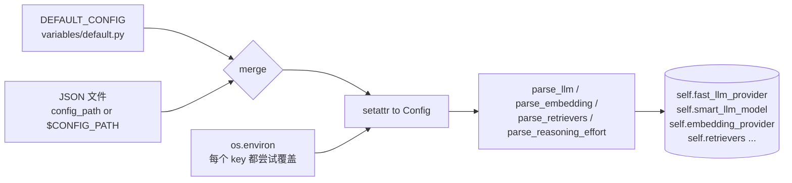
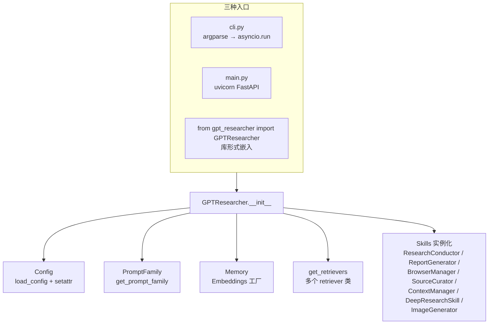
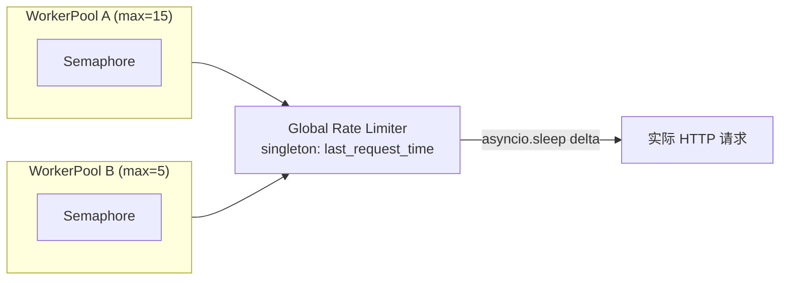

# 01. 配置体系、入口编排与异步并发架构

## 模块概述

这一篇是后续所有源码阅读的"地基"。我们要回答三个问题：

1. **配置怎么来？**——`Config` 类如何把 `default.py`、JSON 文件、环境变量三层合并成一个对外可访问的扁平对象，并把 `provider:model` 字符串拆成 LLM/Embedding 元组。
2. **程序怎么进？**——CLI、`main.py`、`backend.server.app` 三个入口分别是什么定位；`GPTResearcher.__init__` 这一巨大构造函数到底做了什么。
3. **并发怎么管？**——`WorkerPool` + `GlobalRateLimiter` 单例是如何把"并发上限"和"全局节流"分离开的。

理解这三件事，后续读 Skills、Retrievers、Multi-Agents 时才不会被"突然冒出的 `self.cfg.fast_llm_provider`"或"莫名 `await pool.throttle()`"打断。

---

## 架构 / 流程图

### 配置加载顺序



### 入口与对象图



### 并发与限流双层模型



> 关键点：**信号量管"同时几个"**（in-pool 并发），**全局限流器管"两次之间多少秒"**（cross-pool 频率）。深度研究里多个 `GPTResearcher` 实例并存时，只有这种"双层模型"才能避免击穿目标 API。

---

## 核心源码解析

### 1) 配置入口：`Config.__init__`

文件：`gpt_researcher/config/config.py:34-60`

```python
class Config:
    CONFIG_DIR = os.path.join(os.path.dirname(__file__), "variables")

    def __init__(self, config_path: str | None = None):
        self.config_path = config_path
        self.llm_kwargs: Dict[str, Any] = {}        # 透传给 LangChain ChatModel 的额外参数
        self.embedding_kwargs: Dict[str, Any] = {}  # 透传给 Embedding 类

        config_to_use = self.load_config(config_path)   # ① 拿到合并后的 dict
        self._set_attributes(config_to_use)             # ② 写到 self.<lower_case_key>，再被 env 覆盖
        self._set_embedding_attributes()                # ③ "openai:text-embedding-3-small" → (provider, model)
        self._set_llm_attributes()                      # ④ FAST/SMART/STRATEGIC 三套 LLM 都拆
        self._handle_deprecated_attributes()            # ⑤ 老变量名兼容（EMBEDDING_PROVIDER 等）
        if config_to_use['REPORT_SOURCE'] != 'web':
            self._set_doc_path(config_to_use)           # ⑥ 本地文档路径校验

        # MCP 占位，后续在 GPTResearcher 里会被注入
        self.mcp_servers = []
        self.mcp_allowed_root_paths = []
```

**关键设计点**：

- 所有 key 在内存里都**小写**（`setattr(self, key.lower(), value)`），所以代码里写 `self.cfg.smart_llm`、`self.cfg.max_iterations`，而不是 `SMART_LLM`。
- 类型来源是 `BaseConfig` 这个 `TypedDict`（`config/variables/base.py`），`convert_env_value` 用 `get_origin/get_args` 反射做"字符串 → bool/int/float/list/dict"的安全转换：

```python
# config.py:257
@staticmethod
def convert_env_value(key: str, env_value: str, type_hint: Type) -> Any:
    origin = get_origin(type_hint); args = get_args(type_hint)
    if origin is Union:                              # 处理 Union[str, None]
        for arg in args:
            if arg is type(None):
                if env_value.lower() in ("none", "null", ""): return None
            else:
                try: return Config.convert_env_value(key, env_value, arg)
                except ValueError: continue
        raise ValueError(...)
    if type_hint is bool:  return env_value.lower() in ("true","1","yes","on")
    if type_hint is int:   return int(env_value)
    if type_hint is float: return float(env_value)
    if type_hint in (str, Any): return env_value
    if origin is list or origin is List: return json.loads(env_value)
    if type_hint is dict:  return json.loads(env_value)
```

> ⚠️ 因此 `MCP_SERVERS=[{"name":"x"}]` 这种 env 是**当 JSON 解析的**——写错引号会直接报错。

### 2) `provider:model` 字符串拆解

```python
# config.py:204
@staticmethod
def parse_llm(llm_str):
    from gpt_researcher.llm_provider.generic.base import _SUPPORTED_PROVIDERS
    llm_provider, llm_model = llm_str.split(":", 1)
    assert llm_provider in _SUPPORTED_PROVIDERS, ...
    return llm_provider, llm_model
```

`_SUPPORTED_PROVIDERS` 是 26 个写死的 provider 集合（openai / anthropic / azure_openai / cohere / google_vertexai / google_genai / fireworks / ollama / together / mistralai / huggingface / groq / bedrock / dashscope / xai / deepseek / litellm / gigachat / openrouter / vllm_openai / aimlapi / netmind / forge / avian / minimax）——见 `gpt_researcher/llm_provider/generic/base.py:13`。

**这层抽象的目的**是：上层代码全部只写 `cfg.smart_llm_model` + `cfg.smart_llm_provider`，由 `GenericLLMProvider.from_provider()` 用 if/elif 派发到具体的 `langchain_openai.ChatOpenAI` / `langchain_anthropic.ChatAnthropic` / ……，保持业务无感切换模型。

### 3) `GPTResearcher.__init__`：项目的"瑞士军刀"

文件：`gpt_researcher/agent.py:50-200`

构造函数接受 **30+ 个参数**，但实质只做四件事：

```python
def __init__(self, query, report_type=..., ..., **kwargs):
    # ① 接收原始入参（保存或归一化为枚举）
    self.query = query
    self.report_type = report_type
    self.cfg = Config(config_path)        # ← 配置中心
    self.cfg.set_verbose(verbose)
    self.tone = tone if isinstance(tone, Tone) else Tone.Objective
    self.report_source = report_source or getattr(self.cfg, 'report_source', None)
    ...
    # ② 状态容器（贯穿整个研究生命周期）
    self.research_sources = []   # 抓到的 (title, content, images)
    self.research_images = []    # 选定的插图
    self.visited_urls = visited_urls or set()
    self.context = context or []
    self.research_costs = 0.0
    self.step_costs: dict[str, float] = {}
    self._current_step: str = "general"   # ← 给 add_costs() 归账用

    # ③ Prompt + MCP + Retrievers + Memory
    self.prompt_family = get_prompt_family(prompt_family or self.cfg.prompt_family, self.cfg)
    if mcp_configs: self._process_mcp_configs(mcp_configs)
    self.retrievers = get_retrievers(self.headers, self.cfg)
    self.memory = Memory(
        self.cfg.embedding_provider, self.cfg.embedding_model, **self.cfg.embedding_kwargs
    )

    # ④ 装配 Skills（每个 skill 都拿 self 反向引用）
    self.research_conductor = ResearchConductor(self)
    self.report_generator   = ReportGenerator(self)
    self.context_manager    = ContextManager(self)
    self.scraper_manager    = BrowserManager(self)
    self.source_curator     = SourceCurator(self)
    if report_type == ReportType.DeepResearch.value:
        self.deep_researcher = DeepResearchSkill(self)
    self.image_generator    = ImageGenerator(self)
    self.mcp_strategy       = self._resolve_mcp_strategy(mcp_strategy, mcp_max_iterations)
```

**注意三个隐藏特性**：

1. **Skills 是"反向依赖"模型**——每个 skill 把 `self`（即 GPTResearcher 实例）整个抓进去：`ResearchConductor(self)`。这意味着 skill 内部能直接读 `self.researcher.cfg.smart_llm_model`、`self.researcher.context`、`self.researcher.add_costs(...)`。
   - 优点：写起来像"内嵌函数"，省 60% 参数传递。
   - 代价：耦合极强，单元测试基本只能用 `unittest.mock`。
2. **`_current_step` 是"成本记账栏目"**——每个 skill 在主流程里手动改这个字符串，`add_costs` 用它把消费分摊到 `agent_selection / research / report_writing / deep_research` 等步骤。
3. **MCP 默默改写 `cfg.retrievers`**——只要 `mcp_configs` 非空且用户没显式设过 `RETRIEVER` env，构造函数会自动把 `"mcp"` 加进 retrievers 列表，详见 `agent.py:282`（这点常常让用户困惑"为什么我没要 mcp 但它跑了 mcp 检索"）。

### 4) 主流程：`conduct_research` + `write_report`

```python
# agent.py:331
async def conduct_research(self, on_progress=None):
    await self._log_event("research", step="start", details={...})

    if self.report_type == ReportType.DeepResearch.value and self.deep_researcher:
        return await self._handle_deep_research(on_progress)        # ① 深度研究分支

    if not (self.agent and self.role):                              # ② 角色尚未指定 → LLM 选角
        self._current_step = "agent_selection"
        self.agent, self.role = await choose_agent(
            query=self.query, cfg=self.cfg, ...,
            cost_callback=self.add_costs,                           #    ↑ 成本回写
            prompt_family=self.prompt_family,
        )

    self._current_step = "research"
    self.context = await self.research_conductor.conduct_research()  # ③ 主搜索循环

    if self.image_generator and self.image_generator.is_enabled():   # ④ 插图（可选）
        self.available_images = await self.image_generator.plan_and_generate_images(...)
    return self.context

# agent.py:451
async def write_report(self, ...):
    self._current_step = "report_writing"
    return await self.report_generator.write_report(
        existing_headers=existing_headers,
        relevant_written_contents=relevant_written_contents,
        ext_context=ext_context or self.context,                     # 默认用刚搜到的 context
        custom_prompt=custom_prompt,
        available_images=self.available_images,
    )
```

> **使用范式**就是这两行：
> ```python
> r = GPTResearcher(query="...", report_type="research_report")
> await r.conduct_research()          # 阶段一：建上下文
> md = await r.write_report()         # 阶段二：写报告
> ```

### 5) 并发原语：`WorkerPool` + `GlobalRateLimiter`

文件：`gpt_researcher/utils/workers.py`、`utils/rate_limiter.py`

```python
class WorkerPool:
    def __init__(self, max_workers: int, rate_limit_delay: float = 0.0):
        self.executor   = ThreadPoolExecutor(max_workers=max_workers)  # 给同步 scraper 用
        self.semaphore  = asyncio.Semaphore(max_workers)               # 给协程用
        get_global_rate_limiter().configure(rate_limit_delay)          # 写到全局单例

    @asynccontextmanager
    async def throttle(self):
        async with self.semaphore:                  # ← 进出 with：本池并发限流
            await get_global_rate_limiter().wait_if_needed()  # ← 跨池频率限流
            yield
```

```python
class GlobalRateLimiter:
    _instance: ClassVar = None                  # 单例
    async def wait_if_needed(self):
        if self.rate_limit_delay <= 0: return
        async with self.get_lock():
            now = time.time()
            delta = now - self.last_request_time
            if delta < self.rate_limit_delay:
                await asyncio.sleep(self.rate_limit_delay - delta)
            self.last_request_time = time.time()
```

调用方写法（在 BrowserManager / scraper 里）：

```python
async with worker_pool.throttle():
    html = await scraper.scrape(url)
```

**这套设计的妙处**：

| 你想做的事 | 配什么 |
|---|---|
| 同时跑 15 个抓取协程 | `MAX_SCRAPER_WORKERS=15` |
| 每秒最多打 1 次目标 API | `SCRAPER_RATE_LIMIT_DELAY=1.0` |
| 防止"deep research 套娃"把 API 打爆 | 不需要做任何额外工作——单例自动跨实例生效 |

---

## 技术原理深度解析

### A. 配置三层合并的优先级

```
最终值 = env_var (有就赢) > custom_json[KEY] > DEFAULT_CONFIG[KEY]
```

源码体现（`_set_attributes`）：

```python
for key, value in config.items():
    env_value = os.getenv(key)
    if env_value is not None:                                    # ← env 永远赢
        value = self.convert_env_value(key, env_value, BaseConfig.__annotations__[key])
    setattr(self, key.lower(), value)
```

> 这种顺序对应 12-Factor App 的 *Config in Environment* 原则：开发期改 `default.py`，部署期只改 env，不改代码。

### B. 三档 LLM：fast / smart / strategic

| 档位 | 默认模型 | token 上限 | 用途 |
|---|---|---|---|
| `FAST_LLM` | `openai:gpt-4o-mini` | 3000 | 高频、短决策（agent 选角、单 query 改写、单段总结） |
| `SMART_LLM` | `openai:gpt-4.1` | 6000 | 报告主体写作（需要 ≥ 2k words 输出能力） |
| `STRATEGIC_LLM` | `openai:o4-mini` | 4000 | 反思/规划/复杂推理（更慢、更贵） |

代码里的具体取舍可以在 `gpt_researcher/skills/researcher.py` 和 `actions/query_processing.py` 里搜 `self.cfg.fast_llm_model` / `smart_llm_model` 印证。

### C. 异步重试：`create_chat_completion` 的指数退避

```python
# utils/llm.py:101
max_attempts = 1 if (stream and websocket is not None) else 10
for attempt in range(1, max_attempts + 1):
    try:
        response = await provider.get_chat_response(messages, stream, websocket, **kwargs)
    except Exception as exc:
        last_exception = exc
        if attempt < max_attempts:
            await asyncio.sleep(min(2 ** (attempt - 1), 8))   # 1s,2s,4s,8s,8s,...
            continue
        break
```

注意 **流式 + websocket 模式不重试**——因为重试会把已经发出去的部分文本再发一遍，破坏前端流。

### D. 成本归账模型

```python
# agent.py:718
def add_costs(self, cost: float) -> None:
    self.research_costs += cost
    step = self._current_step                            # 当前桶
    self.step_costs[step] = self.step_costs.get(step, 0.0) + cost
```

每个 LLM 调用都通过 `cost_callback=self.add_costs` 透传出去，由 `utils/costs.py:estimate_llm_cost` 用 `tiktoken` 统计 input/output token 计算 USD。这套机制让你最后能拿到：

```python
r.get_costs()        # 0.183
r.get_step_costs()   # {'agent_selection': 0.001, 'research': 0.060, 'report_writing': 0.122}
```

> ⚠️ 价格写死在 `costs.py:11` 是 OpenAI 通用价；非 OpenAI provider 的成本只是粗估。

---

## 关键设计决策

| 决策 | 取舍 |
|---|---|
| **TypedDict + setattr** 而非 dataclass / Pydantic Settings | 牺牲了校验严谨性，换来对环境变量的"按 key 自由覆盖"和 `getattr(cfg, 'xxx', default)` 这种柔性兼容老代码的能力 |
| **Skills 持有 `self`（反向引用）** | 写法极简但耦合极重；项目特意不用依赖注入框架，因为研究流程是"一次性流水线"而非长生命周期服务 |
| **3 档 LLM** 而非 1 档统一 | 用便宜模型干杂活、贵模型干主报告，是开源 deep research agent 的通用做法（Perplexity / Storm 同思路） |
| **GlobalRateLimiter 单例** 而非每实例独立限流 | 多 GPTResearcher 实例共存场景（深度研究、批量任务）下，只有跨实例共享状态才能真正保护下游 API |
| **MCP 默默注入 retrievers** | 提升"开箱即用"体验，但牺牲了显式性；用户必须知道 `RETRIEVER` env 是"显式优先"的 escape hatch |
| **流式不重试** | 用 UX 一致性换可靠性——避免回放产生重复内容 |

替代方案讨论：

- 配置层完全可以用 `pydantic-settings.BaseSettings` 替换，校验更强；不用是因为作者要兼容历史 env 名（`LLM_PROVIDER`、`FAST_LLM_MODEL` 等）。
- LLM 客户端封装可以直接用 `langchain.chat_models.init_chat_model`，作者写的 `from_provider` 是更精细的 if/elif 派发，主要为了塞**特殊参数**（如 `openai_api_base`、`reasoning_effort`、Bedrock 的 `region_name` 等）。

---

## 与其他模块的关联

```
本模块输出
   │
   ├─→ Config 实例   →  几乎所有模块都通过 self.cfg.* 读
   │
   ├─→ GPTResearcher.__init__ 装配
   │    ├─→ Skills 层（→ 02_single_agent_skills.md）
   │    ├─→ get_retrievers / Memory（→ 04, 05）
   │    └─→ choose_agent / PromptFamily（→ 03）
   │
   └─→ WorkerPool / RateLimiter
        ├─→ skills/browser.py 抓取调度（→ 04）
        └─→ skills/deep_research.py 跨实例并发（→ 09）
```

输入：

- `.env` 文件（`load_dotenv()` 在 `main.py` / `cli.py` 顶部触发）
- 可选 JSON 配置文件路径（构造时传 `config_path=` 或 `CONFIG_PATH` env）
- 用户调用代码中的 30+ 个 `GPTResearcher(...)` 关键字参数

---

## 实操教程

### 环境准备

```bash
# 1. Python 3.11+
python -V

# 2. 安装依赖
pip install -r requirements.txt   # 或 uv sync

# 3. 最小环境变量
cat > .env <<EOF
OPENAI_API_KEY=sk-...
TAVILY_API_KEY=tvly-...

# 可选：开 LangSmith Tracing
# LANGCHAIN_TRACING_V2=true
# LANGCHAIN_API_KEY=ls__...
# LANGCHAIN_PROJECT=gpt-researcher

# 可选：限流（Firecrawl 免费档示例）
# MAX_SCRAPER_WORKERS=2
# SCRAPER_RATE_LIMIT_DELAY=6.0
EOF
```

### 最小可运行示例

**例 1：把 Config 当字典翻一遍**

```python
# scripts/dump_config.py
from dotenv import load_dotenv; load_dotenv()
from gpt_researcher.config import Config

cfg = Config()
print("FAST   :", cfg.fast_llm_provider, "/", cfg.fast_llm_model)
print("SMART  :", cfg.smart_llm_provider, "/", cfg.smart_llm_model)
print("STRAT  :", cfg.strategic_llm_provider, "/", cfg.strategic_llm_model)
print("EMBED  :", cfg.embedding_provider, "/", cfg.embedding_model)
print("RETRIEV:", cfg.retrievers)
print("SIM_TH :", cfg.similarity_threshold)
print("MAX_IT :", cfg.max_iterations)
print("PROMPT :", cfg.prompt_family)
```

```
$ python scripts/dump_config.py
FAST   : openai / gpt-4o-mini
SMART  : openai / gpt-4.1
STRAT  : openai / o4-mini
EMBED  : openai / text-embedding-3-small
RETRIEV: ['tavily']
SIM_TH : 0.42
MAX_IT : 3
PROMPT : default
```

**例 2：用 env 切到 Anthropic + Cohere Embedding**

```bash
export FAST_LLM=anthropic:claude-3-5-haiku-latest
export SMART_LLM=anthropic:claude-sonnet-4-5
export STRATEGIC_LLM=anthropic:claude-opus-4-5
export EMBEDDING=cohere:embed-english-v3.0
export ANTHROPIC_API_KEY=sk-ant-...
export COHERE_API_KEY=...
python scripts/dump_config.py
```

**例 3：跑通最小研究**

```python
# scripts/min_research.py
import asyncio
from dotenv import load_dotenv; load_dotenv()
from gpt_researcher import GPTResearcher

async def main():
    r = GPTResearcher(
        query="What are the latest breakthroughs in small language models in 2025?",
        report_type="research_report",
        verbose=True,
    )
    await r.conduct_research()
    md = await r.write_report()

    print("---REPORT---")
    print(md[:600], "...\n")
    print("Cost USD:", r.get_costs())
    print("Per step:", r.get_step_costs())
    print("Sources :", len(r.get_source_urls()))

asyncio.run(main())
```

**例 4：自定义 WorkerPool 演示双层限流**

```python
import asyncio, time
from gpt_researcher.utils.workers import WorkerPool

pool = WorkerPool(max_workers=3, rate_limit_delay=0.5)  # 同时 3 个、间隔 ≥ 0.5s

async def fake_request(i):
    async with pool.throttle():
        t = time.time()
        print(f"req{i} starts at {t:.2f}")
        await asyncio.sleep(0.2)   # 模拟下游耗时

async def main():
    await asyncio.gather(*[fake_request(i) for i in range(8)])

asyncio.run(main())
# 你会看到 req0~req2 几乎同时开始，但任两次开始之间至少差 0.5s
```

### 常见问题与 Debug 技巧

| 症状 | 原因 | 处理 |
|---|---|---|
| `ValueError: Set SMART_LLM = '<provider>:<model>'` | env 写成了 `SMART_LLM=gpt-4o`（缺 provider 前缀） | 改成 `SMART_LLM=openai:gpt-4o` |
| `Unsupported xxx. Supported llm providers are: ...` | provider 名拼错 / 没在 26 个白名单里 | 看 `llm_provider/generic/base.py:_SUPPORTED_PROVIDERS` |
| 跑 deep research 时 Tavily 一直 429 | 多实例并发但没设全局节流 | 设 `SCRAPER_RATE_LIMIT_DELAY` 即可（注意它是给 scraper 的；Tavily 检索的限流不在此层，需要降 `MAX_SEARCH_RESULTS_PER_QUERY` 或 `DEEP_RESEARCH_CONCURRENCY`） |
| `EMBEDDING_PROVIDER is deprecated` 警告 | 用了老变量名 | 换成 `EMBEDDING=openai:text-embedding-3-small` |
| 想加自家 OpenAI 兼容服务（vLLM、LM Studio） | 直接 `OPENAI_BASE_URL=http://localhost:8000/v1` + `FAST_LLM=openai:my-model`，`from_provider` 会自动注入 base_url（见 `generic/base.py:104`） |

调试时打开三处日志最有用：

```python
import logging
logging.basicConfig(level=logging.INFO)
logging.getLogger('gpt_researcher').setLevel(logging.DEBUG)
logging.getLogger('research').setLevel(logging.DEBUG)   # log_handler 备份日志在这
```

### 进阶练习建议

1. **写一个 `JsonConfigLoader`**：把 `Config.load_config` 改造成支持 YAML / TOML（仿写 `convert_env_value` 的反射逻辑）。
2. **添加新 provider**：在 `_SUPPORTED_PROVIDERS` + `from_provider` 加一个分支（如 Zhipu / 文心），跑通 `scripts/min_research.py`。
3. **写自定义 `log_handler`**：实现 `on_tool_start / on_agent_action / on_research_step` 三个 async 方法，把事件转推到自家事件总线（参考 `agent.py:_log_event`）。
4. **复现一次"Firecrawl 限流事故"**：故意把 `MAX_SCRAPER_WORKERS=20`、`SCRAPER_RATE_LIMIT_DELAY=0` 跑一次，再加上限对比 429 数。

---

## 延伸阅读

1. [12-Factor App – Config](https://12factor.net/config) — 三层合并优先级的来源依据。
2. [LangChain `init_chat_model`](https://python.langchain.com/api_reference/langchain/chat_models/langchain.chat_models.base.init_chat_model.html) — 项目自写 `from_provider` 的官方对位实现。
3. [Python `asyncio.Semaphore`](https://docs.python.org/3/library/asyncio-sync.html#semaphore) 与 [`contextlib.asynccontextmanager`](https://docs.python.org/3/library/contextlib.html#contextlib.asynccontextmanager) — `WorkerPool.throttle()` 的两个核心原语。
4. [tiktoken 与 OpenAI 计费模型](https://github.com/openai/tiktoken) — 理解 `costs.py` 为什么用 `o200k_base`。
5. [pydantic-settings 与环境变量校验](https://docs.pydantic.dev/latest/concepts/pydantic_settings/) — 如果你想把本项目配置层"工程化"升级，从这里开始。

---

> ✅ 本篇结束。下一篇 **`02_single_agent_skills.md`** 将深入"Skills 模式"——拆解 `ResearchConductor` 的主循环、`ReportGenerator` 的分章并行写作、以及 `BrowserManager` 如何把"检索 → 抓取 → 入向量库"这条链路串起来。
> 回复 **"继续"** 即可。
