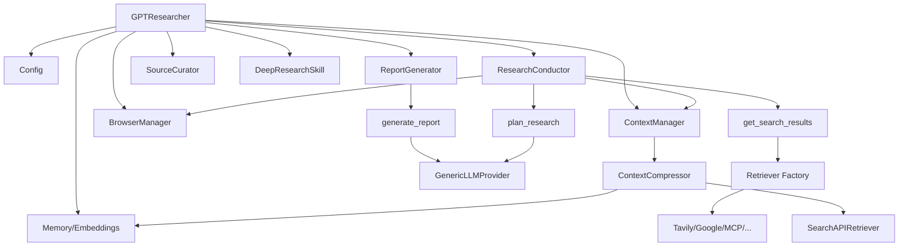

# Phase 1: 项目架构与核心入口

> 本章目标：理解 GPT-Researcher 的整体架构设计、核心入口类 `GPTResearcher`、配置系统，以及各组件间的协作关系。

---

## 1.1 架构总览

GPT-Researcher 采用 **Plan-and-Execute** 架构模式，核心思路为：

```
┌─────────────────────────────────────────────────────────┐
│                    GPTResearcher (agent.py)              │
│                    ═══════════════════════               │
│  ┌─────────────┐  ┌──────────────┐  ┌────────────────┐  │
│  │ Config      │  │ Memory       │  │ PromptFamily   │  │
│  │ (配置管理)   │  │ (Embeddings) │  │ (提示词模板)    │  │
│  └─────────────┘  └──────────────┘  └────────────────┘  │
│                                                         │
│  ┌─────────────────── Skills ──────────────────────────┐ │
│  │ ResearchConductor │ ContextManager │ ReportGenerator│ │
│  │ BrowserManager    │ SourceCurator  │ DeepResearch   │ │
│  └─────────────────────────────────────────────────────┘ │
│                                                         │
│  ┌─────────────────── Actions ─────────────────────────┐ │
│  │ choose_agent  │ get_search_results │ generate_report│ │
│  │ plan_research │ get_retrievers     │ extract_headers│ │
│  └─────────────────────────────────────────────────────┘ │
│                                                         │
│  ┌──────── Retrievers (16种) ────┐  ┌─── LLM Provider ─┐│
│  │ Tavily│Google│Bing│MCP│...    │  │ OpenAI│Anthropic  ││
│  └───────────────────────────────┘  │ Gemini│Ollama│... ││
│                                     └──────────────────┘│
└─────────────────────────────────────────────────────────┘
```

### 设计模式分析

| 模式 | 应用位置 | 说明 |
|------|---------|------|
| **策略模式** | Retrievers、LLM Provider | 检索器和LLM提供商可替换 |
| **工厂模式** | `get_retriever()`、`GenericLLMProvider.from_provider()` | 通过名称创建具体实例 |
| **门面模式** | `GPTResearcher` 类 | 封装复杂子系统，提供简单接口 |
| **模板方法** | `PromptFamily` | 基类定义提示词结构，子类可覆写 |
| **组合模式** | Skills 层 | 各 Skill 组合使用，形成研究流程 |

---

## 1.2 核心入口：GPTResearcher 类

**源码位置**：`gpt_researcher/agent.py`

### 构造函数关键参数

```python
class GPTResearcher:
    def __init__(
        self,
        query: str,                          # 研究查询
        report_type: str = "research_report", # 报告类型
        report_source: str = "web",           # 数据来源: web/local/hybrid
        tone: Tone = Tone.Objective,          # 报告语气
        source_urls: list[str] | None = None, # 指定来源URL
        vector_store=None,                    # 自定义向量库
        config_path=None,                     # 配置文件路径
        websocket=None,                       # WebSocket流式输出
        mcp_configs: list[dict] | None = None,# MCP服务器配置
        mcp_strategy: str | None = None,      # MCP策略: fast/deep/disabled
        ...
    ):
```

### 初始化流程（关键步骤）

```python
# 1. 加载配置
self.cfg = Config(config_path)

# 2. 初始化记忆体（Embeddings）
self.memory = Memory(
    self.cfg.embedding_provider, 
    self.cfg.embedding_model, 
    **self.cfg.embedding_kwargs
)

# 3. 获取检索器列表
self.retrievers = get_retrievers(self.headers, self.cfg)

# 4. 初始化核心技能组件
self.research_conductor = ResearchConductor(self)     # 研究编排器
self.report_generator = ReportGenerator(self)          # 报告生成器
self.context_manager = ContextManager(self)            # 上下文管理器
self.scraper_manager = BrowserManager(self)            # 浏览器管理器
self.source_curator = SourceCurator(self)              # 来源筛选器
```

### 核心方法调用链

```
conduct_research()
  ├── choose_agent()              # 根据查询自动选择专业Agent角色
  ├── research_conductor.conduct_research()   # 执行研究
  │   ├── plan_research()         # 生成子查询
  │   ├── _process_sub_query()    # 并行处理每个子查询
  │   │   ├── _scrape_data_by_urls()   # 搜索+抓取
  │   │   └── context_manager.get_similar_content_by_query()  # 上下文压缩
  │   └── source_curator.curate_sources()  # 可选：来源筛选
  └── image_generator (可选)      # AI图片生成

write_report()
  └── report_generator.write_report()
      └── generate_report()       # LLM生成最终报告
```

---

## 1.3 配置系统

**源码位置**：`gpt_researcher/config/config.py`

### 配置加载优先级

```
环境变量 > 配置文件 (JSON) > 默认值 (DEFAULT_CONFIG)
```

### 关键配置项

```python
# LLM 配置（格式: "provider:model"）
SMART_LLM = "openai:gpt-4o"              # 用于报告生成等复杂任务
FAST_LLM = "openai:gpt-4o-mini"          # 用于摘要等简单任务
STRATEGIC_LLM = "openai:o4-mini"          # 用于规划和推理任务

# Embedding 配置
EMBEDDING = "openai:text-embedding-3-small"

# 检索器配置
RETRIEVER = "tavily"                       # 支持逗号分隔多检索器

# 研究参数
MAX_SEARCH_RESULTS_PER_QUERY = 5
MAX_ITERATIONS = 3                         # 最大子查询数
TOTAL_WORDS = 1000                         # 报告最小字数

# 深度研究配置
DEEP_RESEARCH_BREADTH = 4                  # 广度
DEEP_RESEARCH_DEPTH = 2                    # 深度
DEEP_RESEARCH_CONCURRENCY = 2             # 并发数
```

### 三级 LLM 设计

项目精妙地将 LLM 分为三级，用于不同复杂度的任务：

| LLM 级别 | 用途 | 典型模型 |
|----------|------|---------|
| `fast_llm` | 摘要、简单判断 | gpt-4o-mini |
| `smart_llm` | 报告生成、Agent选择 | gpt-4o |
| `strategic_llm` | 规划、推理 | o4-mini (支持reasoning effort) |

---

## 1.4 报告类型体系

```python
class ReportType(Enum):
    ResearchReport = "research_report"       # 标准研究报告
    ResourceReport = "resource_report"       # 资源推荐报告
    OutlineReport = "outline_report"         # 大纲报告
    CustomReport = "custom_report"           # 自定义报告
    DetailedReport = "detailed_report"       # 详细报告（多子主题）
    SubtopicReport = "subtopic_report"       # 子主题报告
    DeepResearch = "deep_research"           # 深度递归研究
```

### 数据来源类型

```python
class ReportSource(Enum):
    Web = "web"                              # 网络搜索
    Local = "local"                          # 本地文档
    Hybrid = "hybrid"                        # 混合搜索
    LangChainDocuments = "langchain_documents"
    LangChainVectorStore = "langchain_vectorstore"
    Azure = "azure"
```

---

## 1.5 组件间依赖关系



---

## 1.6 动手实验

### 实验 1：阅读核心入口
1. 打开 `gpt_researcher/agent.py`
2. 关注 `__init__()` 中各组件的初始化顺序
3. 跟踪 `conduct_research()` 和 `write_report()` 的调用链

### 实验 2：理解配置系统
1. 查看 `gpt_researcher/config/variables/default.py` 中的 `DEFAULT_CONFIG`
2. 查看 `.env.example` 了解支持的环境变量
3. 尝试修改配置值观察行为变化

### 实验 3：最小可运行示例
```python
from gpt_researcher import GPTResearcher

async def main():
    researcher = GPTResearcher(
        query="什么是 RAG (Retrieval Augmented Generation)?",
        report_type="research_report"
    )
    context = await researcher.conduct_research()
    report = await researcher.write_report()
    print(report)
```

---

## 📌 本章要点回顾

- [x] GPTResearcher 是整个系统的 **门面类**，封装了所有核心功能
- [x] 配置系统支持 **环境变量 > 配置文件 > 默认值** 三级优先级
- [x] LLM 被分为 **fast/smart/strategic** 三级，对应不同复杂度任务
- [x] Skills 层 (researcher/context_manager/writer) 是核心业务逻辑层
- [x] Actions 层提供原子操作（agent选择、查询处理、报告生成）
