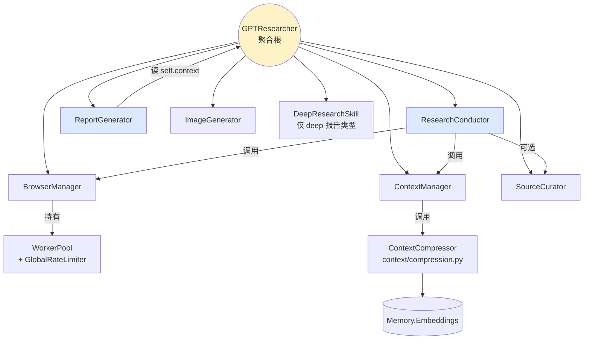
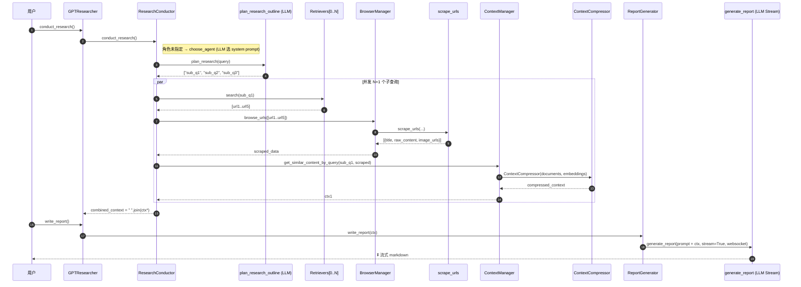

# 02. 单 Agent：Skills 模式与 ResearchConductor 主循环

## 模块概述

`gpt_researcher/skills/` 是单 Agent 形态下"业务编排"的全部所在。它把研究流程拆成 **6 个 Skill 类**：

| Skill | 文件 | 职责（一句话） |
|---|---|---|
| `ResearchConductor` | `researcher.py` | 研究主循环：选 Agent → 改写子查询 → 调度检索/抓取 → 拼接上下文 |
| `BrowserManager` | `browser.py` | 把 URL 列表丢给 scraper，并维护一个 `WorkerPool` |
| `ContextManager` | `context_manager.py` | embed → 相似度过滤 → 上下文压缩 |
| `SourceCurator` | `curator.py` | 用 LLM 给候选来源打分挑前 N 个（可选） |
| `ReportGenerator` | `writer.py` | 介绍 / 结论 / 子主题 / 主报告的写作编排 |
| `ImageGenerator` | `image_generator.py` | 用 Gemini Nano-Banana 给报告生成插图（可选） |
| `DeepResearchSkill` | `deep_research.py` | 递归深挖（独立一篇 09 详讲） |

它们共同的设计模式叫 **Skill Pattern**——每个 Skill 接收一个 `researcher` 反向引用，所有跨 Skill 的状态都通过 `self.researcher.*` 共享，等价于"把 GPTResearcher 当做一个全局上下文对象"。

> 本篇聚焦 5 个核心 Skill（不含 Deep Research / ImageGenerator 的细节，那两块各有专题）。读完后你应该能闭着眼画出"用户提问 → markdown 报告"的完整时序图。

---

## 架构 / 流程图

### Skill 依赖拓扑



### 一次"web research_report"的端到端时序



### Skill 模式 vs 经典模式（设计动机）

```
经典 OOP                           Skill Pattern (本项目)
┌──────────────┐                   ┌──────────────────────┐
│ Researcher   │                   │   GPTResearcher (上帝对象)│
│  ├─ search() │                   │   + cfg / context / costs │
│  ├─ scrape() │                   └────────────┬───────────────┘
│  ├─ embed()  │                                │
│  ├─ write()  │       ↔                       ▼
└──────────────┘                   ┌─ ResearchConductor(self)
依赖注入复杂                        ├─ ReportGenerator(self)
单元测试方便                        ├─ ContextManager(self)
                                    └─ BrowserManager(self)
                                    每个 Skill 都能读写 self.researcher.*
```

---

## 核心源码解析

### Skill 的"反向引用"构造模式

所有 Skill 的 `__init__` 都长一个样：

```python
# skills/researcher.py:34
class ResearchConductor:
    def __init__(self, researcher):
        self.researcher = researcher          # ← 唯一参数：GPTResearcher 实例
        self.logger = logging.getLogger('research')
        self.json_handler = get_json_handler()
        self._mcp_results_cache = None         # MCP 缓存（fast 策略下复用）
        self._mcp_query_count = 0
```

```python
# skills/browser.py:25
class BrowserManager:
    def __init__(self, researcher):
        self.researcher = researcher
        self.worker_pool = WorkerPool(
            researcher.cfg.max_scraper_workers,
            researcher.cfg.scraper_rate_limit_delay,
        )
```

```python
# skills/writer.py:31
class ReportGenerator:
    def __init__(self, researcher):
        self.researcher = researcher
        self.research_params = {                # ← 把常用入参打包，复用进每次 generate_report
            "query": researcher.query,
            "agent_role_prompt": researcher.cfg.agent_role or researcher.role,
            "report_type": researcher.report_type,
            "report_source": researcher.report_source,
            "tone": researcher.tone,
            "websocket": researcher.websocket,
            "cfg": researcher.cfg,
            "headers": researcher.headers,
        }
```

> **设计意图**：研究流程是一次性流水线（一个 query 跑完即销毁），把"全局状态"集中到 `GPTResearcher`、再让各 Skill 反向引用，比通过依赖注入框架组装更轻巧。代价是单测必须 mock `researcher` 的 30+ 个属性。

### 1) `ResearchConductor.conduct_research`：研究的总开关

文件：`gpt_researcher/skills/researcher.py:89-211`

```python
async def conduct_research(self):
    self.researcher.visited_urls.clear()        # ① 清状态：URL 去重集合
    research_data = []

    # ② 角色：没人显式传就让 LLM 选（→ 03 篇详细讲）
    if not (self.researcher.agent and self.researcher.role):
        self.researcher.agent, self.researcher.role = await choose_agent(
            query=self.researcher.query,
            cfg=self.researcher.cfg,
            parent_query=self.researcher.parent_query,
            cost_callback=self.researcher.add_costs,
            headers=self.researcher.headers,
            prompt_family=self.researcher.prompt_family,
        )

    # ③ MCP 检索是否在 retrievers 里？
    has_mcp_retriever = any("mcpretriever" in r.__name__.lower()
                            for r in self.researcher.retrievers)

    # ④ 按 report_source 分流（5 种）
    if self.researcher.source_urls:
        research_data = await self._get_context_by_urls(self.researcher.source_urls)
        if self.researcher.complement_source_urls:
            research_data += ' '.join(
                await self._get_context_by_web_search(...))
    elif self.researcher.report_source == ReportSource.Web.value:
        research_data = await self._get_context_by_web_search(...)
    elif self.researcher.report_source == ReportSource.Local.value:
        document_data = await DocumentLoader(self.researcher.cfg.doc_path).load()
        research_data = await self._get_context_by_web_search(query, document_data, ...)
    elif self.researcher.report_source == ReportSource.Hybrid.value:
        ...   # 本地 + Web 都跑一遍，最后用 prompt_family.join_local_web_documents 拼
    elif self.researcher.report_source == ReportSource.Azure.value:
        ...   # AzureDocumentLoader → DocumentLoader → web_search 流程
    elif self.researcher.report_source == ReportSource.LangChainDocuments.value:
        ...
    elif self.researcher.report_source == ReportSource.LangChainVectorStore.value:
        research_data = await self._get_context_by_vectorstore(...)

    self.researcher.context = research_data

    # ⑤ 可选：用 LLM 给来源精挑 Top-N
    if self.researcher.cfg.curate_sources:
        self.researcher.context = await self.researcher.source_curator.curate_sources(research_data)

    return self.researcher.context
```

**关键观察**：

1. **`source_urls` 优先**——如果用户传了 URL 列表，就直接抓取这些（可选叠加 web 搜索）；只有空才走 6 种 `report_source` 分支。
2. **MCP 是"独立第三条腿"**——既不属于 web retriever 也不是 local，下面 `_get_context_by_web_search` 里专门有一段 MCP 策略调度。
3. **`curate_sources` 是非默认开关**——`cfg.curate_sources=True` 时才跑 Source Curator，多花一次 SMART_LLM 调用换更精的源。

### 2) `_get_context_by_web_search`：并发子查询 + MCP 策略

```python
# researcher.py:266
async def _get_context_by_web_search(self, query, scraped_data=None, query_domains=None):
    # ① MCP 策略调度（fast / deep / disabled）
    mcp_retrievers = [r for r in self.researcher.retrievers
                      if "mcpretriever" in r.__name__.lower()]
    mcp_strategy = self._get_mcp_strategy()        # ← 参考 01 篇的策略解析

    if mcp_retrievers and self._mcp_results_cache is None:
        if mcp_strategy == "fast":
            # 用「原始 query」跑一次 MCP，缓存复用给所有子查询
            mcp_context = await self._execute_mcp_research_for_queries([query], mcp_retrievers)
            self._mcp_results_cache = mcp_context
        elif mcp_strategy == "deep":
            pass        # 不缓存，等子查询里逐个跑
        elif mcp_strategy == "disabled":
            pass        # 完全跳过

    # ② LLM 改写出子查询（→ 03 篇详细讲 plan_research_outline）
    sub_queries = await self.plan_research(query, query_domains)
    if self.researcher.report_type != "subtopic_report":
        sub_queries.append(query)        # 把原始 query 也并入

    # ③ 并发处理：N+1 个子查询同时跑 → asyncio.gather
    context = await asyncio.gather(*[
        self._process_sub_query(sub_q, scraped_data, query_domains)
        for sub_q in sub_queries
    ])
    context = [c for c in context if c]
    return " ".join(context) if context else []
```

> **MCP 策略对成本/延迟的影响**：
> - `fast`（默认）：原始 query 跑 1 次 MCP → 4 个子查询都用缓存。共 1 次 MCP 调用。
> - `deep`：每个子查询都打一次 MCP。共 N+1 次。
> - `disabled`：0 次。

### 3) `_process_sub_query`：单个子查询的"小流水线"

```python
# researcher.py:449
async def _process_sub_query(self, sub_query, scraped_data=[], query_domains=[]):
    mcp_retrievers     = [r for r in self.researcher.retrievers if "mcpretriever" in r.__name__.lower()]
    non_mcp_retrievers = [r for r in self.researcher.retrievers if "mcpretriever" not in r.__name__.lower()]

    mcp_context = []
    web_context = ""
    mcp_strategy = self._get_mcp_strategy()

    # ① MCP 部分（按策略消费缓存或现跑）
    if mcp_retrievers:
        if mcp_strategy == "disabled": pass
        elif mcp_strategy == "fast" and self._mcp_results_cache is not None:
            mcp_context = self._mcp_results_cache.copy()    # ← 直接复用
        elif mcp_strategy == "deep":
            mcp_context = await self._execute_mcp_research_for_queries([sub_query], mcp_retrievers)
        else:
            mcp_context = await self._execute_mcp_research_for_queries([sub_query], mcp_retrievers)

    # ② Web 部分：retrieve → scrape
    if not scraped_data:
        scraped_data = await self._scrape_data_by_urls(sub_query, query_domains)

    # ③ 上下文压缩（embed + similarity filter）
    if scraped_data:
        # TODO langchian ContextCompressor 详解👇
        # https://gemini.google.com/app/764a73c694c140c5
        web_context = await self.researcher.context_manager.get_similar_content_by_query(
            sub_query, scraped_data
        )

    # ④ MCP context + Web context 智能拼接
    return self._combine_mcp_and_web_context(mcp_context, web_context, sub_query)
```

**步骤 ② 的"两阶段抓取"细节**（`_scrape_data_by_urls` → `_search_relevant_source_urls`）：

```python
# researcher.py:751
async def _search_relevant_source_urls(self, query, query_domains=None):
    new_search_urls = []
    prefetched_content = []

    for retriever_class in self.researcher.retrievers:
        if "mcpretriever" in retriever_class.__name__.lower():
            continue                                     # MCP 不出 URL，跳过

        retriever = retriever_class(query, query_domains=query_domains)
        # 同步 search() 用 to_thread 包成异步，避免阻塞事件循环
        search_results = await asyncio.to_thread(
            retriever.search, max_results=self.researcher.cfg.max_search_results_per_query
        )

        for result in search_results:
            url = result.get("href") or result.get("url")
            raw_content = result.get("raw_content") or result.get("body")

            # 关键分流：retriever 已经返回正文（如 PubMed Central / Tavily extract）
            # 就直接用，不再去 scrape；否则只留 URL 等下一步抓
            if url and raw_content and len(raw_content) > 100:
                prefetched_content.append({"url": url, "raw_content": raw_content})
            elif url:
                new_search_urls.append(url)

    new_search_urls = await self._get_new_urls(new_search_urls)   # 去重
    random.shuffle(new_search_urls)                                # 防止顺序依赖
    return new_search_urls, prefetched_content
```

> ✨ **`prefetched_content` 这个分流**是项目里很巧的设计：有些 retriever（PubMed Central 全文 API、Tavily 的 extract 模式）已经把正文带回来了，这时候再去 scrape 就是浪费——直接复用。`scrape_urls` 只处理那些"只有 URL 没有正文"的结果。

### 4) `BrowserManager.browse_urls`：抓取的薄包装

```python
# skills/browser.py:37
async def browse_urls(self, urls: list[str]) -> list[dict]:
    scraped_content, images = await scrape_urls(
        urls, self.researcher.cfg, self.worker_pool       # ← 把 WorkerPool 传给底层 scrape
    )
    self.researcher.add_research_sources(scraped_content)
    new_images = self.select_top_images(images, k=4)      # ← 用 image hash 去重，最多挑 4 张
    self.researcher.add_research_images(new_images)
    return scraped_content
```

`select_top_images` 用 `get_image_hash` 做内容指纹去重（详见 `scraper/utils.py`），然后按 `score` 倒排取 Top-K：

```python
# browser.py:86
def select_top_images(self, images, k=2):
    unique_images = []; seen_hashes = set()
    current = self.researcher.get_research_images()
    for img in sorted(images, key=lambda im: im["score"], reverse=True):
        h = get_image_hash(img['url'])
        if h and h not in seen_hashes and img['url'] not in current:
            seen_hashes.add(h); unique_images.append(img["url"])
            if len(unique_images) == k: break
    return unique_images
```

### 5) `ContextManager.get_similar_content_by_query`：RAG 的"压缩"入口

```python
# skills/context_manager.py:37
async def get_similar_content_by_query(self, query, pages):
    context_compressor = ContextCompressor(
        documents=pages,
        embeddings=self.researcher.memory.get_embeddings(),    # ← Embedding 工厂（→ 05 篇）
        prompt_family=self.researcher.prompt_family,
        **self.researcher.kwargs
    )
    return await context_compressor.async_get_context(
        query=query, max_results=10, cost_callback=self.researcher.add_costs
    )
```

`ContextCompressor` 内部的工作（`context/compression.py`，05 篇细讲）：

1. 把 `pages` 切成段（用 `RecursiveCharacterTextSplitter`）
2. 把 query 与每段都 embed
3. 用 cosine 相似度 + `SIMILARITY_THRESHOLD` 过滤
4. 取 Top-`max_results` 段拼成新 context

> 注意 `max_results=10` 是"段数"不是"页数"——一页可能贡献多段。

### 6) `ReportGenerator.write_report`：报告生成的薄包装

```python
# skills/writer.py:49
async def write_report(self, existing_headers=[], relevant_written_contents=[],
                       ext_context=None, custom_prompt="", available_images=None):
    available_images = available_images or []
    context = ext_context or self.researcher.context

    report_params = self.research_params.copy()
    report_params["context"] = context
    report_params["custom_prompt"] = custom_prompt
    report_params["available_images"] = available_images

    if self.researcher.report_type == "subtopic_report":
        report_params.update({
            "main_topic": self.researcher.parent_query,
            "existing_headers": existing_headers,
            "relevant_written_contents": relevant_written_contents,
            "cost_callback": self.researcher.add_costs,
        })
    else:
        report_params["cost_callback"] = self.researcher.add_costs

    return await generate_report(**report_params, **self.researcher.kwargs)
```

实际写作发生在 `actions/report_generation.py:generate_report`：根据 `report_type` 选 prompt → SMART_LLM 流式输出 → 通过 `websocket` 推前端。流式部分代码片段：

```python
# actions/report_generation.py: write_report_introduction（同 generate_report 类似）
introduction = await create_chat_completion(
    model=config.smart_llm_model,
    messages=[{"role": "system", "content": agent_role_prompt},
              {"role": "user",   "content": prompt_family.generate_report_introduction(...)}],
    temperature=0.25,
    llm_provider=config.smart_llm_provider,
    stream=True,                  # ← 关键：流式
    websocket=websocket,          # ← 关键：直接推到前端
    max_tokens=config.smart_token_limit,
    llm_kwargs=config.llm_kwargs,
    cost_callback=cost_callback,
)
```

### 7) `SourceCurator.curate_sources`：可选的"二次精挑"

```python
# skills/curator.py:33
async def curate_sources(self, source_data, max_results=10):
    response = await create_chat_completion(
        model=self.researcher.cfg.smart_llm_model,
        messages=[
            {"role": "system", "content": f"{self.researcher.role}"},
            {"role": "user",   "content": self.researcher.prompt_family.curate_sources(
                self.researcher.query, source_data, max_results)},
        ],
        temperature=0.2,
        max_tokens=8000,
        llm_provider=self.researcher.cfg.smart_llm_provider,
        ...
    )
    curated_sources = json.loads(response)        # ← 期望 LLM 返回 JSON
    return curated_sources
```

实务上：
- `temperature=0.2`（更确定性）。
- 用 SMART_LLM（不是 fast），因为它要"读懂"全部源、然后做权衡判断。
- 错误兜底是"原样返回 source_data"——curator 失败不应该让整个研究断掉。

---

## 技术原理深度解析

### A. Plan-and-Execute 范式在本项目的体现

| 阶段 | 实现位置 | LLM 用法 |
|---|---|---|
| **Plan** | `actions/query_processing.py:plan_research_outline` | LLM 输出 N 个子查询（结构化 JSON） |
| **Execute（并发）** | `_get_context_by_web_search` 的 `asyncio.gather` | 每个子查询是独立 task：retrieve → scrape → compress |
| **Synthesize** | `ReportGenerator.write_report` → `generate_report` | SMART_LLM 把所有 context 压成 markdown 报告 |

这个"先规划后并行"的形态对应 [Plan-and-Solve 论文](https://arxiv.org/abs/2305.04091)，比传统 ReAct（思考-动作-观察循环）更适合**离线深度研究**——延迟不关键，质量与覆盖度优先。

### B. 为什么 retriever 用 `asyncio.to_thread`？

```python
search_results = await asyncio.to_thread(
    retriever.search, max_results=...
)
```

绝大多数 retriever 是 **同步** 的（用 `requests` / `tavily-python` 这种 BlockingIO 库写的）。直接 `await retriever.search()` 会报错（不是 coroutine）；直接调用又会阻塞事件循环。

`asyncio.to_thread` 把同步函数丢到默认 ThreadPool 里跑，事件循环可以继续调度其他子查询。**这是把同步 SDK 接入 asyncio 项目的标准 trick**，也比自己造 ThreadPool 更省心。

### C. context 拼接的两套思路：`join_local_web_documents` vs `_combine_mcp_and_web_context`

- **本地 + Web** 走的是 **prompt 层拼接**：`prompt_family.join_local_web_documents(docs, web)` 直接生成一个新的 markdown 段，让后续 SMART_LLM 知道"这一段是本地文档、那一段是 web"。
- **MCP + Web** 走的是 **代码层拼接**：`_combine_mcp_and_web_context` 在每条 MCP 结果末尾追加 `\n\n*Source: title (url)*\n\n---\n\n` 的引文标记，再与 web context 用空行分隔。

> 两种风格都是为了让 SMART_LLM "看见来源差异"，但前者依赖 prompt 设计、后者依赖文本格式约定。本项目两套并存，反映了不同时期作者的设计偏好。

### D. 流式输出的两条路径

```
LLM ↘ provider.get_chat_response(stream=True, websocket=...)
        │
        ├── token 来 → 直接 send_json 到 websocket（前端实时看到字）
        │
        └── 全文累积成 response → 函数返回时给调用者
```

调用者既能拿到完整 markdown 字符串，前端又能实时滚字。秘诀在 `GenericLLMProvider.get_chat_response`（`llm_provider/generic/base.py`）里同时做累积和回推。

### E. visited_urls 去重为什么是 `set` 而不是 LRU

研究流程是"一次性流水线"——`conduct_research` 入口处 `self.researcher.visited_urls.clear()` 整个清空，所以不需要驱逐策略。`set` 提供 O(1) 的 `add/in`，对 ≤ 1000 量级 URL 完全够用。

---

## 关键设计决策

| 决策 | 取舍 |
|---|---|
| **Skills 反向引用 GPTResearcher** | 牺牲单测便利，换跨 Skill 共享状态的极简写法 |
| **`ResearchConductor` 同时管 web/local/hybrid/azure/...** 6 种源 | 把分支逻辑集中在一个方法里，便于阅读/排查；缺点是函数巨长 |
| **MCP 三种策略而非简单"开/关"** | `fast` 缓存复用 vs `deep` 全量调用，是「成本-质量」拉杆，给用户选择空间 |
| **`SourceCurator` 默认关闭** | 它要消耗 SMART_LLM 一次大调用，对短查询不划算；只有显式开 `CURATE_SOURCES=True` 才跑 |
| **`prefetched_content` 分流** | 让"自带正文的 retriever"省一次 scrape，但增加了 `_search_relevant_source_urls` 的复杂度 |
| **不在 Skill 层做缓存** | 除了 `_mcp_results_cache`，没有其它缓存。原因：每次研究都是新 query，缓存命中率低，复杂度不值 |
| **`ImageGenerator` 在 `conduct_research` 末尾跑** | 必须在写报告前生成完，否则 prompt 里没法插图。代价：用户必须等图片生成完才看到报告流式输出 |

---

## 与其他模块的关联

```
本模块（skills/） 的输入：
  ├─ Config（→ 01）：所有 cfg.* 行为开关
  ├─ Retrievers（→ 04）：self.researcher.retrievers 列表
  ├─ Memory.Embeddings（→ 05）：ContextCompressor 用
  └─ PromptFamily（→ 03）：所有 LLM 调用的 prompt 模板

本模块的输出：
  ├─ self.researcher.context     → ReportGenerator 用
  ├─ self.researcher.research_sources / images  → 报告引用
  ├─ self.researcher.visited_urls          → 去重 + add_references
  └─ self.researcher.research_costs        → 成本统计

本模块被外部使用的地方：
  ├─ multi_agents/agents/researcher.py   → 多 Agent 把 GPTResearcher 当作"研究子模块"调（→ 07）
  ├─ backend/report_type/*               → FastAPI 不同报告类型的 runner（→ 10）
  └─ cli.py / 直接 import 的库用法
```

---

## 实操教程

### 环境准备

跟 01 篇相同：`OPENAI_API_KEY` + `TAVILY_API_KEY`，`pip install -r requirements.txt`。

### 例 1：直接调用 ResearchConductor（绕开高层 API）

```python
# scripts/skill_demo_conductor.py
import asyncio
from dotenv import load_dotenv; load_dotenv()
from gpt_researcher import GPTResearcher

async def main():
    r = GPTResearcher(query="LangGraph vs CrewAI for multi-agent research, late 2025",
                      report_type="research_report", verbose=True)
    # 步骤拆开做
    sub_queries = await r.research_conductor.plan_research(r.query)
    print("子查询：", sub_queries)

    ctx = await r.research_conductor.conduct_research()
    print("上下文长度：", len(str(ctx)))

asyncio.run(main())
```

### 例 2：利用 source_urls 做"指定源研究"

```python
# scripts/skill_demo_pinned_urls.py
import asyncio
from dotenv import load_dotenv; load_dotenv()
from gpt_researcher import GPTResearcher

async def main():
    r = GPTResearcher(
        query="What are the trade-offs between LangGraph and Pregel-style execution?",
        report_type="research_report",
        source_urls=[
            "https://blog.langchain.dev/langgraph/",
            "https://en.wikipedia.org/wiki/Pregel_(API)",
        ],
        complement_source_urls=False,    # 不再额外做 web search
        verbose=True,
    )
    await r.conduct_research()
    print(await r.write_report())

asyncio.run(main())
```

### 例 3：开启 SourceCurator + 自定义 max_search

```python
import os, asyncio
from dotenv import load_dotenv; load_dotenv()

# 通过 env 调几个 cfg 开关
os.environ["CURATE_SOURCES"] = "true"
os.environ["MAX_SEARCH_RESULTS_PER_QUERY"] = "8"
os.environ["SIMILARITY_THRESHOLD"] = "0.45"

from gpt_researcher import GPTResearcher

async def main():
    r = GPTResearcher(query="State of small language models in production, 2025",
                      verbose=True)
    await r.conduct_research()
    md = await r.write_report()
    print("报告字数 ≈", len(md.split()))
    print("Total $", r.get_costs())

asyncio.run(main())
```

### 例 4：自定义 Skill —— 复用 `ResearchConductor` 但替换写报告逻辑

```python
# scripts/custom_skill.py
import asyncio
from dotenv import load_dotenv; load_dotenv()
from gpt_researcher import GPTResearcher
from gpt_researcher.utils.llm import create_chat_completion

class TweetWriter:
    """换掉 ReportGenerator——把 context 浓缩成 280 字以内的推文。"""
    def __init__(self, researcher):
        self.r = researcher

    async def write(self):
        return await create_chat_completion(
            model=self.r.cfg.fast_llm_model,
            llm_provider=self.r.cfg.fast_llm_provider,
            messages=[
                {"role": "system", "content": self.r.role},
                {"role": "user", "content":
                    f"Compress this research context into a single tweet (≤280 chars), "
                    f"keep one URL citation:\n\n{self.r.context}"},
            ],
            max_tokens=200, temperature=0.6,
            cost_callback=self.r.add_costs,
        )

async def main():
    r = GPTResearcher(query="Anthropic MCP adoption status, 2025", verbose=True)
    await r.conduct_research()
    tw = TweetWriter(r)
    print(await tw.write())

asyncio.run(main())
```

> 这就是 Skill Pattern 的杀手级用法：**任何持有 `researcher` 引用的对象都能玩**，不用继承、不用 mixin、不用注册。

### 常见问题与 Debug 技巧

| 症状 | 排查路径 |
|---|---|
| 子查询 plan 出来全是英文，但你想要中文 | 设 env `LANGUAGE=chinese`；prompt_family 会把 language 注入到 prompt（→ 03 篇） |
| `_process_sub_query` 报 `NoneType has no attribute __name__` | retriever 类被传成实例了；检查 `get_retrievers` 返回的是类而非实例 |
| `web_context` 一直空 | 多半是 scrape 全失败（被 403/cloudflare 挡）；切 `SCRAPER=browser`（playwright）试试 |
| 报告生成超长后被截断 | `SMART_TOKEN_LIMIT` 默认 6000；超长报告把它调到 8000-12000，但要确认模型本身支持 |
| 想看每个 sub-query 的中间产物 | `verbose=True` + `websocket=None` 时也会打印；想结构化拿到，注册自己的 `log_handler`（参考 01 篇） |

调试时打开两个日志名字最有用：

```python
import logging
logging.getLogger('research').setLevel(logging.DEBUG)        # ResearchConductor 用的 logger
logging.getLogger('gpt_researcher').setLevel(logging.DEBUG)
```

### 进阶练习建议

1. **改造 `_get_context_by_web_search`**：把 `asyncio.gather` 改成 `asyncio.as_completed`，每完成一个 sub-query 就先入向量库；同时支持中途 `CancelledError` 优雅退出。
2. **写一个 `MultiQueryCurator`**：在子查询执行**前**先用 LLM 看「哪些子查询彼此重复」，去重后再 gather，省 30% retrieve 成本。
3. **新增 Skill `FactChecker`**：在 `conduct_research` 返回前，对每段 context 跑一次"事实声明抽取 → 反查"流程，给出 confidence。
4. **替换 `ReportGenerator` 成 `JSONReport`**：让最终输出是结构化 JSON 而非 markdown，方便接入下游业务。

---

## 延伸阅读

1. [Plan-and-Solve Prompting (2023)](https://arxiv.org/abs/2305.04091) — `plan_research_outline` 的理论依据。
2. [LangChain Streaming with `astream`](https://python.langchain.com/docs/concepts/streaming/) — 理解 `create_chat_completion(stream=True)` 在底层怎么把 token 推回去。
3. [Python `asyncio.to_thread` 文档](https://docs.python.org/3/library/asyncio-task.html#asyncio.to_thread) — 同步 SDK 接入 asyncio 的官方推荐做法。
4. [LangChain `ContextualCompressionRetriever`](https://python.langchain.com/docs/how_to/contextual_compression/) — 本项目 `ContextCompressor` 的概念前身。
5. [Storm: Synthesizing topic outlines through retrieval and multi-perspective question asking](https://arxiv.org/abs/2402.14207) — 多 Agent 篇会再次提到，但单 Agent 的 plan→search→combine 形态也来自这里。

---

> ✅ 本篇结束。下一篇 **`03_query_planning_and_prompts.md`** 会深入两件事：
> 1. **Agent 角色生成**（`choose_agent` 怎么让 LLM 自己挑 system prompt）；
> 2. **PromptFamily 抽象**（一套"换 prompt 不换代码"的多态模板），以及 Pydantic 结构化输出（`Subtopics`、`SearchQueries`）。
> 回复 **"继续"** 即可。
