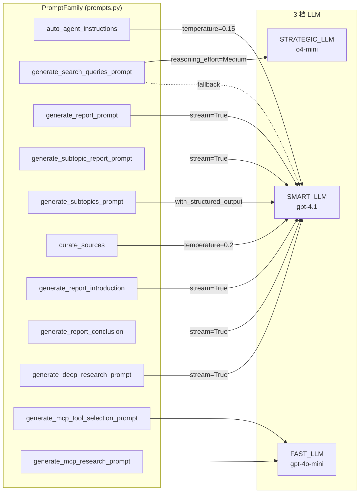
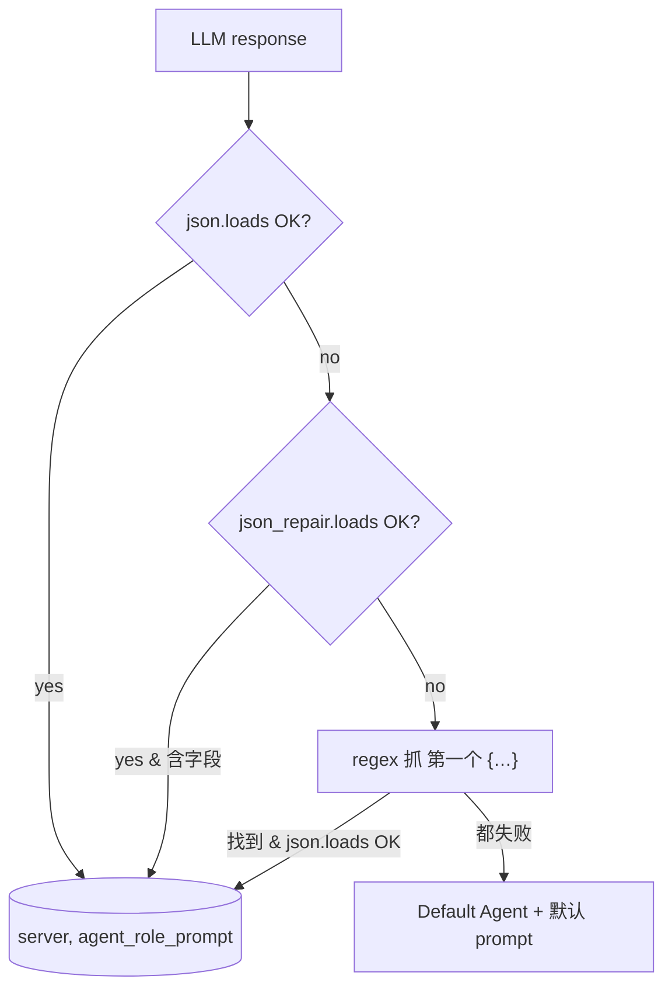
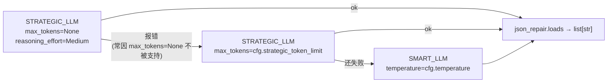

# 03. 查询规划、Agent 角色生成与 PromptFamily

## 模块概述

这一篇拆解 GPT-Researcher 的"语言层"：**所有 LLM 决策与文本输出**到底是怎么被组织的。

它聚焦三件事：

1. **Agent 角色生成（`choose_agent`）**——LLM 给 LLM 选 system prompt 的"元 prompt"模式，附 JSON 自愈三段式（`json` → `json_repair` → 正则兜底）。
2. **查询改写（`plan_research_outline` → `generate_sub_queries`）**——Strategic LLM 优先、SMART LLM 兜底的"3 档降级"调用链；prompt 内置 `{max_iterations}` 与 `{context}`，把"刚搜到的初步结果"当 few-shot 反喂给规划模型。
3. **PromptFamily 抽象**——一套"换 prompt 不换代码"的多态模板系统：`PromptFamily` 基类 + `Granite3PromptFamily / Granite33PromptFamily` 派生类，通过工厂函数 `get_prompt_family` 按 `cfg.prompt_family` 选用。所有 prompt 都集中在 `gpt_researcher/prompts.py`（**约 900 行单文件**）。

附带讲清两个相关机制：**Pydantic 结构化输出**（`Subtopics` 模型 + `PydanticOutputParser`）、**降级链与 JSON 容错**（`json_repair` 库的角色）。

---

## 架构 / 流程图

### Prompt 与 LLM 的"调用矩阵"



### `choose_agent` 的 JSON 自愈漏斗



### `generate_sub_queries` 的 3 档降级链



### PromptFamily 类层级

```
PromptFamily               (默认；所有方法定义在这里)
├── GranitePromptFamily    (薄 façade，按 cfg.smart_llm 字符串路由)
├── Granite3PromptFamily   (覆盖 pretty_print_docs / join_local_web_documents)
└── Granite33PromptFamily  (覆盖同上 + 用 <|start_of_role|> 等 IBM token)

prompt_family_mapping = {
    "default":    PromptFamily,
    "granite":    GranitePromptFamily,
    "granite3":   Granite3PromptFamily,
    "granite3.1": Granite3PromptFamily,
    "granite3.2": Granite3PromptFamily,
    "granite3.3": Granite33PromptFamily,
}
```

---

## 核心源码解析

### 1) `auto_agent_instructions`：让 LLM 自己挑 system prompt

文件：`gpt_researcher/prompts.py:486`

```python
@staticmethod
def auto_agent_instructions():
    return """
This task involves researching a given topic, regardless of its complexity ...
The server is determined by the field of the topic and the specific name of the server
that could be utilized to research the topic provided. Agents are categorized by their area
of expertise, and each server type is associated with a corresponding emoji.

examples:
task: "should I invest in apple stocks?"
response:
{
    "server": "💰 Finance Agent",
    "agent_role_prompt: "You are a seasoned finance analyst AI assistant. Your primary
goal is to compose comprehensive, astute, impartial, and methodically arranged financial
reports based on provided data and trends."
}
task: "could reselling sneakers become profitable?"
response:
{
    "server":  "📈 Business Analyst Agent",
    "agent_role_prompt": "..."
}
task: "what are the most interesting sites in Tel Aviv?"
response:
{
    "server":  "🌍 Travel Agent",
    "agent_role_prompt": "..."
}
"""
```

> **这是一个 meta-prompt**：上层 prompt 教 LLM 输出"下一步要给 LLM 当 system message 的字符串"。这种"两层 prompt"结构在 deep research 类项目里非常常见——它让单 Agent 也能拥有"角色多样性"，而不必在代码里硬编码 N 个角色枚举。

### 2) `choose_agent` 与三段式 JSON 兜底

文件：`gpt_researcher/actions/agent_creator.py`

```python
async def choose_agent(query, cfg, parent_query=None, cost_callback=None,
                       headers=None, prompt_family=PromptFamily, **kwargs):
    query = f"{parent_query} - {query}" if parent_query else f"{query}"
    response = None
    try:
        response = await create_chat_completion(
            model=cfg.smart_llm_model,                # ← 用 SMART（要"理解任务"）
            messages=[
                {"role": "system", "content": prompt_family.auto_agent_instructions()},
                {"role": "user",   "content": f"task: {query}"},
            ],
            temperature=0.15,                          # ← 低温度求确定性
            llm_provider=cfg.smart_llm_provider,
            llm_kwargs=cfg.llm_kwargs,
            cost_callback=cost_callback,
            **kwargs
        )
        agent_dict = json.loads(response)              # ① 第一道：strict
        return agent_dict["server"], agent_dict["agent_role_prompt"]
    except Exception:
        return await handle_json_error(response)       # ② 三段式兜底
```

```python
async def handle_json_error(response):
    # ② json_repair：自动补全单引号、缺失逗号、未闭合括号等
    try:
        agent_dict = json_repair.loads(response)
        if agent_dict.get("server") and agent_dict.get("agent_role_prompt"):
            return agent_dict["server"], agent_dict["agent_role_prompt"]
    except Exception as e:
        logger.warning(...)

    # ③ 正则抓第一个 {…}
    json_string = extract_json_with_regex(response)
    if json_string:
        try:
            json_data = json.loads(json_string)
            return json_data["server"], json_data["agent_role_prompt"]
        except json.JSONDecodeError:
            ...

    # ④ 兜底：返回硬编码 Default Agent
    return "Default Agent", (
        "You are an AI critical thinker research assistant. Your sole purpose is to write "
        "well written, critically acclaimed, objective and structured reports on given text."
    )

def extract_json_with_regex(response):
    json_match = re.search(r"{.*?}", response, re.DOTALL)
    return json_match.group(0) if json_match else None
```

> **设计要点**：JSON Mode 不是所有 provider 都支持（很多本地模型、Cohere、部分老 Anthropic 接口都没有）。**`json_repair` 是这种环境下的救命稻草**——它能把"半破 JSON"修好（90% 以上的格式错误能自动修复）。即便如此，作者还是再加了一层正则 + 一层硬编码兜底——4 层防御对应"模型质量越差越要保证可用"的工程哲学。

### 3) 查询改写：`plan_research_outline` + `generate_sub_queries`

文件：`gpt_researcher/actions/query_processing.py`

```python
async def plan_research_outline(query, search_results, agent_role_prompt, cfg,
                                parent_query, report_type, cost_callback=None,
                                retriever_names=None, **kwargs):
    if retriever_names is None: retriever_names = []

    # MCP 单独检索时，不做子查询改写——MCP 自己有 LLM 选 tool 的逻辑
    if retriever_names and ("mcp" in retriever_names or "MCPRetriever" in retriever_names):
        mcp_only = (len(retriever_names) == 1 and ...)
        if mcp_only:
            return [query]                # ← 直接返回原 query

    return await generate_sub_queries(query, parent_query, report_type,
                                      search_results, cfg, cost_callback, **kwargs)
```

```python
async def generate_sub_queries(query, parent_query, report_type, context, cfg,
                               cost_callback=None, prompt_family=PromptFamily, **kwargs):
    gen_queries_prompt = prompt_family.generate_search_queries_prompt(
        query, parent_query, report_type,
        max_iterations=cfg.max_iterations or 3,
        context=context,                    # ← 把刚搜到的初步结果回喂
    )

    # ① 优先 STRATEGIC_LLM（max_tokens=None：让 reasoning 模型不受限）
    try:
        response = await create_chat_completion(
            model=cfg.strategic_llm_model,
            messages=[{"role": "user", "content": gen_queries_prompt}],
            llm_provider=cfg.strategic_llm_provider,
            max_tokens=None,
            llm_kwargs=cfg.llm_kwargs,
            reasoning_effort=ReasoningEfforts.Medium.value,
            cost_callback=cost_callback,
            **kwargs
        )
    except Exception as e:
        # ② 同模型，加 max_tokens 重试（应对某些 provider 不接受 None 的实现）
        try:
            response = await create_chat_completion(
                model=cfg.strategic_llm_model,
                max_tokens=cfg.strategic_token_limit,
                ...
            )
        except Exception as e:
            # ③ 兜底：换 SMART_LLM（不一定支持 reasoning_effort，但更稳）
            response = await create_chat_completion(
                model=cfg.smart_llm_model,
                temperature=cfg.temperature,
                max_tokens=cfg.smart_token_limit,
                ...
            )

    return json_repair.loads(response)         # ← 又是 json_repair
```

对应的 prompt（`prompts.py:213`）：

```python
@staticmethod
def generate_search_queries_prompt(question, parent_query, report_type,
                                   max_iterations=3, context=[]):
    if report_type in (ReportType.DetailedReport.value, ReportType.SubtopicReport.value):
        task = f"{parent_query} - {question}"
    else:
        task = question

    context_prompt = f"""
You are a seasoned research assistant tasked with generating search queries to find
relevant information for the following task: "{task}".
Context: {context}

Use this context to inform and refine your search queries. The context provides real-time
web information that can help you generate more specific and relevant queries...
""" if context else ""

    dynamic_example = ", ".join([f'"query {i+1}"' for i in range(max_iterations)])

    return f"""Write {max_iterations} google search queries to search online that form
an objective opinion from the following task: "{task}"

Assume the current date is {datetime.now(timezone.utc).strftime('%B %d, %Y')} if required.

{context_prompt}
You must respond with a list of strings in the following format: [{dynamic_example}].
The response should contain ONLY the list.
"""
```

**几个值得注意的细节**：

- `Assume the current date is ...`——动态注入今天日期，是**对抗 LLM 内部知识过期**的标准技巧（防止它生成"2023 年第三季度财报"之类的过期搜索词）。
- `dynamic_example` 通过字符串拼接构造"3 个示例"，让模型严格输出"`["q1", "q2", "q3"]`"格式，比写抽象规则更可靠。
- `context` 字段是**当前 query 在初次粗搜后的结果**——相当于让规划模型"看着初步信息再细化子查询"，是 Plan-and-Solve 的工程化体现。

### 4) PromptFamily：可替换的 prompt 模板族

文件：`gpt_researcher/prompts.py:13`

```python
class PromptFamily:
    """General purpose class for prompt formatting.

    Methods are broken down into two groups:
    1. Prompt Generators: 标准 (question, context, report_source, ...) 签名，
                          通过 get_prompt_by_report_type 按 ReportType 路由
    2. Prompt Methods:    自由签名（auto_agent_instructions / curate_sources / ...）
    """
    def __init__(self, config: Config):
        self.cfg = config
    ...
```

工厂函数：

```python
# prompts.py:885
def get_prompt_family(prompt_family_name, config):
    if isinstance(prompt_family_name, PromptFamilyEnum):
        prompt_family_name = prompt_family_name.value
    if prompt_family := prompt_family_mapping.get(prompt_family_name):
        return prompt_family(config)
    warnings.warn(...)
    return PromptFamily()
```

按报告类型路由 prompt：

```python
# prompts.py:858
report_type_mapping = {
    ReportType.ResearchReport.value:  "generate_report_prompt",
    ReportType.ResourceReport.value:  "generate_resource_report_prompt",
    ReportType.OutlineReport.value:   "generate_outline_report_prompt",
    ReportType.CustomReport.value:    "generate_custom_report_prompt",
    ReportType.SubtopicReport.value:  "generate_subtopic_report_prompt",
    ReportType.DeepResearch.value:    "generate_deep_research_prompt",
}

def get_prompt_by_report_type(report_type, prompt_family):
    prompt_by_type = getattr(prompt_family, report_type_mapping.get(report_type, ""), None)
    if not prompt_by_type:
        warnings.warn(... "Using default report type ...")
        prompt_by_type = getattr(prompt_family, report_type_mapping[ReportType.ResearchReport.value])
    return prompt_by_type
```

> **效果**：上层只需要传一个字符串 `prompt_family="granite3.3"`，整套 prompt 模板就被替换成 IBM Granite 模型偏好的 `<|start_of_role|>document {...}<|end_of_role|>` 格式。无需改任何业务代码。

### 5) Granite 派生：以"文档拼接格式"为例

```python
# prompts.py:802
class Granite33PromptFamily(PromptFamily):
    """Prompts for IBM's granite 3.3 models"""

    _DOCUMENT_TEMPLATE = """<|start_of_role|>document {{"document_id": "{document_id}"}}<|end_of_role|>
{document_content}<|end_of_text|>
"""

    @classmethod
    def pretty_print_docs(cls, docs, top_n=None):
        return "\n".join([
            cls._DOCUMENT_TEMPLATE.format(
                document_id=doc.metadata.get("source", i),
                document_content=cls._get_content(doc),
            )
            for i, doc in enumerate(docs)
            if top_n is None or i < top_n
        ])

    @classmethod
    def join_local_web_documents(cls, docs_context, web_context):
        return "\n\n".join([docs_context, web_context])
```

这就是"换 prompt 不换代码"的真实价值——**Granite 用了 IBM 自家的特殊 token，OpenAI 模型则用 markdown**，业务层完全不需要知道这个差异。

### 6) 结构化输出：`Subtopics` + `PydanticOutputParser`

文件：`gpt_researcher/utils/validators.py` + `utils/llm.py:138`

```python
# validators.py
class Subtopic(BaseModel):
    task: str = Field(description="Task name", min_length=1)

class Subtopics(BaseModel):
    subtopics: List[Subtopic] = []
```

```python
# utils/llm.py:138
async def construct_subtopics(task, data, config, subtopics=[],
                              prompt_family=PromptFamily, **kwargs):
    parser = PydanticOutputParser(pydantic_object=Subtopics)

    prompt = PromptTemplate(
        template=prompt_family.generate_subtopics_prompt(),
        input_variables=["task", "data", "subtopics", "max_subtopics"],
        partial_variables={
            "format_instructions": parser.get_format_instructions()},  # ← 注入 schema
    )

    provider_kwargs = {'model': config.smart_llm_model}
    if config.llm_kwargs: provider_kwargs.update(config.llm_kwargs)
    if config.smart_llm_model in SUPPORT_REASONING_EFFORT_MODELS:
        provider_kwargs['reasoning_effort'] = ReasoningEfforts.High.value
    else:
        provider_kwargs['temperature'] = config.temperature
        provider_kwargs['max_tokens']  = config.smart_token_limit

    provider = get_llm(config.smart_llm_provider, **provider_kwargs)
    chain = prompt | provider.llm | parser           # ← LCEL 三件套：prompt | model | parser
    return await chain.ainvoke({
        "task": task, "data": data,
        "subtopics": subtopics,
        "max_subtopics": config.max_subtopics
    }, **kwargs)
```

`generate_subtopics_prompt`（`prompts.py:569`）通过 `{format_instructions}` 占位被 LangChain 自动展开成：

```
The output should be formatted as a JSON instance that conforms to the JSON schema below.
...
{"properties": {"subtopics": {"items": {"$ref": "#/definitions/Subtopic"}, ...
```

这是 LangChain `PydanticOutputParser` 的标准做法——把 Pydantic 模型自动转 JSON Schema 注入 prompt，再在 parse 阶段反序列化。

> **对比 `with_structured_output`**：项目没用 LangChain 0.2+ 推荐的 `model.with_structured_output(Subtopics)`，因为后者要求底层 provider 实现"function calling 强制输出 JSON Schema"——并不是所有 provider 都支持（如 Ollama 旧版、本地 vLLM）。`PydanticOutputParser` 走 prompt 注入，普适性更强。

---

## 技术原理深度解析

### A. 三档 LLM 在 prompt 调用矩阵中的分工

| 调用 | 模型 | 温度 | 设计理由 |
|---|---|---|---|
| `choose_agent` | SMART | 0.15 | 需"理解任务领域"，但要稳定 → 低温 |
| `generate_sub_queries` | STRATEGIC（首选）→ SMART（兜底） | 默认 / `cfg.temperature` | 多步推理任务（用 reasoning model 更好） |
| `generate_report_*` | SMART | 0.25 | 需要长篇创意写作，温度略高更自然 |
| `curate_sources` | SMART | 0.2 | 严肃判断打分，求确定 |
| `construct_subtopics` | SMART | reasoning=High 或 cfg.temperature | 结构化输出 + 较长上下文 |
| `generate_mcp_*`（→ 08 篇） | FAST | n/a | tool 选择是高频小任务 |

### B. `json_repair` 的修复能力

它能修：
- 末尾缺逗号 / 多逗号
- 单引号当 JSON（`{'a': 1}` → `{"a": 1}`）
- 字符串里没转义的换行
- 缺失的引号（半结构化输出常见）

它**不能**修：
- 完全没有大括号
- key/value 顺序错乱（如 `{ : "v"}`）

所以仍需要正则兜底。

### C. 动态日期注入对长寿命 prompt 的意义

```python
Assume the current date is {datetime.now(timezone.utc).strftime('%B %d, %Y')} if required.
```

LLM 内部知识截止日期是固定的（如 GPT-4o 是 2023 年 10 月），但用户 query 经常依赖"最新"。把当天日期注入 prompt 后，**模型会主动构造时效相关的搜索词**（"2025 H2 Q3"、"latest"），这一招对 web research 类应用是刚需。

### D. `max_iterations` 与"宽度 vs 深度"权衡

`cfg.max_iterations`（默认 3）控制"每个查询切几个子查询"。值越大：
- 召回宽度↑（覆盖更多角度）
- 检索/抓取/embed 成本↑
- 报告生成时 context 堆叠↑

实务建议：
- 简短问题 → `MAX_ITERATIONS=2`
- 标准研究 → 默认 3
- 长篇 detailed_report → 4-5（再往上 marginal benefit 显著下降）

### E. PromptFamily 为什么不用 Jinja2？

作者刻意只用 f-string + 字符串拼接，不引入 Jinja2 等模板引擎。理由（推测）：
- prompt 改动极频繁，纯 Python 字符串便于 grep / 跳转
- 模板引擎引入额外依赖与"字符转义"陷阱（`{` `{{` `\}}`）
- prompt 中很多动态部分（日期、循环示例）用 Python 表达式更直接

代价：复杂 prompt（如 `generate_subtopic_report_prompt`）阅读体验差，需要 IDE 支持。

---

## 关键设计决策

| 决策 | 理由 / 取舍 |
|---|---|
| **元 prompt 让 LLM 选 system prompt**（`auto_agent_instructions`） | 避免硬编码上百种 agent 类型；代价是每次研究多一次 SMART 调用 |
| **JSON 输出走 prompt 注入 + json_repair**，不强依赖 function calling | 兼容老 provider / 本地模型；牺牲 strict schema 校验 |
| **STRATEGIC → SMART 三段式降级** | 兼顾"用更好的 reasoning 模型规划"与"必有兜底" |
| **PromptFamily 工厂 + Enum 路由** | 给 IBM Granite 等模型族留扩展位；上层无感 |
| **prompts 单文件 ≈ 900 行** | 反 Java 风格但便于全局搜索/对比；新加 prompt 只需在一个文件里加方法 |
| **不用 `with_structured_output`** | 取宽兼容性，弃 schema 强约束 |
| **prompt 用动态日期/动态示例** | 对抗模型知识过期 + 提高输出格式遵循率 |

替代方案讨论：

- 若你的部署只用 OpenAI / Anthropic 最新模型，可以用 `model.with_structured_output(Subtopics)` 替换 `PydanticOutputParser`，schema 强制更可靠。
- 若你想做 **prompt A/B 测试**，可以新增一个 `ExperimentalPromptFamily(PromptFamily)`，仅覆盖关心的方法，再通过 env 切换 `PROMPT_FAMILY=experimental`。
- 若你需要**多语言 prompt**（不止 `language` 参数注入），可以做 `EnglishPromptFamily / ChinesePromptFamily` 两条线——本项目把 language 当 prompt 参数，是简化方案。

---

## 与其他模块的关联

```
本模块（prompts.py + actions/agent_creator.py + actions/query_processing.py）

输入：
  ├─ Config（→ 01）：cfg.smart_llm / strategic_llm / max_iterations / language / prompt_family
  └─ ResearchConductor 调用栈（→ 02）

输出：
  ├─ choose_agent → (server_name, system_prompt)  → GPTResearcher.role
  ├─ plan_research_outline → list[str]            → 子查询的并发种子
  ├─ get_prompt_by_report_type → 函数对象          → ReportGenerator 调用
  └─ get_prompt_family → PromptFamily 实例         → 全程 self.prompt_family.* 访问

被以下模块大量引用：
  ├─ skills/researcher.py / writer.py / curator.py / context_manager.py / image_generator.py
  ├─ actions/report_generation.py
  └─ multi_agents/agents/researcher.py / writer.py（→ 06、07 篇）
```

---

## 实操教程

### 例 1：直接调 `choose_agent` 看不同 query 的角色

```python
# scripts/demo_choose_agent.py
import asyncio
from dotenv import load_dotenv; load_dotenv()
from gpt_researcher.config import Config
from gpt_researcher.actions.agent_creator import choose_agent
from gpt_researcher.prompts import PromptFamily

async def main():
    cfg = Config()
    pf  = PromptFamily(cfg)

    queries = [
        "Should I invest in Anthropic if it goes public in 2026?",
        "What is the cleanest beach in Tel Aviv for kids?",
        "Compare Postgres pgvector vs Qdrant for production RAG",
        "为什么大语言模型推理时 KV-cache 是必需的？",
    ]
    for q in queries:
        agent, role = await choose_agent(q, cfg, prompt_family=pf)
        print(f"\n[{q[:50]}]")
        print(f"  agent: {agent}")
        print(f"  role : {role[:120]}...")

asyncio.run(main())
```

输出（实际可能因模型而异）：

```
[Should I invest in Anthropic if it goes public in 2026?]
  agent: 💰 Finance Agent
  role : You are a seasoned finance analyst AI assistant. Your primary goal is to compose...

[What is the cleanest beach in Tel Aviv for kids?]
  agent: 🌍 Travel Agent
  role : You are a world-travelled AI tour guide assistant...
```

### 例 2：直接调 `generate_sub_queries`

```python
# scripts/demo_subqueries.py
import asyncio
from dotenv import load_dotenv; load_dotenv()
from gpt_researcher.config import Config
from gpt_researcher.actions.query_processing import generate_sub_queries

async def main():
    cfg = Config()
    qs = await generate_sub_queries(
        query="Why is RAG with reranking necessary?",
        parent_query="",
        report_type="research_report",
        context=[],
        cfg=cfg,
    )
    print("Sub-queries:", qs)

asyncio.run(main())
```

> 注意 `context=[]`——传一个真实的初步搜索结果列表（`[{title, body, href}, ...]`）会让规划模型生成更精的子查询。

### 例 3：写一个自定义 PromptFamily（实验中文写作风）

```python
# scripts/cn_prompt_family.py
import asyncio
from dotenv import load_dotenv; load_dotenv()
from gpt_researcher.prompts import PromptFamily

class ChineseAcademicFamily(PromptFamily):
    """专给中文学术风格用的 prompt"""

    @staticmethod
    def auto_agent_instructions():
        # 直接用中文写元 prompt，强制返回中文 role
        return """
你是一个研究角色分配助手。给定 task，输出 JSON：
{"server": "<emoji 角色名>", "agent_role_prompt": "<中文系统提示，不超过 200 字>"}

示例：
task: "我应该投资苹果股票吗？"
{"server": "💰 财经分析师", "agent_role_prompt": "你是一名资深财经分析师..."}
"""

# 注册（可放进 prompt_family_mapping，但这里直接传实例）
from gpt_researcher.config import Config
from gpt_researcher.actions.agent_creator import choose_agent

async def main():
    cfg = Config()
    agent, role = await choose_agent(
        "Anthropic 的 MCP 协议会成为行业标准吗？",
        cfg, prompt_family=ChineseAcademicFamily(cfg)
    )
    print(agent); print(role)

asyncio.run(main())
```

### 例 4：用 `Subtopics` 结构化拿子主题

```python
# scripts/demo_subtopics.py
import asyncio
from dotenv import load_dotenv; load_dotenv()
from gpt_researcher import GPTResearcher

async def main():
    r = GPTResearcher(query="Modern RAG evaluation methods", verbose=True)
    await r.conduct_research()
    subs = await r.get_subtopics()
    # subs 是 Subtopics(BaseModel) 实例
    for st in subs.subtopics:
        print("- ", st.task)

asyncio.run(main())
```

### 常见问题与 Debug 技巧

| 症状 | 排查 |
|---|---|
| `choose_agent` 总是返回 "Default Agent" | LLM 输出根本没有 JSON；打开 verbose，看 `handle_json_error` 里 logger.debug 打印的前 500 字。常见是非 OpenAI provider 没遵循"only JSON"指令——把 prompt 末尾加 "Output ONLY a JSON object." |
| `generate_sub_queries` 报 `KeyError 'subtopics'` | 99% 是 LLM 把整个 list 包了一层（`{"queries": [...]}`）；`json_repair.loads` 修不了语义错误。临时方案：在 prompt 里 hard-code "MUST be a top-level JSON array, NOT wrapped" |
| Granite 模型不识别 `<|start_of_role|>` | 你切错了 prompt_family；`PROMPT_FAMILY=granite3.3` 才会激活 Granite33PromptFamily |
| 中文 query 但报告里夹英文 | `LANGUAGE=chinese` 只对部分 prompt 生效；deep research 等 prompt 里需要二次校验 |
| `construct_subtopics` 返回空 list | `parser` 抛异常被吃掉了；把 `try/except` 临时去掉看真实错误。常见原因：模型不支持 PydanticOutputParser 注入的 schema 长度 |

调试 prompt 输出最好用：

```python
import logging
# 把 LangChain 的 chain.invoke 内部日志全开
logging.getLogger('langchain').setLevel(logging.DEBUG)

# 也可以直接打印 prompt
from gpt_researcher.prompts import PromptFamily
print(PromptFamily.generate_search_queries_prompt(
    "test", "", "research_report", max_iterations=3, context=[]
))
```

### 进阶练习建议

1. **写一个 `JsonModeOnlyPromptFamily`**：所有"期望 JSON 输出"的方法，prompt 末尾都附"You must output ONLY valid JSON wrapped in ```json``` block"，再写一个新的 parser。
2. **Few-shot 改写**：把 `generate_search_queries_prompt` 改成在 `context` 非空时塞 2-3 个"原 query → 子查询"的真实例子（few-shot），实测能否减少子查询的"水查询"。
3. **HyDE 实现**：在 `plan_research_outline` 之前，新增一个 LLM 调用——让模型对原 query 生成"假设答案 paragraph"，把它一起送入 retriever（HyDE 论文方法）。
4. **PromptFamily 多语言版**：派生 `ChinesePromptFamily(PromptFamily)`，覆盖所有 prompt 的中文版本。

---

## 延伸阅读

1. [HyDE: Precise Zero-Shot Dense Retrieval without Relevance Labels](https://arxiv.org/abs/2212.10496) — 查询改写的另一条主流路线（生成假设答案当 query）。
2. [Plan-and-Solve Prompting](https://arxiv.org/abs/2305.04091) — `plan_research_outline` 的算法骨架。
3. [LangChain Output Parsers](https://python.langchain.com/docs/concepts/output_parsers/) — 比较 `PydanticOutputParser` vs `with_structured_output` vs `JsonOutputParser`。
4. [`json_repair` 仓库](https://github.com/mangiucugna/json_repair) — 看它能修哪些"半破" JSON 来确定容错边界。
5. [OpenAI Reasoning Effort 文档](https://platform.openai.com/docs/guides/reasoning) — 解释 `reasoning_effort=Medium` 在 o-系列模型上的实际成本-质量曲线。

---

> ✅ 本篇结束。下一篇 **`04_retrievers_and_scrapers.md`** 会深入"数据进料系统"——17 种 retriever 的统一接口约定、8 种 scraper 的工厂派发、并发抓取的真实调度顺序，以及 `prefetched_content` 这条"短路"是怎么把 PubMed Central 这种"自带正文"的源直接接上向量库的。
> 回复 **"继续"** 即可。
