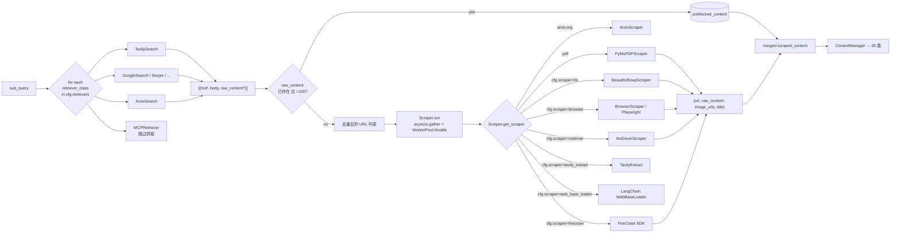

# 04. Retrievers 与 Scrapers：数据进料系统

## 模块概述

研究 Agent 的"原料"完全来自这两层：

| 层 | 输入 | 输出 | 主要文件 |
|---|---|---|---|
| **Retriever** | 自然语言 query | `[{title, href, body, raw_content?}, ...]` | `gpt_researcher/retrievers/*` |
| **Scraper** | URL 列表 | `[{url, raw_content, image_urls, title}, ...]` | `gpt_researcher/scraper/*` |

它们由两个工厂函数串起来：

- `actions/retriever.py:get_retrievers(headers, cfg)` —— 把 `cfg.retrievers`（如 `"tavily,mcp"`）解析为 **类列表**（不是实例）；
- `gpt_researcher/scraper/scraper.py:Scraper.get_scraper(link)` —— 按链接特征**动态选择** scraper（PDF → PyMuPDF / arxiv.org → ArxivScraper / 其它 → `cfg.scraper`）。

本篇把 17 个 retriever 与 8 个 scraper 当作"协议族"来讲：先看**接口契约**（每个类必须长成什么样才能被流水线接进来），再看**派发机制**（路由规则、并发模型、限流如何作用），最后用一份"自定义 retriever / scraper"的实操让你真正落地。

---

## 架构 / 流程图

### 数据进料整体流



### Retriever 接口契约

```python
class XxxRetriever:
    def __init__(self,
                 query: str,
                 query_domains: list[str] | None = None,
                 # 可选附加（不同 retriever 各自加）
                 headers: dict | None = None,
                 # MCP 专用
                 researcher = None,
                 websocket = None):
        ...

    def search(self, max_results: int = 5) -> list[dict]:
        # 必返一个列表，每项至少包含：
        #   {"href": "...", "body": "..."}
        # 高级（可选）：
        #   {"title": "...", "url": "...", "raw_content": "...全文..."}
        #   "url" 与 "href" 等价（_search_relevant_source_urls 会兼容两者）
        ...
```

### Scraper 接口契约

```python
class XxxScraper:
    def __init__(self, link: str, session: requests.Session | None = None):
        ...

    # 同步版本（默认）
    def scrape(self) -> tuple[str, list[dict], str]:
        # return (text_content, image_urls_list, title)
        ...

    # 或异步版本（NoDriverScraper、TavilyExtract 等用）
    async def scrape_async(self) -> tuple[str, list[dict], str]:
        ...
```

> 调度逻辑会自动判断 scraper 是否有 `scrape_async`：
> - 有 → 直接 `await scraper.scrape_async()`（不占线程）
> - 没有 → 用 `loop.run_in_executor(worker_pool.executor, scraper.scrape)` 丢线程池

---

## 核心源码解析

### 1) Retrievers 注册表与工厂

**所有 retriever 类的导入与注册**（`retrievers/__init__.py`）：
[__init__.py](https://gemini.google.com/app/3c22ab9be6b8b1fe)

```python
from .arxiv.arxiv import ArxivSearch
from .bing.bing import BingSearch
from .custom.custom import CustomRetriever
from .duckduckgo.duckduckgo import Duckduckgo
from .google.google import GoogleSearch
from .pubmed_central.pubmed_central import PubMedCentralSearch
from .searx.searx import SearxSearch
from .semantic_scholar.semantic_scholar import SemanticScholarSearch
from .searchapi.searchapi import SearchApiSearch
from .serpapi.serpapi import SerpApiSearch
from .serper.serper import SerperSearch
from .tavily.tavily_search import TavilySearch
from .exa.exa import ExaSearch
from .mcp import MCPRetriever
from .bocha.bocha import BoChaSearch
from .xquik.xquik import XquikSearch
```

> 项目实际可用 17 个：上面 16 个 + `BoChaSearch`（中文检索）+ 配置里允许的 `mock`（测试用）。

**`get_retriever(name)` —— 字符串 → 类（`actions/retriever.py:8`）**：

```python
def get_retriever(retriever: str):
    match retriever:
        case "google":           return GoogleSearch
        case "searx":            return SearxSearch
        case "searchapi":        return SearchApiSearch
        case "serpapi":          return SerpApiSearch
        case "serper":           return SerperSearch
        case "duckduckgo":       return Duckduckgo
        case "bing":             return BingSearch
        case "bocha":            return BoChaSearch
        case "arxiv":            return ArxivSearch
        case "tavily":           return TavilySearch
        case "exa":              return ExaSearch
        case "semantic_scholar": return SemanticScholarSearch
        case "pubmed_central":   return PubMedCentralSearch
        case "custom":           return CustomRetriever
        case "mcp":              return MCPRetriever
        case "xquik":            return XquikSearch
        case _:                  return None
```

> ⚠️ 用 `match/case`（Python 3.10+）+ **lazy import**：每个分支才 `from ... import`，避免一次性把 17 个 SDK 全装上。

**`get_retrievers(headers, cfg)` —— 多 retriever 解析（同文件 :104）**：

```python
def get_retrievers(headers, cfg):
    if headers.get("retrievers"):                  # ① 请求头优先（多个，逗号分隔）
        retrievers = headers.get("retrievers").split(",")
    elif headers.get("retriever"):                 # ② 请求头单 retriever
        retrievers = [headers.get("retriever")]
    elif cfg.retrievers:                           # ③ 配置（list 或字符串都接受）
        retrievers = cfg.retrievers if isinstance(cfg.retrievers, list) \
                     else cfg.retrievers.split(",")
        retrievers = [r.strip() for r in retrievers]
    elif cfg.retriever:                            # ④ 老字段兼容
        retrievers = [cfg.retriever]
    else:
        retrievers = [get_default_retriever().__name__]  # ⑤ 默认 Tavily

    # 任何一个名字解析失败 → 兜底 Tavily（不抛错）
    return [get_retriever(r) or get_default_retriever() for r in retrievers]
```

> ⚙️ **关键点**：返回的是 **类列表**，而非实例。`ResearchConductor` 在每个 sub-query 上才实例化：`retriever_class(query, query_domains=...)`。这种"延迟实例化"让同一个 retriever 类能针对不同 query 反复使用，且天然避免实例间状态污染。

### 2) 一个最简 Retriever：`TavilySearch`

`retrievers/tavily/tavily_search.py`：

```python
class TavilySearch:
    def __init__(self, query, headers=None, topic="general", query_domains=None):
        self.query = query
        self.topic = topic
        self.base_url = "https://api.tavily.com/search"
        self.api_key = self.get_api_key()                 # env TAVILY_API_KEY
        self.query_domains = query_domains or None

    def search(self, max_results=10):
        try:
            results = self._search(
                self.query, search_depth="basic",
                max_results=max_results, topic=self.topic,
                include_domains=self.query_domains,
            )
            sources = results.get("results", [])
            if not sources: raise Exception("No results found...")
            search_response = [
                {"href": obj["url"], "body": obj["content"]}      # ← 标准化
                for obj in sources
            ]
        except Exception as e:
            print(f"Error: {e}. Failed fetching sources.")
            search_response = []
        return search_response
```

要点：
- **同步**调用 (`requests.post`)；交给上层 `asyncio.to_thread` 包装异步。
- 返回的字典只用 `{href, body}` 两键——这是**最小契约**。
- 异常**全部吞掉**返回空列表——确保单个 retriever 的失败不会让整个研究停掉。

### 3) "自带正文" Retriever：`PubMedCentralSearch`

`retrievers/pubmed_central/pubmed_central.py:118`：

```python
def search(self, max_results=10):
    article_ids = self._search_articles(max_results)
    if not article_ids: return []

    out = []
    for aid in article_ids:
        article = self._fetch_full_text(aid)        # ← 拉 XML 全文
        if article:
            out.append({
                "href": article["url"],
                "body": article["abstract"],         # 摘要（短）
                "raw_content": article["full_text"], # 全文（长）→ 让 ResearchConductor 走"短路"
                "title": article["title"],
            })
    return out
```

`ResearchConductor._search_relevant_source_urls`（02 篇讲过）会判断：
```python
if url and raw_content and len(raw_content) > 100:
    prefetched_content.append({"url": url, "raw_content": raw_content})  # 跳过 scrape！
elif url:
    new_search_urls.append(url)                                           # 进 scrape 队列
```

> 换句话说，**只要一个 retriever 在 `search()` 返回值里塞 `raw_content`，它就自动跳过 scraper 这一层**。这是项目"协议层"留给开发者的一条优化通道。

### 4) `Duckduckgo` —— 三方包二次封装

```python
from itertools import islice
from ..utils import check_pkg

class Duckduckgo:
    def __init__(self, query, query_domains=None):
        check_pkg('ddgs')              # ← 缺包给清晰报错
        from ddgs import DDGS
        self.ddg = DDGS()
        self.query = query
        self.query_domains = query_domains or None

    def search(self, max_results=5):
        try:
            return self.ddg.text(self.query, region='wt-wt', max_results=max_results)
        except Exception as e:
            print(f"Error: {e}.")
            return []
```

`check_pkg` 来自 `retrievers/utils.py:44`，缺包时给出可执行的 `pip install` 命令。注意它**不预装**——只在使用时才校验，让用户按需安装。

### 5) `SerperSearch` —— 把高级特性塞进 query string

```python
class SerperSearch:
    def __init__(self, query, query_domains=None,
                 country=None, language=None, time_range=None, exclude_sites=None):
        self.query = query
        self.country     = country     or os.getenv("SERPER_REGION")
        self.language    = language    or os.getenv("SERPER_LANGUAGE")
        self.time_range  = time_range  or os.getenv("SERPER_TIME_RANGE")
        self.exclude_sites = exclude_sites or self._get_exclude_sites_from_env()
        ...

    def search(self, max_results=7):
        # 把"排除站点 / 限定域"全部拼到 query 里，依赖 Google 自身的搜索语法
        query_with_filters = self.query
        if self.exclude_sites:
            for site in self.exclude_sites:
                query_with_filters += f" -site:{site}"
        if self.query_domains:
            domain_query = " site:" + " OR site:".join(self.query_domains)
            query_with_filters += domain_query

        search_params = {"q": query_with_filters, "num": max_results}
        if self.country:    search_params["gl"]  = self.country
        if self.language:   search_params["hl"]  = self.language
        if self.time_range: search_params["tbs"] = self.time_range
        ...
```

> Serper 不直接支持 "exclude site"，作者用 `-site:foo.com` 这种 **Google search 语法**绕过去——这是成熟做法。

### 6) Scrapers 注册与派发

**注册表**（`scraper/__init__.py`）：

```python
from .beautiful_soup.beautiful_soup import BeautifulSoupScraper
from .web_base_loader.web_base_loader import WebBaseLoaderScraper
from .arxiv.arxiv import ArxivScraper
from .pymupdf.pymupdf import PyMuPDFScraper
from .browser.browser import BrowserScraper
from .browser.nodriver_scraper import NoDriverScraper
from .tavily_extract.tavily_extract import TavilyExtract
from .firecrawl.firecrawl import FireCrawl
from .scraper import Scraper
```

**`Scraper` 调度类构造**（`scraper/scraper.py:30`）：

```python
class Scraper:
    def __init__(self, urls, user_agent, scraper, worker_pool: WorkerPool):
        # 关键：URL 去重保留顺序
        unique_urls = list(dict.fromkeys(urls))
        duplicates_removed = len(urls) - len(unique_urls)

        self.urls = unique_urls
        self.session = requests.Session()
        self.session.headers.update({"User-Agent": user_agent})
        self.scraper = scraper                    # cfg.scraper 字符串：bs / browser / firecrawl / ...
        # 部分 scraper 依赖外部 SDK，按需 pip install
        if self.scraper in ("tavily_extract", "firecrawl"):
            self._check_pkg(self.scraper)
        self.worker_pool = worker_pool
```

**`get_scraper(link)` —— 按 URL 特征派发**（`scraper.py:171`）：

```python
def get_scraper(self, link):
    SCRAPER_CLASSES = {
        "pdf":            PyMuPDFScraper,
        "arxiv":          ArxivScraper,
        "bs":             BeautifulSoupScraper,
        "web_base_loader":WebBaseLoaderScraper,
        "browser":        BrowserScraper,
        "nodriver":       NoDriverScraper,
        "tavily_extract": TavilyExtract,
        "firecrawl":      FireCrawl,
    }
    if link.endswith(".pdf"):           scraper_key = "pdf"
    elif "arxiv.org" in link:           scraper_key = "arxiv"
    else:                               scraper_key = self.scraper      # 用 cfg.scraper
    return SCRAPER_CLASSES[scraper_key]
```

> ⚙️ **隐含规则**：PDF 与 arxiv 永远走专门 scraper，**忽略 `cfg.scraper`**——因为它们的内容结构特殊。

**核心抓取循环**（`scraper.py:63 / 108`）：

```python
async def run(self):
    contents = await asyncio.gather(
        *(self.extract_data_from_url(url, self.session) for url in self.urls)
    )
    return [c for c in contents if c["raw_content"] is not None]

async def extract_data_from_url(self, link, session):
    async with self.worker_pool.throttle():           # ← 双层限流：信号量 + 全局节流
        try:
            ScraperCls = self.get_scraper(link)
            scraper = ScraperCls(link, session)

            # ① 异步 scraper 直接 await
            if hasattr(scraper, "scrape_async"):
                content, image_urls, title = await scraper.scrape_async()
            # ② 同步 scraper 丢线程池
            else:
                content, image_urls, title = await asyncio.get_running_loop().run_in_executor(
                    self.worker_pool.executor, scraper.scrape
                )

            if not content or len(content) < 100:
                return {"url": link, "raw_content": None,
                        "image_urls": [], "title": title}     # ← 太短直接判废
            return {"url": link, "raw_content": content,
                    "image_urls": image_urls, "title": title}
        except Exception as e:
            return {"url": link, "raw_content": None, "image_urls": [], "title": ""}
```

> 这就是 01 篇的 `WorkerPool.throttle()` 真正"出场"的地方——**所有抓取都被同一个 WorkerPool 序列化**，可以同时控制并发上限和全局节流。

### 7) 三种 Scraper 的对比

#### `BeautifulSoupScraper`（默认 `cfg.scraper = "bs"`）—— 最快，也最容易被挡

```python
class BeautifulSoupScraper:
    def __init__(self, link, session=None):
        self.link, self.session = link, session

    def scrape(self):
        try:
            response = self.session.get(self.link, timeout=4)
            soup = BeautifulSoup(response.content, "lxml", from_encoding=response.encoding)
            soup = clean_soup(soup)              # 删 script/style/footer/header/nav...
            content = get_text_from_soup(soup)
            image_urls = get_relevant_images(soup, self.link)
            title = extract_title(soup)
            return content, image_urls, title
        except Exception as e:
            print("Error! : " + str(e))
            return "", [], ""
```

适合：博客、文档站、维基百科。
不适合：CloudFlare / 反爬强的站、SPA（JS 渲染后才有内容）。

#### `NoDriverScraper`（`cfg.scraper = "nodriver"`）—— 真浏览器，最稳

```python
class NoDriverScraper:
    async def scrape_async(self):
        browser = await self.get_browser()                # ← 复用浏览器实例池
        page = await browser.get(self.url)
        await browser.wait_or_timeout(page, "complete", 2)
        await page.sleep(random.uniform(0.3, 0.7))         # ← 故意延迟模拟真人
        await browser.wait_or_timeout(page, "idle", 2)
        await browser.scroll_page_to_bottom(page)          # ← 触发懒加载
        html = await page.get_content()
        soup = BeautifulSoup(html, "lxml")
        clean_soup(soup)
        return get_text_from_soup(soup), get_relevant_images(soup, self.url), extract_title(soup)
```

适合：JS 渲染站、强反爬站。
代价：每个 URL 多 1-3 秒；浏览器实例占内存（默认有池上限）。

#### `FireCrawl`（`cfg.scraper = "firecrawl"`）—— 第三方 SaaS，省心

```python
class FireCrawl:
    def __init__(self, link, session=None):
        self.link, self.session = link, session
        from firecrawl import FirecrawlApp
        self.firecrawl = FirecrawlApp(api_key=self.get_api_key(), api_url=self.get_server_url())

    def scrape(self):
        try:
            response = self.firecrawl.scrape(url=self.link, formats=["markdown"])
            if response.metadata and response.metadata.error:
                return "", [], ""
            content = response.markdown or ""
            title = response.metadata.title if response.metadata else ""

            # 用本地 BeautifulSoup 拿图（FireCrawl 不返回图）
            response_bs = self.session.get(self.link, timeout=4)
            soup = BeautifulSoup(response_bs.content, "lxml")
            image_urls = get_relevant_images(soup, self.link)
            return content, image_urls, title
        except Exception as e:
            return "", [], ""
```

适合：批量 / 受限站；返回的是 markdown，省后处理。
代价：需 API key、有速率限制（搭 `SCRAPER_RATE_LIMIT_DELAY` 用）。

### 8) 图片抓取：`get_relevant_images` 的打分逻辑

```python
# scraper/utils.py:16
def get_relevant_images(soup, url):
    image_urls = []
    for img in soup.find_all('img', src=True):
        img_src = urljoin(url, img['src'])
        if img_src.startswith(('http://', 'https://')):
            score = 0
            # 1) 类名命中"内容图"特征 → 4 分（最高）
            if any(cls in img.get('class', []) for cls in
                   ['header','featured','hero','thumbnail','main','content']):
                score = 4
            # 2) 没命中类名，按尺寸打分
            elif img.get('width') and img.get('height'):
                w = parse_dimension(img['width']); h = parse_dimension(img['height'])
                if w >= 2000 and h >= 1000:                score = 3
                elif w >= 1600 or h >= 800:                score = 2
                elif w >= 800 or h >= 500:                 score = 1
                elif w >= 500 or h >= 300:                 score = 0
                else: continue                              # 太小直接丢
            image_urls.append({'url': img_src, 'score': score})
    return sorted(image_urls, key=lambda x: x['score'], reverse=True)[:10]
```

> 这套打分把"装饰小图标"过滤掉，留下文章主图，再交给 `BrowserManager.select_top_images` 做去重。

---

## 技术原理深度解析

### A. 协议优先 vs 抽象基类（Duck Typing 的代价与收益）

项目里的 retriever / scraper **都不继承任何基类**——纯靠"长得像就能用"的 Duck Typing：

- 调用 `retriever.search(max_results=N)` 不抛错就行；
- 返回的列表元素能拿到 `href` / `url` + `body` / `raw_content` 之一就行。

**收益**：贡献者写新 retriever 几乎零门槛，连 import 都不用动（只需在 `__init__.py` 导出 + `get_retriever` 加 case）。
**代价**：缺契约校验，新手容易漏 `body` 字段；调试时只能看运行时错误。

> 这种风格在 LangChain 早期也很常见，后来才用 `BaseRetriever` 抽象统一。GPT-Researcher 故意不引入抽象基类，目的是降低 PR 门槛——这是开源项目的合理取舍。

### B. 同步 SDK 接入异步流的两种模式

```
模式①：retriever.search()                ← 同步函数
   ResearchConductor 用 asyncio.to_thread 包成协程
   单次调用，开销可接受

模式②：scraper.scrape() / scrape_async()  ← 调度自动判断
   Scraper.extract_data_from_url 内部：
     hasattr(scraper, "scrape_async") → await
     else                              → loop.run_in_executor(worker_pool.executor, scrape)
```

> 这种"双 API 接受"机制让生态友好——既兼容 BeautifulSoup 这类纯同步库，也兼容 Playwright/nodriver 这类原生异步库。

### C. 动态派发的"三层规则"

```
最终 scraper = f(link, cfg.scraper)

if link.endswith(".pdf"):  PyMuPDFScraper        ← 永远生效，覆盖 cfg
elif "arxiv.org" in link: ArxivScraper           ← 永远生效，覆盖 cfg
else:                     SCRAPER_CLASSES[cfg.scraper]
```

> 前两条规则是"内容优先"：PDF 用文本库、arxiv 用专门 API；不是用户能配的。这也是为啥 `cfg.scraper="firecrawl"` 时仍能正常处理 PDF 链接——派发已经接管了。

### D. 并发模型与限流的真实路径

一次研究里的并发栈：

```
ResearchConductor._get_context_by_web_search
  └─ asyncio.gather(_process_sub_query × N)         ← 子查询级并发（默认 3+1）
       └─ 每个子查询：
            ├─ retriever.search   (asyncio.to_thread → 默认 ThreadPoolExecutor)
            └─ Scraper.run
                 └─ asyncio.gather(extract_data_from_url × M)   ← URL 级并发
                      └─ async with worker_pool.throttle():       ← 信号量 + 全局节流
                           ├─ scrape_async()             ← 直接 await
                           └─ run_in_executor(scrape)    ← worker_pool.executor 线程池
```

理论上会出现 `N × M` 个并发抓取任务，但 `WorkerPool.semaphore`（默认 15）做了实际并发上限。配合 `GlobalRateLimiter`，无论你跑多少个 `GPTResearcher`，每秒打目标 API 的请求都不会超限。

### E. 为什么 `len(content) < 100` 直接判废？

```python
if not content or len(content) < 100:
    return {"url": link, "raw_content": None, ...}
```

经验阈值。常见 100 字以下的页面：
- 403 / 错误页（"Access Denied"）
- 跳转占位页
- 仅有 banner 没有正文的 SPA

直接判废能让上层用 `[c for c in contents if c["raw_content"] is not None]` 一行过滤，避免污染上下文。

---

## 关键设计决策

| 决策 | 取舍 |
|---|---|
| **17 个 retriever 用 if/elif 分支注册**，不用插件机制 | 简单粗暴，新增需要改 4 处（导出 / `get_retriever` / `VALID_RETRIEVERS` / 文档），但启动时不依赖动态加载，运行时性能更可预测 |
| **lazy import**（`match` 分支里才 `from ... import`） | 用户只装他用得到的 SDK；TavilySearch 用户不用装 `playwright` |
| **Duck Typing 而非抽象基类** | 降低贡献门槛；牺牲契约校验 |
| **`raw_content` 协议短路** | 给"全文 API"型 retriever 留快速通道；上层一行 if 即兼容 |
| **PDF / arxiv 强制覆盖 `cfg.scraper`** | 内容驱动而非配置驱动，符合最小惊讶 |
| **scrape 失败返回空数据而非抛错** | 单 URL 失败不能让整次研究停掉 |
| **`url` 在 set 里去重** | 一次研究内的 URL 集合不大，set 完美胜任 |
| **WorkerPool 双层（信号量 + 全局节流）** | 既限并发又限速率，复合限流是 SaaS 抓取必须 |

替代方案讨论：

- 用 entry point / `pkgutil.iter_modules` 自动发现 retriever 子目录，能省 if/elif；但运行时性能与可调试性变差。
- 用 `pydantic.BaseModel` 定义 `RetrieverResult`，可以挡掉一类"漏 body"的 bug。代价：引入 Pydantic 序列化开销（万级别 search 时不可忽略）。
- scraper 可以拆成"获取 HTML + 解析"两步抽象，让用户单独换其中一步。本项目当前耦合在一起，便于调试但难复用。

---

## 与其他模块的关联

```
本模块输入：
  ├─ Config（→ 01）：cfg.retrievers / cfg.scraper / cfg.user_agent
  │                  cfg.max_search_results_per_query / cfg.max_scraper_workers
  │                  cfg.scraper_rate_limit_delay
  └─ 子查询字符串（来自 03 篇 plan_research_outline）

本模块输出：
  ├─ retriever search 结果 → ResearchConductor._search_relevant_source_urls
  └─ scraped_content      → ContextManager.get_similar_content_by_query (→ 05)

被使用方：
  ├─ skills/researcher.py:_scrape_data_by_urls
  ├─ skills/browser.py:browse_urls
  └─ multi_agents/agents/researcher.py（多 Agent 内置 GPTResearcher 实例）
```

---

## 实操教程

### 例 1：列出本地能用的 retriever 与默认 scraper

```python
# scripts/list_retrievers.py
from gpt_researcher.retrievers.utils import get_all_retriever_names, VALID_RETRIEVERS
from gpt_researcher.actions.retriever import get_retriever
print("Discovered :", get_all_retriever_names())
print("Whitelisted:", VALID_RETRIEVERS)
print("Tavily class:", get_retriever("tavily").__name__)
print("MCP    class:", get_retriever("mcp").__name__)
```

### 例 2：组合 4 个 retriever 跑一次研究

```bash
export RETRIEVER="tavily,arxiv,semantic_scholar,duckduckgo"
export MAX_SEARCH_RESULTS_PER_QUERY=5
export TAVILY_API_KEY=...
# arxiv / semantic_scholar / duckduckgo 不要 key
python -c "
import asyncio
from dotenv import load_dotenv; load_dotenv()
from gpt_researcher import GPTResearcher

async def main():
    r = GPTResearcher(query='Mixture-of-Experts language models in 2025', verbose=True)
    await r.conduct_research()
    print('源数量:', len(r.get_source_urls()))
asyncio.run(main())
"
```

### 例 3：切到 NoDriver scraper 应对反爬站

```bash
export SCRAPER=nodriver
export MAX_SCRAPER_WORKERS=4   # 浏览器并发别开太大
python -m uvicorn backend.server.app:app --reload
```

### 例 4：写一个自定义 Retriever（含 raw_content 短路）

```python
# my_local_md_retriever.py
import os, glob

class LocalMarkdownRetriever:
    """对 ./notes/*.md 做关键字检索，全文一次返回（触发上层 prefetch 短路）"""
    def __init__(self, query, query_domains=None):
        self.query = query.lower()
        self.dir = os.environ.get("NOTES_DIR", "./notes")

    def search(self, max_results=5):
        results = []
        for path in glob.glob(f"{self.dir}/*.md"):
            with open(path, encoding="utf-8") as f:
                text = f.read()
            if self.query in text.lower():
                results.append({
                    "href": f"file://{os.path.abspath(path)}",
                    "body": text[:200],         # 摘要
                    "raw_content": text,        # 全文 → 跳过 scraper！
                    "title": os.path.basename(path),
                })
            if len(results) >= max_results:
                break
        return results
```

注册它（最简方式：作为 `custom`）：

```bash
export RETRIEVER=custom
export RETRIEVER_PATH=./my_local_md_retriever.py:LocalMarkdownRetriever
```

详见 `gpt_researcher/retrievers/custom/custom.py`：`CustomRetriever` 是个 thin wrapper，按 env 路径动态 import 你的类。

### 例 5：写一个自定义 Scraper（截屏 OCR 兜底）

```python
# my_screenshot_scraper.py
import io, requests
from PIL import Image
import pytesseract

class ScreenshotOcrScraper:
    """对静态页拍图 → OCR；适合极端反爬场景，但要装 tesseract。"""
    def __init__(self, link, session=None):
        self.link, self.session = link, session

    def scrape(self):
        # 真正项目里你会调 Playwright 拍图；这里仅示意
        resp = self.session.get(self.link, timeout=10)
        img = Image.open(io.BytesIO(resp.content))   # 假设服务返回图
        text = pytesseract.image_to_string(img)
        return text, [], "OCR Result"
```

把它接进项目最小改动：在 `scraper/__init__.py` 导出，然后在 `Scraper.SCRAPER_CLASSES` 加一行 `"ocr": ScreenshotOcrScraper`，最后 `cfg.scraper = "ocr"`。

### 常见问题与 Debug 技巧

| 症状 | 排查 |
|---|---|
| Tavily 一直返回空 | 看 `TAVILY_API_KEY` 是否生效；免费档 query/月可能用尽 |
| Serper 返回 503 | 检查 `SERPER_API_KEY`；或者 `query_with_filters` 太长（Google `q` 参数有上限），检查你 `query_domains` 数量 |
| 抓取速度异常慢 | `cfg.scraper="browser"` 默认用 Playwright，每个 URL 都要起浏览器；切回 `bs` 或调 `MAX_SCRAPER_WORKERS` |
| arxiv 链接没拿到全文 | URL 必须含 `arxiv.org`；强制覆盖只看子串匹配，对 `arxiv.org/abs/...` 才生效，对 `arxiv.com` 不生效 |
| 反复出现 `Content too short` 警告 | 网站可能 SPA；切 `nodriver` 或 `firecrawl`；或在 `clean_soup` 里别删 `header`（某些站正文塞在 header 里） |
| FireCrawl 一直 429 | 设 `SCRAPER_RATE_LIMIT_DELAY=6.0`、`MAX_SCRAPER_WORKERS=2`（免费档限制） |
| 自定义 retriever 不生效 | 检查 `cfg.retrievers` 是否被你显式覆盖；MCP 默认会自动加进去（→ 01 篇） |

调试时的高价值日志：

```python
import logging
logging.getLogger('gpt_researcher.scraper.scraper').setLevel(logging.DEBUG)  # 抓取每条记录
logging.getLogger('research').setLevel(logging.DEBUG)                       # 子查询/URL 流水
```

### 进阶练习建议

1. **写一个 `RankFusionRetriever`**：内部包多个 retriever，结果用 RRF（Reciprocal Rank Fusion）融合，再返回 Top-K。
2. **给 `Scraper` 加 LRU 缓存**：以 `(url, scraper_kind)` 为 key 缓存一次研究内的抓取结果（抗"多个子查询命中同一 URL"重复抓）。
3. **实现 `FilterByLanguage` 中间件**：在 `Scraper.run` 返回前，用 `langdetect` 过滤掉非目标语言的页面。
4. **加一个 `metric_collector`**：在 `extract_data_from_url` 里统计成功率、耗时分布，输出到 Prometheus。

---

## 延伸阅读

1. [Tavily Search API 文档](https://docs.tavily.com/) — 项目默认 retriever 的官方说明。
2. [arXiv API 用户指南](https://info.arxiv.org/help/api/index.html) — 理解 `ArxivScraper` 怎么直接拿全文。
3. [Playwright Python](https://playwright.dev/python/) 与 [Nodriver](https://github.com/ultrafunkamsterdam/nodriver) — 两套主流的"真浏览器抓取"方案。
4. [Firecrawl API](https://docs.firecrawl.dev/) — 第三方 markdown 化抓取服务。
5. [Reciprocal Rank Fusion (TREC paper)](https://plg.uwaterloo.ca/~gvcormac/cormacksigir09-rrf.pdf) — 进阶练习 1 的算法基础。

---

> ✅ 本篇结束。下一篇 **`05_rag_vectorstore_memory.md`** 把"上下文压缩"这条最关键的链路扒到底：
> 1. `Memory.Embeddings` 工厂如何统一 11 种 embedding provider；
> 2. `ContextCompressor / VectorstoreCompressor / WrittenContentCompressor` 三胞胎的角色分工；
> 3. `SIMILARITY_THRESHOLD` 与 `COMPRESSION_THRESHOLD` 两个门槛参数对成本/质量的真实影响。
> 回复 **"继续"** 即可。
