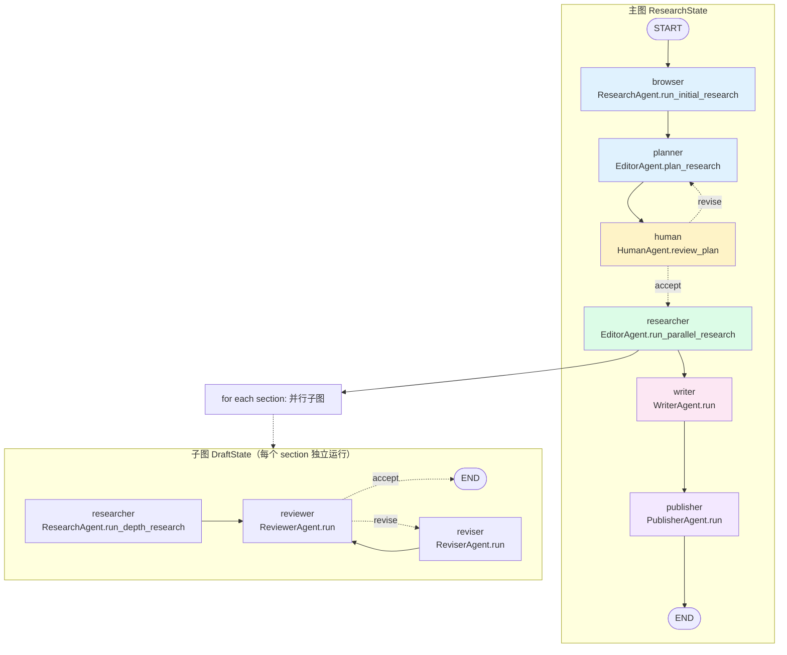

# 06. 多 Agent 上篇：LangGraph 架构、StateGraph 与 ChiefEditor 编排

## 模块概述

`multi_agents/` 是项目的**第二种形态**——基于 [LangGraph](https://langchain-ai.github.io/langgraph/) 的多 Agent 流水线。它不是替代单 Agent，而是**把单 Agent 当作其中一个节点**复用。

灵感来自 STORM 论文（Stanford 2024）：让一个团队（Editor / Researcher / Reviewer / Reviser / Writer / Publisher）协作产出长报告，比单 Agent 一遍写到底质量高得多。

本上篇聚焦 **架构骨架**：

| 关注点 | 文件 |
|---|---|
| **入口与任务定义** | `multi_agents/main.py`、`multi_agents/task.json` |
| **总编 / 总图装配** | `multi_agents/agents/orchestrator.py:ChiefEditorAgent` |
| **State 数据结构** | `multi_agents/memory/research.py:ResearchState`、`memory/draft.py:DraftState` |
| **LangGraph 原语在本项目里的用法** | `StateGraph` / `add_node` / `add_edge` / `add_conditional_edges` / `compile` / `ainvoke` |

下篇（07）才会深入每个 Agent 的具体实现、并行子图、Reviewer-Reviser 闭环、AG2 实现对比。

---

## 架构 / 流程图

### 双层 StateGraph：主图 + 并行子图



> 注意 **HumanAgent 的条件边**：当 `human_feedback is None` → 走 `accept` 进 researcher；非 None → 走 `revise` 回到 planner。这就是 HITL（Human-in-the-Loop）在 LangGraph 里的标准实现。

### 主图节点 → State 字段写入对照表

```
节点 (node)             函数返回的 dict 会 merge 到 ResearchState 的字段
────────────────────────────────────────────────────────────────────────
browser     ResearchAgent.run_initial_research → {initial_research}
planner     EditorAgent.plan_research          → {title, date, sections}
human       HumanAgent.review_plan             → {human_feedback}
researcher  EditorAgent.run_parallel_research  → {research_data}
writer      WriterAgent.run                    → {report, headers, table_of_contents,
                                                   introduction, conclusion, sources, ...}
publisher   PublisherAgent.run                 → {} (副作用：写文件)
```

### 调用栈：从命令行到 graph.ainvoke

```
multi_agents/main.py
   ├─ open_task()                         # 读 task.json，可被 STRATEGIC_LLM env 覆盖 model
   └─ ChiefEditorAgent(task)
        └─ run_research_task(task_id)
            ├─ init_research_team()       # 构图（不编译）
            │    ├─ _initialize_agents()  # 5 个 Agent 实例
            │    └─ _create_workflow()    # StateGraph + add_node + add_edge
            └─ chain = research_team.compile()   # ← LangGraph 编译
                config = {"configurable": {"thread_id": ..., "thread_ts": ...}}
                await chain.ainvoke({"task": self.task}, config=config)
```

---

## 核心源码解析

### 1) 入口：从 `task.json` 到 ChiefEditor

`multi_agents/main.py`

```python
def open_task():
    current_dir = os.path.dirname(os.path.abspath(__file__))
    task_json_path = os.path.join(current_dir, 'task.json')
    with open(task_json_path, 'r') as f:
        task = json.load(f)

    # ★ 关键设计：env 可以覆盖 task.json 的 model
    strategic_llm = os.environ.get("STRATEGIC_LLM")
    if strategic_llm and ":" in strategic_llm:
        # 取冒号后的部分作为模型名 (e.g. "openai:gpt-4o" → "gpt-4o")
        task["model"] = strategic_llm.split(":", 1)[1]
    elif strategic_llm:
        task["model"] = strategic_llm
    return task

async def main():
    task = open_task()
    chief_editor = ChiefEditorAgent(task)
    return await chief_editor.run_research_task(task_id=uuid.uuid4())

if __name__ == "__main__":
    asyncio.run(main())
```

**`task.json` 字段含义**：

```json
{
  "query": "Is AI in a hype cycle?",
  "max_sections": 3,                         // 子主题数量上限（==并行子图数量）
  "publish_formats": {"markdown": true, "pdf": true, "docx": true},
  "include_human_feedback": false,           // HITL 总开关
  "follow_guidelines": false,                // 是否在 Reviewer 里强制校验
  "model": "gpt-4o",                         // 给所有节点用的 model（覆盖 cfg.smart_llm）
  "guidelines": ["MUST be APA", "MUST in spanish", ...],
  "verbose": true
}
```

> ⚠️ 多 Agent 形态下，**`task["model"]` 只覆盖一部分调用**——Editor / Reviewer / Writer 里通过 `call_model(prompt, model=task["model"])` 传进去；但 ResearchAgent 内部的 GPTResearcher 仍按 `cfg.smart_llm` / `cfg.fast_llm` 走（→ 07 篇会展开）。

### 2) `ChiefEditorAgent`：装配总图

`multi_agents/agents/orchestrator.py`

```python
from langgraph.graph import StateGraph, END
from ..memory.research import ResearchState
from . import WriterAgent, EditorAgent, PublisherAgent, ResearchAgent, HumanAgent

class ChiefEditorAgent:
    def __init__(self, task, websocket=None, stream_output=None, tone=None, headers=None):
        self.task = task
        self.websocket = websocket
        self.stream_output = stream_output
        self.headers = headers or {}
        self.tone = tone
        self.task_id = self._generate_task_id()         # int(time.time())
        self.output_dir = self._create_output_directory()  # ./outputs/run_<id>_<query[:40]>/

    def _initialize_agents(self):
        return {
            "writer":    WriterAgent(self.websocket, self.stream_output, self.headers),
            "editor":    EditorAgent(self.websocket, self.stream_output, self.tone, self.headers),
            "research":  ResearchAgent(self.websocket, self.stream_output, self.tone, self.headers),
            "publisher": PublisherAgent(self.output_dir, self.websocket, self.stream_output, self.headers),
            "human":     HumanAgent(self.websocket, self.stream_output, self.headers),
        }

    def _create_workflow(self, agents):
        workflow = StateGraph(ResearchState)               # ① 用 TypedDict 当 State

        # ② 6 个节点（注意：editor 同时被绑到两个节点 planner 和 researcher）
        workflow.add_node("browser",    agents["research"].run_initial_research)
        workflow.add_node("planner",    agents["editor"].plan_research)
        workflow.add_node("researcher", agents["editor"].run_parallel_research)
        workflow.add_node("writer",     agents["writer"].run)
        workflow.add_node("publisher",  agents["publisher"].run)
        workflow.add_node("human",      agents["human"].review_plan)

        self._add_workflow_edges(workflow)
        return workflow

    def _add_workflow_edges(self, workflow):
        workflow.add_edge('browser',   'planner')          # 串行
        workflow.add_edge('planner',   'human')
        workflow.add_edge('researcher','writer')
        workflow.add_edge('writer',    'publisher')
        workflow.set_entry_point("browser")                # 入口
        workflow.add_edge('publisher', END)                # 出口

        # ★ 条件边：HITL 的核心
        workflow.add_conditional_edges(
            'human',
            lambda review: "accept" if review['human_feedback'] is None else "revise",
            {"accept": "researcher", "revise": "planner"}
        )

    def init_research_team(self):
        agents = self._initialize_agents()
        return self._create_workflow(agents)

    async def run_research_task(self, task_id=None):
        research_team = self.init_research_team()
        chain = research_team.compile()                    # ③ 编译为可执行 chain

        config = {
            "configurable": {
                "thread_id": task_id,                      # ④ checkpoint 用
                "thread_ts": datetime.datetime.utcnow()
            }
        }
        result = await chain.ainvoke({"task": self.task}, config=config)
        return result
```

**几个不显眼但关键的设计**：

1. **EditorAgent 绑两个节点**：`planner` 走 `plan_research`，`researcher` 走 `run_parallel_research`。LangGraph 的节点不是"agent"而是"函数引用"——同一个 Agent 可以提供多个节点函数。
2. **`compile()` 是编译动作**：`StateGraph` 仅是定义，`compile()` 才把它变成可调用的 `Runnable`。这跟 LangChain LCEL 的"编译时"概念一致。
3. **`config["configurable"]`** 包含 `thread_id` —— 是给 `Checkpointer`（持久化层）用的标识。本项目这里没启用 Checkpointer（`from langgraph.checkpoint.memory import MemorySaver` 这行被注释掉了），所以 `thread_id` 实际未生效，**但保留了启用入口**。
4. **不存在显式"start"节点**——`set_entry_point("browser")` 让 START 直接连到 browser。

### 3) State：单一 dict 贯穿 6 节点

`multi_agents/memory/research.py`

```python
from typing import TypedDict, List, Annotated
import operator

class ResearchState(TypedDict):
    task: dict                    # 用户初始 task.json
    initial_research: str         # browser 节点产物
    sections: List[str]           # planner 节点产物
    research_data: List[dict]     # researcher 节点产物（并行 N 个 section 的 draft）
    human_feedback: str           # human 节点产物（None 表示放行）

    # writer 节点产物
    title: str
    headers: dict
    date: str
    table_of_contents: str
    introduction: str
    conclusion: str
    sources: List[str]
    report: str
```

**State 合并规则**：

- 默认行为：每个节点返回的 dict 直接 `update` 进 State（同名 key 覆盖旧值）。
- 高级用法（本项目没用）：在 TypedDict 字段上加 `Annotated[..., operator.add]` 表示"累加"，常用于多个节点同时往一个 list 写。本项目用 `import operator` 但实际没用 `Annotated`——这是预留。

`multi_agents/memory/draft.py`（子图用）：

```python
class DraftState(TypedDict):
    task: dict
    topic: str               # 当前 section 名
    draft: dict              # researcher 节点产物
    review: str              # reviewer 节点产物（None=通过）
    revision_notes: str      # reviser 节点产物
```

### 4) HumanAgent：HITL 条件边的"驱动器"

`multi_agents/agents/human.py`

```python
class HumanAgent:
    async def review_plan(self, research_state: dict):
        task   = research_state.get("task")
        layout = research_state.get("sections")
        user_feedback = None

        if task.get("include_human_feedback"):                  # ★ 总开关
            if self.websocket and self.stream_output:
                # WebSocket 模式：把 plan 推前端，等用户回复
                await self.stream_output("human_feedback", "request",
                    f"Any feedback on this plan? {layout}? Reply 'no' to accept.",
                    self.websocket)
                response = await self.websocket.websocket.receive_text()
                response_data = json.loads(response)
                if response_data.get("type") == "human_feedback":
                    user_feedback = response_data.get("content")
            else:
                # CLI 模式：直接 input()
                user_feedback = input(f"Any feedback on this plan? {layout}? ...")

        # 'no' 视为放行
        if user_feedback and "no" in user_feedback.strip().lower():
            user_feedback = None

        return {"human_feedback": user_feedback}
```

主图的条件边据此判定：

```python
workflow.add_conditional_edges(
    'human',
    lambda review: "accept" if review['human_feedback'] is None else "revise",
    {"accept": "researcher", "revise": "planner"}
)
```

> 当 `include_human_feedback=False` 时，`HumanAgent.review_plan` 直接返回 `{"human_feedback": None}` —— 等于一个"无操作 pass-through"节点。这种"开关式 HITL"是 LangGraph 项目里非常常见的模式。

### 5) `EditorAgent.run_parallel_research`：节点内启动子图

`multi_agents/agents/editor.py:52`

```python
async def run_parallel_research(self, research_state):
    agents   = self._initialize_agents()                # ResearchAgent / ReviewerAgent / ReviserAgent
    workflow = self._create_workflow()                  # 子图 StateGraph(DraftState)
    chain    = workflow.compile()

    queries = research_state.get("sections")            # planner 给的 section 列表
    title   = research_state.get("title")

    self._log_parallel_research(queries)

    # ★ 关键：每个 section 一个独立子图实例，全部 gather
    final_drafts = [
        chain.ainvoke(
            self._create_task_input(research_state, query, title),
            config={"tags": ["gpt-researcher"]}
        )
        for query in queries
    ]
    research_results = [
        result["draft"] for result in await asyncio.gather(*final_drafts)
    ]
    return {"research_data": research_results}

def _create_workflow(self):
    agents = self._initialize_agents()
    workflow = StateGraph(DraftState)
    workflow.add_node("researcher", agents["research"].run_depth_research)
    workflow.add_node("reviewer",   agents["reviewer"].run)
    workflow.add_node("reviser",    agents["reviser"].run)
    workflow.set_entry_point("researcher")
    workflow.add_edge("researcher", "reviewer")
    workflow.add_edge("reviser",    "reviewer")
    workflow.add_conditional_edges(
        "reviewer",
        lambda draft: "accept" if draft["review"] is None else "revise",
        {"accept": END, "revise": "reviser"},
    )
    return workflow
```

> 这是**典型的 Map-Reduce 模式**：主图节点内部展开成 N 个独立子图实例（map），asyncio.gather 收集（reduce）。LangGraph 0.2+ 提供了原生的 `Send` API 来表达同一意图，本项目用的是更朴素的"手工 gather"。

### 6) `call_model`：所有节点共享的 LLM 调用门面

`multi_agents/agents/utils/llms.py`

```python
async def call_model(prompt: list, model: str, response_format: str | None = None):
    cfg = Config()
    lc_messages = convert_openai_messages(prompt)        # OpenAI message 格式 → LangChain
    try:
        response = await create_chat_completion(
            model=model,
            messages=lc_messages,
            temperature=0,                                # ← 所有规划/评审都求确定性
            llm_provider=cfg.smart_llm_provider,
            llm_kwargs=cfg.llm_kwargs,
        )
        if response_format == "json":
            # 双层 JSON 容错：parse_json_markdown 抓 ```json ``` 块 + json_repair 修复
            return parse_json_markdown(response, parser=json_repair.loads)
        return response
    except Exception as e:
        logger.error(f"Error in calling model: {e}")
```

注意**这里复用的是 `gpt_researcher.utils.llm.create_chat_completion`**——多 Agent 没有自己的 LLM 调用栈，完全继承单 Agent 的实现（包括 01 篇讲过的 10 次重试 + 流式判断 + cost_callback）。

### 7) `EditorAgent.plan_research`：典型的"节点-prompt-LLM-State" 写法

```python
async def plan_research(self, research_state):
    initial_research = research_state.get("initial_research")
    task = research_state.get("task")
    include_human_feedback = task.get("include_human_feedback")
    human_feedback = research_state.get("human_feedback")    # ← 第二次进入时（revise 路径）会有值
    max_sections = task.get("max_sections")

    prompt = self._create_planning_prompt(
        initial_research, include_human_feedback, human_feedback, max_sections)

    plan = await call_model(
        prompt=prompt,
        model=task.get("model"),
        response_format="json",
    )

    return {
        "title":    plan.get("title"),
        "date":     plan.get("date"),
        "sections": plan.get("sections"),
    }
```

prompt 末段：

```
You must return nothing but a JSON with the fields 'title' (str) and 
'sections' (maximum {max_sections} section headers) with the following structure:
'{{title: string research title, date: today's date, 
   sections: ['section header 1', ...]}}'.
```

> 与 03 篇思路一致：prompt 注入"必须输出 JSON"约束，调用方用 `parse_json_markdown + json_repair` 容错——**多 Agent 形态完全沿用了单 Agent 的"自愈 JSON"风格**。

---

## 技术原理深度解析

### A. LangGraph `StateGraph` 三件套

```
1) State 定义：TypedDict（可选 Annotated 指定 reducer）
2) 节点 (Node)：async def 函数，签名 (state) -> partial_state_dict
3) 边 (Edge)：
   ├─ 普通边：add_edge(from, to)
   ├─ 条件边：add_conditional_edges(from, router_fn, mapping_dict)
   ├─ 入口：set_entry_point(name) 或 add_edge(START, name)
   └─ 出口：add_edge(name, END)
```

**节点函数的契约**：

```python
async def my_node(state: ResearchState) -> dict:
    # 1) 读 state（不要 mutate 原 state，永远新建 dict 返回）
    x = state["initial_research"]
    # 2) 计算
    new_value = await llm_call(...)
    # 3) 返回 partial state，框架会 merge
    return {"sections": new_value}
```

返回字典里**没出现的字段保持不变**，**出现的字段被覆盖**（除非用 `Annotated[..., operator.add]` 累加）。

### B. `add_conditional_edges` 的执行顺序

```python
workflow.add_conditional_edges(
    'human',
    lambda review: "accept" if review['human_feedback'] is None else "revise",
    {"accept": "researcher", "revise": "planner"}
)
```

LangGraph 在 'human' 节点完成后：

1. 先把节点返回值 merge 进 state；
2. 把**完整 state** 传给 router 函数 `lambda review: ...`（注意参数是 state，不是 partial）；
3. router 返回字符串（"accept" / "revise"）；
4. 在 mapping 里查到对应的下一节点，跳过去。

> 一个常见 bug：router 里读 state 字段名拼错→永远走默认分支。debug 时记得 `print(review.keys())`。

### C. 子图 vs `Send`：Map-Reduce 两种风格

**本项目用法**（手工 gather）：

```python
chain = sub_workflow.compile()
final_drafts = [chain.ainvoke(input_i, config=...) for i in queries]
results = await asyncio.gather(*final_drafts)
```

**LangGraph 原生 `Send`**：

```python
from langgraph.constants import Send
def fanout(state):
    return [Send("sub_node", {"topic": q}) for q in state["sections"]]
workflow.add_conditional_edges("planner", fanout)
```

两者效果等价，但 `Send` 把 fanout 也表达为图边，可视化时更完整；本项目早于 `Send` 稳定版，所以走 gather。下篇会讨论这个选择。

### D. Checkpointer：本项目预留但未启用

`orchestrator.py` 顶部注释掉的：

```python
# from langgraph.checkpoint.memory import MemorySaver
```

启用方式：

```python
from langgraph.checkpoint.memory import MemorySaver
memory = MemorySaver()
chain = research_team.compile(checkpointer=memory)
```

启用后：

- 每个节点完成都把 state 持久化到 `MemorySaver`（也可用 `SqliteSaver` / `PostgresSaver`）；
- `config["configurable"]["thread_id"]` 区分不同执行流；
- 中断后能从最后一次 checkpoint 恢复——这才是 `thread_id`/`thread_ts` 的真正用途。

> 项目当前**有 thread_id 没 checkpointer**，等于把"恢复入口"留好但暂不接入。是合理的"少做但留接口"。

### E. 与单 Agent 的复用边界

```
单 Agent 形态 (gpt_researcher/)
  └─ GPTResearcher 类是聚合根

  ↑ 被复用为：

多 Agent 形态 (multi_agents/)
  ├─ ResearchAgent.run_initial_research   →  内部 new GPTResearcher(...)
  ├─ ResearchAgent.run_depth_research     →  内部 new GPTResearcher(report_type="subtopic_report")
  └─ EditorAgent / WriterAgent / Reviewer  →  自己写 prompt + call_model（不依赖 GPTResearcher）
```

**核心原则**：需要"做研究"的活儿（搜索/抓取/向量召回）就 new 一个 `GPTResearcher` 让单 Agent 干；需要"写策略性文本"的活儿（计划 / 评审 / 改稿）就直接 prompt + call_model。下篇会逐个 Agent 验证这条原则。

---

## 关键设计决策

| 决策 | 取舍 |
|---|---|
| **用 LangGraph 而非 LangChain Sequential** | 真正需要"条件边 + 子图"才能表达 Reviewer-Reviser 闭环；LCEL Chain 做不出 |
| **State 用 TypedDict 而非 Pydantic** | TypedDict 轻量、无运行时校验；LangGraph 0.x 时 Pydantic 还不是一等公民 |
| **EditorAgent 绑两个节点** | 同一个"角色"可以承担多个职责（规划 + 调度并发），不是 1:1 映射 |
| **HumanAgent 当作"开关节点"** | 即使 `include_human_feedback=False` 也保留节点；让"开/关 HITL"无需改图 |
| **手工 gather 而非 Send API** | 项目历史早于 Send 稳定版；下篇会讨论是否值得改 |
| **Checkpointer 注释掉** | 留接口、不增加学习曲线；生产部署应启用 SqliteSaver / PostgresSaver |
| **`task["model"]`只覆盖一部分 LLM 调用** | 让用户能用一个 model 跑全流程，但保留 cfg.fast_llm 不变（节省 plan_research_outline 等用 fast 的成本） |
| **`call_model` 内部 `temperature=0`** | 多 Agent 里所有"规划/评审/改稿"都求确定性 |
| **任务定义在 task.json**而非命令行参数 | 复杂任务（guidelines、publish_formats 嵌套）用 JSON 自然；CLI 风格不适合多字段 |

替代方案讨论：

- **State 改 Pydantic**：能在节点入参/出参做 schema 校验，调试更早暴露 bug；代价是 LangGraph 部分能力（如 `Annotated[..., add]`）需要换写法。
- **手工 gather → Send**：更"图原生"，可视化更好；但 `Send` 对错误处理与中间状态写回的约束更强，要重新审视 `_create_task_input` 的写法。
- **多 Agent 用 AG2**：项目同时有 `multi_agents_ag2/`，下篇做对比。

---

## 与其他模块的关联

```
多 Agent 形态依赖的"单 Agent 资产"：
  ├─ Config / GenericLLMProvider（→ 01）
  ├─ create_chat_completion（→ 03）
  ├─ GPTResearcher 类（→ 02）：被 ResearchAgent 内部 new
  ├─ Memory / VectorStore（→ 05）：通过 GPTResearcher 间接用
  └─ Retrievers / Scrapers（→ 04）：同上

多 Agent 自有：
  ├─ ChiefEditorAgent / WriterAgent / EditorAgent / HumanAgent / PublisherAgent
  ├─ ResearchAgent / ReviewerAgent / ReviserAgent
  ├─ ResearchState / DraftState
  └─ utils/{llms.py, views.py, file_formats.py, utils.py}

下游：
  ├─ backend/server/multi_agent_runner.py（→ 10 篇）：FastAPI WebSocket 调度
  └─ langgraph.json：LangGraph Studio 调试入口
```

---

## 实操教程

### 例 1：跑通最小多 Agent 流程

```bash
cd multi_agents
pip install -r requirements.txt
export OPENAI_API_KEY=sk-...
export TAVILY_API_KEY=tvly-...
python main.py
```

默认会用 `task.json` 里的 query "Is AI in a hype cycle?"，跑完后输出在 `multi_agents/outputs/run_<id>_<query>/` 下：

```
outputs/run_1731234567_Is_AI_in_a_hype_cycle/
├── report.md
├── report.pdf
└── report.docx
```

### 例 2：开 HITL，在 CLI 中给反馈

```bash
# 编辑 task.json：
# {
#   "include_human_feedback": true,
#   ...
# }
python main.py
```

跑到 planner 节点后会看到：
```
Any feedback on this plan? ['Section 1', 'Section 2', 'Section 3']? If not, please reply with 'no'.
>> please add a section about Anthropic
```

输入非 "no" 后，graph 走 `revise` 边回到 planner，重新生成 plan（带上你的 feedback）。

### 例 3：用 LangGraph Studio 可视化（dev tool）

项目根目录 `langgraph.json`：

```json
{
  "dependencies": ["./"],
  "graphs": { "agent": "./multi_agents/agent.py:graph" },
  "env": ".env"
}
```

`multi_agents/agent.py` 提供了一个最小的 graph 给 LangGraph Studio：

```python
from multi_agents.agents import ChiefEditorAgent
chief_editor = ChiefEditorAgent({...task...}, websocket=None, stream_output=None)
graph = chief_editor.init_research_team()
graph = graph.compile()
```

启动：

```bash
pip install langgraph-cli
langgraph dev
# 打开 http://localhost:8123 拖动节点 / 看 state 变化
```

### 例 4：自己写一个最小 LangGraph 主图（剥离业务）

```python
# scripts/min_langgraph_demo.py
import asyncio
from typing import TypedDict
from langgraph.graph import StateGraph, END

class State(TypedDict):
    query: str
    plan: list
    draft: str

async def planner(state):
    print("[planner]", state["query"])
    return {"plan": ["intro", "body", "conclusion"]}

async def writer(state):
    print("[writer]", state["plan"])
    return {"draft": " | ".join(state["plan"])}

async def main():
    g = StateGraph(State)
    g.add_node("planner", planner)
    g.add_node("writer", writer)
    g.set_entry_point("planner")
    g.add_edge("planner", "writer")
    g.add_edge("writer", END)
    chain = g.compile()
    out = await chain.ainvoke({"query": "demo", "plan": [], "draft": ""})
    print(out)

asyncio.run(main())
# {'query': 'demo', 'plan': ['intro', 'body', 'conclusion'], 'draft': 'intro | body | conclusion'}
```

### 例 5：用 SqliteSaver 启用持久化

```python
# scripts/multi_agent_with_persistence.py
import asyncio, uuid
from dotenv import load_dotenv; load_dotenv()
from langgraph.checkpoint.sqlite import SqliteSaver
from multi_agents.agents import ChiefEditorAgent
from multi_agents.main import open_task

async def main():
    task = open_task()
    chief = ChiefEditorAgent(task)
    graph = chief.init_research_team()

    async with SqliteSaver.from_conn_string("./checkpoints.sqlite") as memory:
        chain = graph.compile(checkpointer=memory)
        config = {"configurable": {"thread_id": str(uuid.uuid4())}}
        result = await chain.ainvoke({"task": task}, config=config)
        print(result.get("report")[:300])

asyncio.run(main())
```

启用后：
- 任意节点中断（异常 / Ctrl+C），下次可以同 `thread_id` 续跑；
- `chain.aget_state(config)` 能查看任意时刻的 State 快照。

### 常见问题与 Debug 技巧

| 症状 | 排查 |
|---|---|
| `KeyError: 'task'` 在 browser 节点 | `ainvoke({"task": ...})` 入参漏了 task；`ResearchState` 里 task 是必填项 |
| HumanAgent 一直走 revise 不停 | feedback 输入 "ok" 不被识别为放行；只有完全包含 "no" 才视为放行（看源码 `if "no" in user_feedback.strip().lower()`） |
| 子图 ainvoke 都成功但 research_data 全空 | 检查 `_create_task_input` 是否漏字段，或 ResearchAgent.run_depth_research 在异常时返回了空 draft |
| `task["model"]` 设了不生效 | model 名错（如 "gpt4o" 漏了点）→ 看 cfg.smart_llm 兜底；务必用 `provider:model` 全限定 |
| 想看图结构但跑不动 LangGraph Studio | `print(graph.get_graph().draw_mermaid())` 直接打印 mermaid |
| Checkpointer 启用后报 sqlite 锁 | SqliteSaver 不适合多并发，生产用 `PostgresSaver` |

### 进阶练习建议

1. **改用 `Send` API**：把 `EditorAgent.run_parallel_research` 的手工 gather 改成用 LangGraph 原生 `Send`，对比可观测性差异。
2. **加一条"质量门"边**：在 publisher 之前加一个 `quality_gate` 节点，只有当 `len(report.split()) > 800` 才能走 publisher。
3. **State 拆分**：把 ResearchState 拆成 `PlanningState`（前半段）和 `WritingState`（后半段），用 LangGraph subgraph 串起来。
4. **加 SqliteSaver 持久化**：让任务可以"中断 → 重启 → 续跑"，验证 thread_id。

---

## 延伸阅读

1. [LangGraph 官方文档](https://langchain-ai.github.io/langgraph/) — `StateGraph` / 子图 / Checkpointer / `Send` 全部在这里。
2. [STORM: Synthesizing Topic Outlines through Retrieval and Multi-perspective Question Asking](https://arxiv.org/abs/2402.14207) — 项目多 Agent 拓扑的论文起源。
3. [LangGraph Studio docs](https://langchain-ai.github.io/langgraph/cloud/) — 可视化调试工具。
4. [Plan-and-Solve Prompting](https://arxiv.org/abs/2305.04091) — Editor 节点的 prompt 哲学背后。
5. 项目自带的 [`multi_agents/README.md`](../multi_agents/README.md) — 作者对 8 个 Agent 角色定义的官方说明。

---

> ✅ 本篇结束。下一篇 **`07_multi_agents_part2_workflow.md`** 会逐个 Agent 拆开看：
> 1. `ResearchAgent.run_initial_research` 与 `run_depth_research` 如何包装单 Agent；
> 2. `ReviewerAgent / ReviserAgent` 的 LLM-as-Judge 闭环（最多几次循环？怎么避免死锁？）；
> 3. `WriterAgent / PublisherAgent` 的多格式输出与文件落盘；
> 4. `multi_agents_ag2/` 用 AutoGen 的对比实现。
> 回复 **"继续"** 即可。
