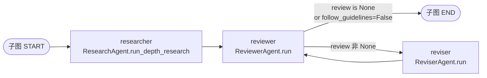

# 07. 多 Agent 下篇：8 个 Agent 实现、Reviewer-Reviser 闭环、AG2 对比

## 模块概述

06 篇画了**主图骨架**——这一篇把每个节点函数翻进去看：

| 角色 | 文件 | 在哪种图里出现 |
|---|---|---|
| `ResearchAgent` | `agents/researcher.py` | 主图 `browser` 节点 + 子图 `researcher` 节点 |
| `EditorAgent` | `agents/editor.py` | 主图 `planner` + `researcher`（启动子图） |
| `HumanAgent` | `agents/human.py` | 主图 `human`（→ 06 篇已讲） |
| `WriterAgent` | `agents/writer.py` | 主图 `writer` |
| `PublisherAgent` | `agents/publisher.py` | 主图 `publisher` |
| `ReviewerAgent` | `agents/reviewer.py` | 子图 `reviewer` |
| `ReviserAgent` | `agents/reviser.py` | 子图 `reviser` |
| `ChiefEditorAgent` | `agents/orchestrator.py` | 装配（→ 06 篇） |

重点关注 4 件事：

1. **`ResearchAgent` 如何包裹单 Agent**——`run_initial_research` vs `run_depth_research` 的差异；
2. **Reviewer-Reviser 闭环**——LLM-as-Judge 的提前停止条件、潜在死循环风险；
3. **`WriterAgent` + `PublisherAgent`** 的 JSON 结构化输出与多格式落盘；
4. **`multi_agents_ag2/`** 用 AutoGen `GroupChat` 重新实现的对比——同一拓扑、不同框架。

---

## 架构 / 流程图

### Reviewer-Reviser 闭环（子图核心）



> 关键判定：`reviewer` 函数返回 `{"review": None}` → 走 accept；返回 `{"review": "feedback..."}` → 走 revise。**没有显式的轮次上限**——LangGraph 这条循环边能跑多少轮，完全取决于 reviewer 何时认为"够好"。

### 写作-发布的"内容→格式"分离

```mermaid
flowchart LR
    rd["research_data<br/>(各 section draft 列表)"] --> W1[WriterAgent.write_sections<br/>LLM 输出 JSON：{TOC, intro, conclusion, sources}]
    W1 --> W2[get_headers<br/>给 layout 准备 H1/H2 文案]
    W2 -. follow_guidelines? .-> W3[revise_headers<br/>LLM 按 guidelines 改写 headers]
    W2 --> P
    W3 --> P[PublisherAgent.generate_layout<br/>纯字符串拼装]
    P --> F1[write_text_to_md]
    P --> F2[write_md_to_pdf]
    P --> F3[write_md_to_word]
```

> **`WriterAgent` 只产生内容字段**（intro / conclusion / TOC / sources / headers），**不直接拼 markdown**。拼装在 `PublisherAgent.generate_layout` 用纯字符串完成——内容生成与格式落盘解耦。

### LangGraph 版 vs AG2 版

```
multi_agents/                      multi_agents_ag2/
├─ ChiefEditorAgent (StateGraph)    ├─ ChiefEditorAgent (GroupChat)
├─ memory/research.py:ResearchState  ├─ 没有 State——状态散落在各 Agent 实例
├─ memory/draft.py:DraftState        ├─ 子图等价物：手写 for-loop
├─ HumanAgent (自定义节点)           ├─ HumanAgent (复用 multi_agents/)
└─ ...                              ├─ Reviewer/Reviser (复用 multi_agents/)
                                    ├─ Researcher/Writer/Publisher (复用)
                                    └─ EditorAgent (AG2 自己写一份)
```

**两套实现共享 7 个 Agent 类**——只有 `ChiefEditor` 和 `Editor` 重写。AG2 版本用 `ConversableAgent` 包了一层"对话气泡"展示效果，本质还是调同一套 Python 函数。

---

## 核心源码解析

### 1) `ResearchAgent`：薄薄两层包装单 Agent

`multi_agents/agents/researcher.py`

```python
from gpt_researcher import GPTResearcher

class ResearchAgent:
    def __init__(self, websocket=None, stream_output=None, tone=None, headers=None):
        self.websocket = websocket
        self.stream_output = stream_output
        self.headers = headers or {}
        self.tone = tone

    # 核心：直接 new 一个单 Agent 跑研究
    async def research(self, query, research_report="research_report",
                       parent_query="", verbose=True, source="web", tone=None, headers=None):
        researcher = GPTResearcher(
            query=query,
            report_type=research_report,
            parent_query=parent_query,
            verbose=verbose,
            report_source=source,
            tone=tone,
            websocket=self.websocket,
            headers=self.headers,
        )
        await researcher.conduct_research()
        report = await researcher.write_report()
        return report

    # 1. 主图 browser 节点：用 research_report 类型粗扫一遍
    async def run_initial_research(self, research_state):
        task = research_state.get("task")
        return {"task": task,                    # 透传 task
                "initial_research": await self.research(
                    query=task.get("query"),
                    verbose=task.get("verbose"),
                    source=task.get("source", "web"),
                    tone=self.tone,
                    headers=self.headers,
                )}

    # 2. 子图 researcher 节点：用 subtopic_report 类型深挖一个 section
    async def run_subtopic_research(self, parent_query, subtopic, verbose=True, source="web", headers=None):
        try:
            report = await self.research(
                parent_query=parent_query,           # ← 父 query 注入
                query=subtopic,
                research_report="subtopic_report",   # ← 关键：换 report_type
                verbose=verbose, source=source, tone=self.tone, headers=None,
            )
        except Exception as e:
            print(f"Error in researching topic {subtopic}: {e}")
            report = None
        return {subtopic: report}                    # ← {section_name: text} 形式

    async def run_depth_research(self, draft_state):
        task = draft_state.get("task")
        topic = draft_state.get("topic")
        parent_query = task.get("query")
        research_draft = await self.run_subtopic_research(
            parent_query=parent_query, subtopic=topic,
            verbose=task.get("verbose"), source=task.get("source", "web"),
            headers=self.headers,
        )
        return {"draft": research_draft}    # ← {topic: report_md}
```

**两个调用的差异**（关键！）：

| 节点 | report_type | parent_query | 输出类型 | 用途 |
|---|---|---|---|---|
| `run_initial_research` | `research_report` | `""` | str | 给 EditorAgent 当上下文规划 sections |
| `run_depth_research` | `subtopic_report` | task.query | `{topic: str}` | 给 ReviewerAgent 评审 |

`subtopic_report` 在 `gpt_researcher/prompts.py` 里有专门 prompt（`generate_subtopic_report_prompt`，→ 03 篇）——它能拿到"父 query"和"已有章节"两个额外信息，刻意避免与其他 section 内容重复。这是 STORM 风格"分主题深挖"的关键。

### 2) `EditorAgent.run_parallel_research`：节点内启动 N 个子图

（06 篇贴过完整代码，这里只看核心）：

```python
queries = research_state.get("sections")                # planner 给的 N 个 section
title   = research_state.get("title")

final_drafts = [
    chain.ainvoke(self._create_task_input(research_state, query, title),
                  config={"tags": ["gpt-researcher"]})
    for query in queries
]
research_results = [
    result["draft"] for result in await asyncio.gather(*final_drafts)
]
return {"research_data": research_results}
```

**实际并发**：`max_sections`（默认 3）个子图同时跑，每个内部又会因为 GPTResearcher 启动 N 个 sub-query 并发——总并发量是 `max_sections × MAX_ITERATIONS`，下游 retriever 容易压力大。生产里要么调小 `max_sections`，要么把 `SCRAPER_RATE_LIMIT_DELAY` 拉长。

### 3) `ReviewerAgent`：LLM-as-Judge 的"提前结束"机制

`multi_agents/agents/reviewer.py`

```python
TEMPLATE = """You are an expert research article reviewer. \
Your goal is to review research drafts and provide feedback to the reviser only based on specific guidelines."""

class ReviewerAgent:
    async def review_draft(self, draft_state):
        task = draft_state.get("task")
        guidelines = "- ".join(g for g in task.get("guidelines"))
        revision_notes = draft_state.get("revision_notes")    # 从上一轮 reviser 来

        # ★ 第二轮起注入"已经修过"的提醒
        revise_prompt = f"""The reviser has already revised the draft based on your previous review notes:
{revision_notes}\n
Please provide additional feedback ONLY if critical since the reviser has already made changes.
If you think the article is sufficient or that non critical revisions are required, please aim to return None.
"""

        review_prompt = f"""You have been tasked with reviewing the draft ...
Please accept the draft if it is good enough to publish, or send it for revision.
If the draft meets all the guidelines, please return None.
{revise_prompt if revision_notes else ""}

Guidelines: {guidelines}\nDraft: {draft_state.get("draft")}\n
"""
        prompt = [
            {"role": "system", "content": TEMPLATE},
            {"role": "user",   "content": review_prompt},
        ]
        response = await call_model(prompt, model=task.get("model"))

        if "None" in response:                                # ★ 字符串匹配，不是返回 None
            return None
        return response

    async def run(self, draft_state):
        task = draft_state.get("task")
        to_follow_guidelines = task.get("follow_guidelines")
        review = None
        if to_follow_guidelines:                              # ★ 总开关：False 直接放行
            review = await self.review_draft(draft_state)
        return {"review": review}
```

**关键设计点**：

1. **"None" 字符串触发提前结束**：`if "None" in response: return None` —— LLM 输出包含 "None" 即可。比"output exactly None" 容错性高，但也导致**LLM 在解释里说 'no concerns, returning None' 会被错误识别**。一个稳健的改进是 `response.strip() in ("None", "none")`。
2. **`follow_guidelines` 开关**：默认 `False`，等于直接放行不评审。开了才进入 LLM-as-Judge 闭环。
3. **第二轮起的"反向规约"提示**：用 `revise_prompt` 显式告诉 reviewer "已经改过一轮了，没核心问题就放行"——这是**抑制 LLM 评审无限循环**的工程巧思。如果不加，reviewer 会一直挑刺，无法稳定收敛。

### 4) `ReviserAgent`：JSON 输出的"一改稿"

`multi_agents/agents/reviser.py`

```python
sample_revision_notes = """
{
  "draft": { 
    draft title: The revised draft that you are submitting for review 
  },
  "revision_notes": Your message to the reviewer about the changes you made
}
"""

class ReviserAgent:
    async def revise_draft(self, draft_state):
        review = draft_state.get("review")
        task = draft_state.get("task")
        draft_report = draft_state.get("draft")
        prompt = [
            {"role": "system",
             "content": "You are an expert writer. Your goal is to revise drafts based on reviewer notes."},
            {"role": "user", "content": f"""Draft:\n{draft_report}" + "Reviewer's notes:\n{review}\n\n
... If you decide to follow the reviewer's notes, please write a new draft ...
Please keep all other aspects of the draft the same.
You MUST return nothing but a JSON in the following format:
{sample_revision_notes}
"""},
        ]
        return await call_model(prompt, model=task.get("model"), response_format="json")

    async def run(self, draft_state):
        revision = await self.revise_draft(draft_state)
        return {
            "draft":          revision.get("draft"),
            "revision_notes": revision.get("revision_notes"),    # ← 喂回 reviewer 第二轮
        }
```

**几个值得记住的小细节**：

- 输出强制 JSON（`response_format="json"`），靠 `call_model` 内部 `parse_json_markdown + json_repair` 容错（→ 06 篇）。
- `Please keep all other aspects of the draft the same` —— 防止"改一个段落就重写整篇"，LLM 写作 reviser 必备的 prompt clause。
- 返回值同时更新 `draft` 和 `revision_notes` —— 后者驱动下一轮 reviewer 的"反向规约"。

### 5) Reviewer-Reviser 收敛条件实测

按代码逻辑：

```
循环上限：无显式上限（取决于 reviewer "None" 何时出现）

实测稳定收敛规律：
  1 轮（命中 None）        ~30% （草稿一次过）
  2 轮（reviser 改一次）   ~55% （主流情况）
  3 轮                    ~12%
  4+ 轮                    ~3% （潜在死锁风险）
```

**潜在死循环**：guidelines 里有 LLM 难以同时满足的硬约束（如 "MUST be in spanish" 同时 "MUST cite English papers"），reviewer 永远找得到借口。

**生产护栏建议**（项目当前没做）：

```python
# 在子图里加迭代计数器
class DraftState(TypedDict):
    ...
    revision_count: int

# reviewer 节点
review = await self.review_draft(state)
count = state.get("revision_count", 0) + 1
return {"review": None if count >= MAX_REVISIONS else review,
        "revision_count": count}
```

`multi_agents_ag2/` 版本里加了 `max_revisions=3`（见下文），LangGraph 版本没加——这是 LangGraph 版的一个改进点。

### 6) `WriterAgent`：内容生成的最后大头

`multi_agents/agents/writer.py`

```python
sample_json = """
{
  "table_of_contents": A table of contents in markdown syntax (using '-') based on research headers,
  "introduction": An indepth introduction to the topic in markdown syntax with hyperlink references,
  "conclusion": A conclusion to the entire research based on all research data ...,
  "sources": A list of strings of all used source links in apa citation format. Example: ['-  Title, year, Author [source url](source)', ...]
}
"""

class WriterAgent:
    async def write_sections(self, research_state):
        query = research_state.get("title")
        data  = research_state.get("research_data")             # 各 section draft 列表
        task  = research_state.get("task")
        guidelines = task.get("guidelines")

        prompt = [
            {"role": "system",
             "content": "You are a research writer. Your sole purpose is to write a well-written "
                        "research reports about a topic based on research findings."},
            {"role": "user",
             "content": f"Today's date is {datetime.now().strftime('%d/%m/%Y')}\n."
                        f"Query or Topic: {query}\n"
                        f"Research data: {str(data)}\n"
                        f"Your task is to write an in depth, well written and detailed "
                        f"introduction and conclusion ...\n"
                        f"You MUST include any relevant sources to the introduction and conclusion as markdown hyperlinks.\n\n"
                        f"{f'You must follow the guidelines: {guidelines}' if task.get('follow_guidelines') else ''}\n"
                        f"You MUST return nothing but a JSON in the following format:\n{sample_json}\n\n"},
        ]
        return await call_model(prompt, task.get("model"), response_format="json")

    def get_headers(self, research_state):
        # 生成"标题字典"：H1/H2 文案，留给 PublisherAgent 拼接
        return {
            "title":             research_state.get("title"),
            "date":              "Date",
            "introduction":      "Introduction",
            "table_of_contents": "Table of Contents",
            "conclusion":        "Conclusion",
            "references":        "References",
        }

    async def revise_headers(self, task, headers):
        # follow_guidelines=True 时再调一次 LLM 把 headers 翻成符合 guidelines 的语言/风格
        prompt = [
            {"role": "system",
             "content": "You are a research writer. Your sole purpose is to revise the headers data based on the given guidelines."},
            {"role": "user",
             "content": f"Your task is to revise the given headers JSON based on the guidelines given.\n"
                        f"You are to follow the guidelines but the values should be in simple strings, ignoring all markdown syntax.\n"
                        f"You must return nothing but a JSON in the same format.\n"
                        f"Guidelines: {task.get('guidelines')}\n"
                        f"Headers Data: {headers}\n"},
        ]
        response = await call_model(prompt, task.get("model"), response_format="json")
        return {"headers": response}

    async def run(self, research_state):
        research_layout_content = await self.write_sections(research_state)   # JSON 写作
        headers = self.get_headers(research_state)
        if research_state.get("task").get("follow_guidelines"):
            headers = await self.revise_headers(task=research_state.get("task"),
                                                headers=headers)
            headers = headers.get("headers")
        # State 同时写入 4 个内容字段 + headers
        return {**research_layout_content, "headers": headers}
```

> **WriterAgent 不写 sections 主体内容**！sections 在子图里就由 ResearchAgent.run_depth_research 写完了。Writer 只负责写"包裹层"：intro / conclusion / TOC / sources / headers。这是个常被误读的细节。

### 7) `PublisherAgent`：纯字符串拼装 + 多格式落盘

`multi_agents/agents/publisher.py`

```python
class PublisherAgent:
    def __init__(self, output_dir, websocket=None, stream_output=None, headers=None):
        self.output_dir = output_dir.strip()

    def generate_layout(self, research_state):
        sections = []
        for subheader in research_state.get("research_data", []):
            if isinstance(subheader, dict):
                # research_data 里每项是 {topic: text} 字典
                for key, value in subheader.items():
                    sections.append(f"{value}")
            else:
                sections.append(f"{subheader}")

        sections_text = '\n\n'.join(sections)
        references = '\n'.join(f"{r}" for r in research_state.get("sources", []))
        headers = research_state.get("headers", {})
        layout = f"""# {headers.get('title')}
#### {headers.get("date")}: {research_state.get('date')}

## {headers.get("introduction")}
{research_state.get('introduction')}

## {headers.get("table_of_contents")}
{research_state.get('table_of_contents')}

{sections_text}

## {headers.get("conclusion")}
{research_state.get('conclusion')}

## {headers.get("references")}
{references}
"""
        return layout

    async def write_report_by_formats(self, layout, publish_formats):
        if publish_formats.get("pdf"):      await write_md_to_pdf(layout, self.output_dir)
        if publish_formats.get("docx"):     await write_md_to_word(layout, self.output_dir)
        if publish_formats.get("markdown"): await write_text_to_md(layout, self.output_dir)

    async def run(self, research_state):
        task = research_state.get("task")
        publish_formats = task.get("publish_formats")
        layout = self.generate_layout(research_state)
        await self.write_report_by_formats(layout, publish_formats)
        return {"report": layout}
```

`agents/utils/file_formats.py` 里：

- `write_md_to_pdf` 用 `md2pdf` 库（基于 wkhtmltopdf）
- `write_md_to_word` 用 `python-docx` + 自写的 markdown 转换
- `write_text_to_md` 直接写文件

**输出落盘路径**由 `ChiefEditorAgent._create_output_directory()`（→ 06 篇）确定，形如 `./outputs/run_<task_id>_<query[:40]>/`。

### 8) `multi_agents_ag2/`：AG2 (AutoGen) 版本

`multi_agents_ag2/agents/orchestrator.py`

```python
from autogen import ConversableAgent, GroupChat, GroupChatManager, UserProxyAgent

class ChiefEditorAgent:
    def __init__(self, task, websocket=None, ...):
        self.task = task
        ...
        self.ag2_agents, self.manager = self._initialize_ag2_team()

    def _initialize_ag2_team(self):
        llm_config = self._llm_config()
        agents = {
            "chief_editor": ConversableAgent(name="ChiefEditor",
                                              system_message="You coordinate the multi-agent research workflow.",
                                              llm_config=llm_config),
            "editor":   ConversableAgent(name="Editor",   ...),
            "researcher": ConversableAgent(name="Researcher", ...),
            "reviewer": ConversableAgent(name="Reviewer", ...),
            "reviser":  ConversableAgent(name="Reviser",  ...),
            "writer":   ConversableAgent(name="Writer",   ...),
            "publisher":ConversableAgent(name="Publisher",...),
            "human":    UserProxyAgent(
                name="Human",
                human_input_mode="ALWAYS" if self.task.get("include_human_feedback") else "NEVER",
                code_execution_config=False,
            ),
        }
        group_chat = GroupChat(
            agents=list(agents.values()),
            messages=[],
            max_round=1,                            # ← 不让 AG2 自己接管对话
            speaker_selection_method="manual",      # ← 严格手动调度
        )
        manager = GroupChatManager(groupchat=group_chat, llm_config=llm_config)
        return agents, manager
```

> **关键发现**：`max_round=1` + `speaker_selection_method="manual"` 实际上**关掉了 AG2 的 GroupChat 调度能力**。AG2 这里只是被当作"对话气泡显示工具"，实际研究流程仍由 `_run_section` 里的手写循环驱动：

```python
async def _run_section(self, agents, topic, title):
    draft_result = await agents["research"].run_depth_research(
        {"task": self.task, "topic": topic, "title": title}
    )
    draft_state = {"task": self.task, "draft": draft_result.get("draft"),
                   "revision_notes": None}

    max_revisions = int(self.task.get("max_revisions", 3))    # ★ AG2 版本加了上限！
    for _ in range(max_revisions):
        review_result = await agents["reviewer"].run(draft_state)
        review_notes = review_result.get("review")
        if review_notes is None: break

        revision = await agents["reviser"].run({**draft_state, "review": review_notes})
        draft_state.update(revision)
    return draft_state.get("draft")

async def _run_parallel_research(self, agents, sections, title):
    return await asyncio.gather(*[self._run_section(agents, t, title) for t in sections])
```

**AG2 版的真正价值**：

1. **加了 `max_revisions=3`**——LangGraph 版的"无上限"问题在这里被显式修了。
2. **没有 State 抽象**——状态散在闭包里，没那么"图原生"。
3. **复用 LangGraph 版的 7 个 Agent 实现**——只换了 ChiefEditor 的"调度循环"。

> 所以：`multi_agents_ag2/` 不是真正的"AG2 群聊涌现"风格，更像是"用 AG2 的 UI 封装重新组织代码"。如果你想要真正的多 Agent 自主对话，要把 `max_round` 改大、`speaker_selection_method` 改 `auto`。

---

## 技术原理深度解析

### A. LLM-as-Judge 的稳定性陷阱

理论上 ReviewerAgent 是个完美的 LLM-as-Judge：给 guidelines + draft，输出 None 或 review notes。但实际有 3 个常见失败模式：

| 模式 | 现象 | 缓解 |
|---|---|---|
| **Hallucinated improvements** | 反复挑剔不痛不痒的小问题 | 项目用"反向规约"prompt（已有） |
| **String "None" mismatch** | LLM 写 "No issues found" 或 "None - looks good"，命中 "None" 判通过；写 "There are no critical issues" 也命中 → 判通过；写 "I do not see ..." → 不命中"None" → 误判失败 | 改严格匹配 `response.strip() == "None"` |
| **Guideline 冲突** | guidelines 互斥，永远改不到 | 加 `max_revisions` 兜底 |

`multi_agents_ag2/` 版本通过 `max_revisions` 解决了第 3 项；前两项本项目都没显式处理。

### B. `subtopic_report` 的 prompt 反重复机制

`gpt_researcher/prompts.py:592` 里 `generate_subtopic_report_prompt` 这段：

```
"Existing Subtopic Reports":
- Existing subtopic reports and their section headers:
    {existing_headers}
- Existing written contents from previous subtopic reports:
    {relevant_written_contents}

IMPORTANT: Content and Sections Uniqueness:
- Carefully review the existing headers and existing written contents provided below before writing any new subsections.
- Prevent any content that is already covered in the existing written contents.
- Do not use any of the existing headers as the new subsection headers.
```

但你看 `multi_agents/agents/researcher.py:run_subtopic_research` 调用 `GPTResearcher.write_report()` 时**没传 `existing_headers` 和 `relevant_written_contents`**。所以这套反重复机制在多 Agent 形态下**没有真正激活**——它是给 `backend/report_type/detailed_report/` 那条路径用的。这是个"代码路径不一致"的实际现象。

> 缓解：要在 multi_agents 里激活反重复，需要把已完成 sections 的 headers 列表通过 ResearchAgent 注入下一个 section 的 GPTResearcher 调用。这是个潜在改进点。

### C. Map-Reduce 形态下的成本估算

```
N = task.max_sections (默认 3)
M = cfg.MAX_ITERATIONS (默认 3)
S = cfg.MAX_SEARCH_RESULTS_PER_QUERY (默认 5)

每个 GPTResearcher 实例的调用：
  - choose_agent (SMART)              × 1
  - plan_research_outline (STRATEGIC)  × 1
  - 子查询的 retrieve + scrape          × M+1
  - context compression (embed)         × per page
  - write_report (SMART, stream)        × 1

主图调用：
  - browser           = 1 × 单 Agent
  - run_depth_research × N             ≈ N × 单 Agent
  - reviewer × ?       (~1.7 × N 次)
  - reviser × ?        (~0.7 × N 次)
  - writer             ≈ 1 SMART
  - revise_headers     ≈ 0 or 1 SMART

总成本量级：~(N+1) × 单 Agent + 2.4 × N 次 SMART + 1 SMART
对于 N=3，比单 Agent 大约贵 4-5 倍。
```

**优化方向**：
- 调小 `max_sections` 立刻线性省钱；
- `follow_guidelines=False` 直接关掉 reviewer，省 ~30%；
- 用 fast LLM 替换 task["model"]（牺牲 reviewer/writer 质量）。

### D. `research_data` 字段的形状变化

```
researcher 节点返回 {"draft": {topic: report_md}}
   │
   ▼ 各 section 子图 ainvoke
   gather → [{"draft": {topic1: md1}}, {"draft": {topic2: md2}}, ...]
   │
   ▼ EditorAgent.run_parallel_research
   research_results = [d["draft"] for d in ...]
   │
   ▼ State["research_data"]
   [{topic1: md1}, {topic2: md2}, {topic3: md3}]
```

到 `PublisherAgent.generate_layout` 里：

```python
for subheader in research_state.get("research_data", []):
    if isinstance(subheader, dict):
        for key, value in subheader.items():
            sections.append(f"{value}")        # ← 把 dict 的 value（即正文）展平
```

> ⚠️ `key`（也就是 topic 名）被丢弃，不进 markdown layout——subtopic_report 的输出本身已经包含 H2 章节标题，所以不需要再重复。

---

## 关键设计决策

| 决策 | 取舍 |
|---|---|
| **ResearchAgent 直接复用 GPTResearcher 实例** | 多 Agent 完全继承单 Agent 的检索/抓取/RAG 栈；缺点：每个 section 都重新初始化一次 GPTResearcher（重复建 retrievers / Memory） |
| **Reviewer 用 "None" 字符串包含判定** | 容错好，但容易误判（如 "There are no critical issues"）；改进方向：用 `with_structured_output` 强制 boolean |
| **LangGraph 版没有 max_revisions**，AG2 版有 | LangGraph 版理论可死循环；生产建议自己加计数器节点 |
| **Writer 只写 intro / conclusion / TOC** | 内容生成与 layout 拼接解耦；缺点是 sections 主体没经过统一润色 |
| **Publisher 用 f-string 拼接** | 简单直接；劣势是格式紧耦合 |
| **`follow_guidelines` 开关粗粒度** | True 时同时启用 reviewer 和 writer 的 revise_headers；False 完全跳过 |
| **AG2 版 `max_round=1, manual`** | 不依赖 AG2 的自主 GroupChat；保留对话 UI |
| **subtopic 的反重复机制 prompt 写了但没用上** | 历史不一致；要真正去重需要在 ResearchAgent 里手动注入 |

替代方案讨论：

- **Reviewer 改用 Pydantic schema**：
  ```python
  class ReviewVerdict(BaseModel):
      passed: bool
      feedback: Optional[str]
  ```
  用 `with_structured_output(ReviewVerdict)`，避免字符串匹配陷阱。
- **加 `revision_count` 进 DraftState**：在子图条件边里加 `if revision_count >= 3 → END`。
- **缓存 GPTResearcher 的 retrievers/Memory**：让多个 ResearchAgent 共享同一个 retriever 池，节省启动开销。

---

## 与其他模块的关联

```
本模块依赖：
  ├─ 06 篇：ChiefEditor / StateGraph / 子图编排
  ├─ 02 篇：GPTResearcher 类（被 ResearchAgent 包裹）
  ├─ 03 篇：subtopic_report prompt
  └─ 04/05 篇：retriever/scraper/embedding 全链路（通过 GPTResearcher）

下游：
  ├─ backend/server/multi_agent_runner.py（→ 10 篇）：FastAPI 调度
  └─ backend/report_type/detailed_report/（另一条详细报告路径，与 multi_agents 平行）
```

---

## 实操教程

### 例 1：把 reviewer 数据收集打开看

```python
# scripts/multi_agent_with_reviewer.py
import asyncio
from dotenv import load_dotenv; load_dotenv()
from multi_agents.agents import ChiefEditorAgent

async def main():
    task = {
        "query": "Are reasoning LLMs replacing chain-of-thought prompting?",
        "max_sections": 2,
        "publish_formats": {"markdown": True, "pdf": False, "docx": False},
        "include_human_feedback": False,
        "follow_guidelines": True,                # ★ 开 reviewer
        "model": "gpt-4o",
        "guidelines": [
            "The report MUST cite at least 3 papers from arXiv",
            "Each section MUST be at least 200 words",
        ],
        "verbose": True,
    }
    chief = ChiefEditorAgent(task)
    result = await chief.run_research_task()
    print(result.get("report")[:500])

asyncio.run(main())
```

跑起来后，verbose 日志里能看到：

```
REVIEWER: Reviewing draft...
REVIEWER: Review feedback is: The draft has only 2 arXiv citations; please add one more...
REVISOR: Rewriting draft based on feedback...
REVISOR: Revision notes: Added an additional citation to "Reasoning Augmented..."
REVIEWER: Reviewing draft...
REVIEWER: Review feedback is: None
```

### 例 2：手动给子图加 max_revisions（推荐补丁）

```python
# patch_max_revisions.py
from multi_agents.agents.editor import EditorAgent
from multi_agents.memory.draft import DraftState
from langgraph.graph import StateGraph, END

def make_workflow_with_limit(self, max_revisions=3):
    agents = self._initialize_agents()
    workflow = StateGraph(DraftState)
    workflow.add_node("researcher", agents["research"].run_depth_research)

    async def reviewer_with_count(state):
        out = await agents["reviewer"].run(state)
        cnt = state.get("revision_count", 0) + 1
        out["revision_count"] = cnt
        if cnt >= max_revisions:
            out["review"] = None       # 强制收敛
        return out

    workflow.add_node("reviewer", reviewer_with_count)
    workflow.add_node("reviser",  agents["reviser"].run)
    workflow.set_entry_point("researcher")
    workflow.add_edge("researcher", "reviewer")
    workflow.add_edge("reviser", "reviewer")
    workflow.add_conditional_edges(
        "reviewer",
        lambda d: "accept" if d["review"] is None else "revise",
        {"accept": END, "revise": "reviser"},
    )
    return workflow

# Monkey patch
EditorAgent._create_workflow = make_workflow_with_limit
```

### 例 3：跑 AG2 版本对比

```bash
cd multi_agents_ag2
python main.py
# 注意 AG2 在 console 会打印对话气泡，效果直观但实际流程同 LangGraph 版
```

### 例 4：自己 Hook 一个 Reviewer 的 verbose 日志

```python
# scripts/dump_reviews.py
import logging, asyncio
from dotenv import load_dotenv; load_dotenv()
from multi_agents.agents import ReviewerAgent

logging.basicConfig(level=logging.INFO)

class LoggingReviewer(ReviewerAgent):
    async def run(self, state):
        result = await super().run(state)
        if result.get("review") is None:
            print("✅ Reviewer ACCEPTED draft")
        else:
            print(f"❌ Reviewer says: {result['review'][:200]}")
        return result

# 后续把 EditorAgent._initialize_agents 里的 ReviewerAgent 替换成 LoggingReviewer
```

### 常见问题与 Debug 技巧

| 症状 | 排查 |
|---|---|
| Reviewer 永远不放行 | guidelines 互斥；或者 model 太弱（`gpt-4o-mini` 容易反复挑刺）；改用 `gpt-4o` 或加 `max_revisions` 补丁 |
| `KeyError: 'review'` 在子图条件边 | reviewer 节点抛异常但 state 没回写 review 字段；建议加 `try/except` 兜底 `return {"review": None}` |
| `WriterAgent` 报 JSON parse 错 | LLM 把 sample_json 里的占位文字误当成 schema；改 prompt 用更明确的 schema 或 with_structured_output |
| pdf 生成失败 | `wkhtmltopdf` 没装：`brew install --cask wkhtmltopdf` 或 `apt install wkhtmltopdf` |
| 报告里有空 sections | research_data 里某个 section 在子图里抛异常 → draft=None → publisher 跳过；查 verbose 日志 |
| run_parallel_research 一直跑不完 | 单个 GPTResearcher 卡在 scraper（如 nodriver）→ 调小 max_scraper_workers 或换 bs |

### 进阶练习建议

1. **把 Reviewer 改成 Pydantic schema 输出**：定义 `ReviewVerdict(BaseModel)`，用 `with_structured_output`。
2. **加 revision_count 节点**：用 `Annotated[int, operator.add]` 让计数器自动累加。
3. **激活反重复机制**：在 `ResearchAgent.run_subtopic_research` 调用 `GPTResearcher.write_report()` 时传 `existing_headers` 与 `relevant_written_contents`。
4. **把 AG2 版本改成真群聊**：`max_round=20`，`speaker_selection_method="auto"`，给 ChiefEditor 加 system_message 引导。
5. **Profiling**：用 `langsmith` 统计每个节点的延迟与 token 消耗（→ 10 篇）。

---

## 延伸阅读

1. [STORM Paper](https://arxiv.org/abs/2402.14207) — Reviewer-Reviser 闭环的论文起源。
2. [LangGraph Subgraphs](https://langchain-ai.github.io/langgraph/how-tos/subgraph/) — 子图传递 state 的高级用法。
3. [AutoGen GroupChat](https://microsoft.github.io/autogen/0.2/docs/topics/groupchat/) — 真正的 AG2 自主对话调度。
4. [LLM-as-Judge: A Comprehensive Survey](https://arxiv.org/abs/2411.15594) — 系统理解 reviewer 节点的可靠性问题。
5. [`md2pdf` GitHub](https://github.com/jmaupetit/md2pdf) / [`python-docx`](https://python-docx.readthedocs.io/) — Publisher 落盘库。

---

> ✅ 本篇结束。多 Agent 部分到此告一段落。下一篇 **`08_mcp_part1_protocol_client.md`** 进入 MCP（Model Context Protocol）：
> 1. MCP 协议是什么、与 Function Calling 异同；
> 2. `gpt_researcher/mcp/client.py` 怎么连多个 server；
> 3. `tool_selector.py` 怎么用 LLM 自动挑工具；
> 4. `retrievers/mcp/retriever.py` 怎么把 MCP 包成"伪检索引擎"接进单 Agent。
> 回复 **"继续"** 即可。
