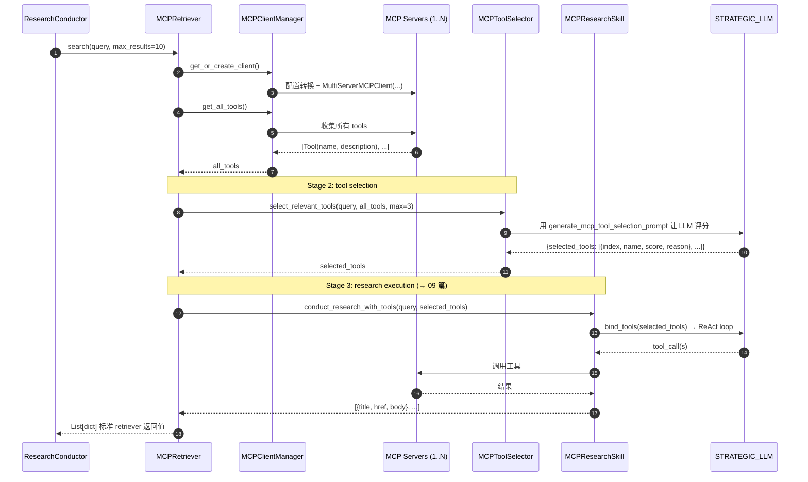

# 08. MCP 上篇：协议、客户端、Tool Selector 与"伪检索引擎"接入

## 模块概述

**MCP（Model Context Protocol）** 是 Anthropic 在 2024 年底提出的"LLM-工具/资源"标准协议——一个 MCP server 暴露一组 tools / resources / prompts，任何 MCP-aware 的 client（Claude Desktop / Cursor / 自家 Agent）都能即插即用。GPT-Researcher 在 2025 年早期接入了 MCP，作为它的**第 17 种 retriever**。

但 MCP 在本项目里被**刻意伪装成 retriever**——`MCPRetriever` 类外形跟 04 篇讲的 17 个搜索引擎一样有 `search()` 方法，但内部完全不是"调一次 API"，而是：

```
MCPRetriever.search(query) ≠ 调一个搜索 API
                        = 调一遍 LLM 选 tool → 让 LLM 用选中的 tool 跑研究 → 返回结果列表
```

这是**两阶段**架构（Stage 1: tool selection / Stage 2: research execution），把"function calling 决策"封装成了一个看起来像普通搜索引擎的接口。这种"协议适配"思路是单 Agent 形态接入 MCP 最干净的做法。

本上篇聚焦"协议 + 接入"：

| 关注点 | 文件 |
|---|---|
| MCP 模块结构 | `gpt_researcher/mcp/__init__.py` |
| 多服务器 client 管理 | `gpt_researcher/mcp/client.py:MCPClientManager` |
| LLM 选工具 | `gpt_researcher/mcp/tool_selector.py:MCPToolSelector` |
| 伪 retriever 入口 | `gpt_researcher/retrievers/mcp/retriever.py:MCPRetriever` |

下篇（09）讲 streaming、real research execution、Deep Research 引擎，以及反向把项目暴露成 MCP server (`mcp-server/`)。

---

## 架构 / 流程图

### MCP 在 gpt-researcher 中的双重角色

```
                     ┌──────────────────────────────────────┐
                     │       gpt-researcher (项目主体)       │
                     │                                      │
   作为 client →     │ ┌─────────────────────────────────┐ │
   消费第三方 MCP     │ │ MCPRetriever (伪 retriever)     │ │
                     │ │   ↓                             │ │
                     │ │ MCPClientManager → MCP servers  │ │
                     │ └─────────────────────────────────┘ │
                     │                                      │
   作为 server →     │ mcp-server/  (反向暴露,见 09 篇)     │
   被外部 MCP 客户端  │   - 暴露 deep_research / quick_search │
   消费              │     等工具                           │
                     └──────────────────────────────────────┘
```

### MCPRetriever 三阶段调用栈



### 与 Function Calling 的对比

```
        OpenAI Function Calling                MCP
        ─────────────────────                  ──────────────────────
工具定义     代码内手写 JSON Schema              MCP server 自描述 (tools/list)
传输          直接放进 messages 参数             stdio / WebSocket / streamable_http
分发          一个 LLM endpoint                  N 个 server，本项目用 MultiServerMCPClient
权限          应用层自己加                       server 端可定 root_paths / token
跨进程        无                                 stdio 子进程或 WS/HTTP
工具组合      硬编码                            动态加载，安装即用
本项目的做法   通过 LangChain bind_tools         先 LLM 选 → 再 bind → 再 ReAct
```

**关键洞察**：MCP **不是替代** function calling，而是在它之上加了一层"工具发现/分发协议"。最终 LLM 调工具仍然走 function calling 这套，只是"工具从哪来 / 怎么传"被标准化了。

---

## 核心源码解析

### 1) MCP 模块的"软依赖"加载

`gpt_researcher/mcp/__init__.py`

```python
try:
    from langchain_mcp_adapters.client import MultiServerMCPClient
    HAS_MCP_ADAPTERS = True

    from .client          import MCPClientManager
    from .tool_selector   import MCPToolSelector
    from .research        import MCPResearchSkill
    from .streaming       import MCPStreamer

    __all__ = ["MCPClientManager", "MCPToolSelector",
               "MCPResearchSkill", "MCPStreamer", "HAS_MCP_ADAPTERS"]

except ImportError as e:
    logger.warning(f"MCP dependencies not available: {e}")
    HAS_MCP_ADAPTERS = False
    __all__ = ["HAS_MCP_ADAPTERS"]
```

> **设计**：`langchain-mcp-adapters` 不是必装依赖。没装就只导出 `HAS_MCP_ADAPTERS=False`，让上层用 `if HAS_MCP_ADAPTERS:` 守卫。这跟项目"按需安装"的整体哲学一致。

### 2) `MCPClientManager`：把 GPT-Researcher config 翻译成 langchain-mcp-adapters 格式

`gpt_researcher/mcp/client.py`

```python
class MCPClientManager:
    def __init__(self, mcp_configs: List[Dict[str, Any]]):
        self.mcp_configs = mcp_configs or []
        self._client = None
        self._client_lock = asyncio.Lock()       # 防多协程并发创建客户端
```

#### 配置自动识别 transport

```python
def convert_configs_to_langchain_format(self) -> Dict[str, Dict[str, Any]]:
    server_configs = {}
    for i, config in enumerate(self.mcp_configs):
        server_name = config.get("name", f"mcp_server_{i+1}")
        server_config = {}

        # ★ 自动从 URL 推断 transport
        connection_url = config.get("connection_url")
        if connection_url:
            if connection_url.startswith(("wss://", "ws://")):
                server_config["transport"] = "websocket"
                server_config["url"] = connection_url
            elif connection_url.startswith(("https://", "http://")):
                server_config["transport"] = "streamable_http"
                server_config["url"] = connection_url
            else:
                connection_type = config.get("connection_type", "stdio")
                server_config["transport"] = connection_type
                if connection_type in ["websocket", "streamable_http", "http"]:
                    server_config["url"] = connection_url
        else:
            # 没 URL → stdio 子进程
            connection_type = config.get("connection_type", "stdio")
            server_config["transport"] = connection_type

        # HTTP 模式可带 headers
        if server_config.get("connection_type") in ["streamable_http", "http"]:
            connection_headers = config.get("connection_headers")
            if connection_headers and isinstance(connection_headers, dict):
                server_config["headers"] = connection_headers

        # stdio 模式必须给 command/args/env
        if server_config.get("transport") == "stdio":
            if config.get("command"):
                server_config["command"] = config["command"]
                server_args = config.get("args", [])
                if isinstance(server_args, str):
                    server_args = server_args.split()
                server_config["args"] = server_args
                server_env = config.get("env", {})
                if server_env:
                    server_config["env"] = server_env

        # 远程鉴权
        if config.get("connection_token"):
            server_config["token"] = config["connection_token"]

        server_configs[server_name] = server_config
    return server_configs
```

> ✨ **使用方写法极简**：
> ```python
> mcp_configs = [
>     {"name": "files", "command": "python", "args": ["my_files_server.py"]},      # stdio
>     {"name": "github", "connection_url": "https://mcp.github.example/sse"},      # HTTP
>     {"name": "linear", "connection_url": "wss://mcp.linear.app/ws",
>      "connection_token": "tok_..."},                                              # WS + token
> ]
> ```
> 三种 transport 都能用同一个字段 `connection_url` 写——`MCPClientManager` 自动识别。

#### 单例 client + 锁

```python
async def get_or_create_client(self) -> Optional[object]:
    async with self._client_lock:
        if self._client is not None:
            return self._client                 # ← 已经有，直接返回
        if not HAS_MCP_ADAPTERS:                # 软依赖兜底
            return None
        if not self.mcp_configs:
            return None
        try:
            server_configs = self.convert_configs_to_langchain_format()
            self._client = MultiServerMCPClient(server_configs)
            return self._client
        except Exception as e:
            logger.error(f"Error creating MCP client: {e}")
            return None
```

> **`asyncio.Lock` 的意义**：MCPRetriever.search() 是同步入口（在 `_search_relevant_source_urls` 里被 `asyncio.to_thread` 调用），但内部跑 async，多个并发子查询同时实例化 client 会触发"重复连接 server"，锁正好挡住。

#### 一次性拿到所有 server 的工具

```python
async def get_all_tools(self) -> List:
    client = await self.get_or_create_client()
    if not client: return []
    try:
        all_tools = await client.get_tools()      # ← MultiServerMCPClient 自动 fan-out
        if all_tools:
            logger.info(f"Loaded {len(all_tools)} total tools from MCP servers")
            return all_tools
        return []
    except Exception as e:
        logger.error(f"Error getting MCP tools: {e}")
        return []
```

`MultiServerMCPClient.get_tools()` 内部会并发对每个 server 发 `tools/list`，把所有结果摊平成一个 LangChain `BaseTool` 列表。每个 tool 已经被自动包装成可以被 `ChatModel.bind_tools()` 用的形态。

### 3) `MCPToolSelector`：让 LLM 自己挑 3 个工具

`gpt_researcher/mcp/tool_selector.py`

整体策略：**有 LLM 用 LLM、LLM 失败了 fallback 到 pattern 匹配、pattern 也失败就空 list**——三层兜底。

```python
async def select_relevant_tools(self, query, all_tools, max_tools=3):
    if not all_tools: return []
    if len(all_tools) < max_tools:
        max_tools = len(all_tools)

    # ① 把所有工具描述打包成 JSON 喂给 LLM
    tools_info = [
        {"index": i, "name": t.name, "description": t.description or "No description"}
        for i, t in enumerate(all_tools)
    ]

    from ..prompts import PromptFamily
    prompt = PromptFamily.generate_mcp_tool_selection_prompt(query, tools_info, max_tools)

    try:
        response = await self._call_llm_for_tool_selection(prompt)
        if not response:
            return self._fallback_tool_selection(all_tools, max_tools)

        # ② JSON 解析三段式（同 03 篇）
        try:
            selection_result = json.loads(response)
        except json.JSONDecodeError:
            json_match = re.search(r"\{.*\}", response, re.DOTALL)
            if json_match:
                try: selection_result = json.loads(json_match.group(0))
                except: return self._fallback_tool_selection(all_tools, max_tools)
            else:
                return self._fallback_tool_selection(all_tools, max_tools)

        # ③ 把 LLM 给的 index 映射回真实 tool 实例
        selected_tools = []
        for sel in selection_result.get("selected_tools", []):
            idx = sel.get("index")
            if idx is not None and 0 <= idx < len(all_tools):
                selected_tools.append(all_tools[idx])
                logger.info(f"Selected tool '{sel.get('name')}' (score: {sel.get('relevance_score')})")

        if not selected_tools:
            return self._fallback_tool_selection(all_tools, max_tools)
        return selected_tools

    except Exception:
        return self._fallback_tool_selection(all_tools, max_tools)
```

LLM 调用细节：

```python
async def _call_llm_for_tool_selection(self, prompt):
    from ..utils.llm import create_chat_completion
    messages = [{"role": "user", "content": prompt}]

    return await create_chat_completion(
        model=self.cfg.strategic_llm_model,           # ★ 用 STRATEGIC_LLM（推理类）
        messages=messages,
        temperature=0.0,                              # ★ 选工具求确定性
        llm_provider=self.cfg.strategic_llm_provider,
        llm_kwargs=self.cfg.llm_kwargs,
        cost_callback=self.researcher.add_costs if self.researcher else None,
    )
```

兜底逻辑（pattern 匹配）：

```python
def _fallback_tool_selection(self, all_tools, max_tools):
    research_patterns = [
        'search', 'get', 'read', 'fetch', 'find', 'list', 'query',
        'lookup', 'retrieve', 'browse', 'view', 'show', 'describe'
    ]
    scored = []
    for tool in all_tools:
        name = tool.name.lower()
        desc = (tool.description or "").lower()
        score = 0
        for p in research_patterns:
            if p in name: score += 3
            if p in desc: score += 1
        if score > 0:
            scored.append((tool, score))
    scored.sort(key=lambda x: x[1], reverse=True)
    return [t for t, s in scored[:max_tools]]
```

> 这一类"LLM 选 tool" 在 MCP 生态里是常见模式——MCP server 经常暴露 20-50 个工具（Linear / GitHub / Slack 这种），全部 bind 给 LLM 会让 prompt 上下文爆炸；先用 LLM 挑 3 个再 bind，是上下文经济的关键。

### 4) Tool Selection Prompt：03 篇没贴的"另一半"

`gpt_researcher/prompts.py:38`（在 03 篇被一笔带过）：

```python
@staticmethod
def generate_mcp_tool_selection_prompt(query, tools_info, max_tools=3):
    return f"""You are a research assistant helping to select the most relevant tools for a research query.

RESEARCH QUERY: "{query}"

AVAILABLE TOOLS:
{json.dumps(tools_info, indent=2)}

TASK: Analyze the tools and select EXACTLY {max_tools} tools that are most relevant for researching the given query.

SELECTION CRITERIA:
- Choose tools that can provide information, data, or insights related to the query
- Prioritize tools that can search, retrieve, or access relevant content
- Consider tools that complement each other (e.g., different data sources)
- Exclude tools that are clearly unrelated to the research topic

Return a JSON object with this exact format:
{{
  "selected_tools": [
    {{
      "index": 0,
      "name": "tool_name",
      "relevance_score": 9,
      "reason": "Detailed explanation of why this tool is relevant"
    }}
  ],
  "selection_reasoning": "Overall explanation of the selection strategy"
}}

Select exactly {max_tools} tools, ranked by relevance to the research query.
"""
```

**几个 prompt engineering 要点**：

- **"EXACTLY {max_tools}"**——重复约束减少 LLM 给 2 或 5 个的概率。
- **`AVAILABLE TOOLS: <JSON dump>`**——结构化喂给 LLM，比自然语言列表 LLM 更容易回引用 index。
- **要求附上 `reason`**——CoT 副产物，提升评分质量；同时方便 debug。
- **`selection_reasoning`** 顶层字段——让 LLM 先给出整体策略，再产生具体选择，类似 plan-then-execute 在 prompt 内部的 mini 复现。

### 5) `MCPRetriever`：把 MCP 套进 retriever 协议

`gpt_researcher/retrievers/mcp/retriever.py`

```python
class MCPRetriever:
    def __init__(self, query, headers=None, query_domains=None,
                 websocket=None, researcher=None, **kwargs):
        self.query = query
        self.researcher = researcher

        # 从 researcher 实例反推所有依赖
        self.mcp_configs = self._get_mcp_configs()
        self.cfg = self._get_config()

        # 4 个组件，每个职责单一
        self.client_manager  = MCPClientManager(self.mcp_configs)
        self.tool_selector   = MCPToolSelector(self.cfg, self.researcher)
        self.mcp_researcher  = MCPResearchSkill(self.cfg, self.researcher)   # → 09 篇
        self.streamer        = MCPStreamer(self.websocket)                   # → 09 篇

        self._all_tools_cache = None      # 同一 retriever 实例只 list 一次工具

    def _get_mcp_configs(self):
        if self.researcher and hasattr(self.researcher, 'mcp_configs'):
            return self.researcher.mcp_configs or []
        return []

    def _get_config(self):
        if self.researcher and hasattr(self.researcher, 'cfg'):
            return self.researcher.cfg
        raise ValueError("MCPRetriever requires a researcher instance with cfg")
```

> ⚠️ **MCPRetriever 与其他 retriever 的关键差异**：构造函数除了 `query` 之外**还要 `researcher`** —— 因为它要拿 cfg、mcp_configs、add_costs。这就是 04 篇里 `_search_relevant_source_urls` 在判断 `is_mcp_retriever` 时为何特殊传 `researcher=...` 的原因（参见 `skills/researcher.py:_search` 中的分支）。

#### 异步主流程

```python
async def search_async(self, max_results: int = 10) -> List[Dict[str, str]]:
    if not self.mcp_configs:
        return []

    try:
        # Stage 1: 拿到所有 tools
        all_tools = await self._get_all_tools()
        if not all_tools: return []

        # Stage 2: LLM 选 3 个 tool
        selected_tools = await self.tool_selector.select_relevant_tools(
            self.query, all_tools, max_tools=3
        )
        if not selected_tools: return []

        # Stage 3: 用选中的 tools 跑研究（→ 09 篇详细讲）
        results = await self.mcp_researcher.conduct_research_with_tools(
            self.query, selected_tools
        )

        if len(results) > max_results:
            results = results[:max_results]
        return results

    except Exception as e:
        logger.error(f"Error in MCP search: {e}")
        return []
    finally:
        # 重要：清理 client 引用
        await self.client_manager.close_client()
```

#### 同步包装：跨事件循环的"线程隔离"

`MCPRetriever.search()` 是同步签名（与其他 retriever 一致），但内部要跑 async，跨事件循环的边界很麻烦：

```python
def search(self, max_results: int = 10) -> List[Dict[str, str]]:
    if not self.mcp_configs: return []

    try:
        try:
            loop = asyncio.get_running_loop()      # ① 当前是否已在事件循环里？
            # 已在：在新线程里开新 event loop 跑 async
            import concurrent.futures, threading

            def run_in_thread():
                new_loop = asyncio.new_event_loop()
                asyncio.set_event_loop(new_loop)
                try:
                    return new_loop.run_until_complete(self.search_async(max_results))
                finally:
                    # 一系列 cleanup：取消 pending tasks → 等 5s timeout → gc → close
                    pending = asyncio.all_tasks(new_loop)
                    for t in pending: t.cancel()
                    if pending:
                        try:
                            new_loop.run_until_complete(asyncio.wait_for(
                                asyncio.gather(*pending, return_exceptions=True),
                                timeout=5.0
                            ))
                        except asyncio.TimeoutError: pass
                    import time, gc
                    time.sleep(0.1); gc.collect(); time.sleep(0.2)
                    if not new_loop.is_closed(): new_loop.close()

            with concurrent.futures.ThreadPoolExecutor() as executor:
                future = executor.submit(run_in_thread)
                results = future.result(timeout=300)        # 5 分钟超时

        except RuntimeError:
            # ② 没运行的事件循环，直接 asyncio.run
            results = asyncio.run(self.search_async(max_results))

        return results
    except Exception as e:
        logger.error(f"Error in MCP search: {e}")
        return []
```

> ⚠️ 这段代码堪称项目最复杂的单一函数。原因：
> 1. ResearchConductor 在事件循环里 `asyncio.to_thread(retriever.search, ...)` —— `to_thread` 已经把执行丢到线程池；
> 2. **但** `asyncio.run` 在已有事件循环的线程里调用会抛 `RuntimeError`；
> 3. 所以需要"开新线程 + 新 event loop"双重隔离；
> 4. 加上 MCP stdio 子进程要正确关 → 一堆 task 取消 + 超时 + gc 兜底。
>
> 这是 MCP 适配层最大的"技术债"，但能保证 MCP 在并发子查询场景下不死锁。

#### 工具列表缓存

```python
async def _get_all_tools(self) -> List:
    if self._all_tools_cache is not None:
        return self._all_tools_cache              # ★ 同一实例只 list 一次
    all_tools = await self.client_manager.get_all_tools()
    if all_tools:
        self._all_tools_cache = all_tools
        return all_tools
    return []
```

> 注意 `_all_tools_cache` 是**实例级**而非类级——每个新查询都会重新 list（因为 ResearchConductor 每个 sub-query 都 new 一个 MCPRetriever）。这其实是浪费，更激进的优化可以用类变量 + LRU 缓存。

---

## 技术原理深度解析

### A. MCP 协议三类原语

```
Tools     —— LLM 可调用的"函数"，跟 OpenAI function calling 等价
Resources —— LLM 可读的"内容"（文件、数据库快照），主动读不主动调
Prompts   —— Server 预定义的 "prompt 模板"，让 client 复用
```

本项目目前**只用 Tools**——`get_tools()` 是核心 API。Resources 和 Prompts 暂未集成（langchain-mcp-adapters 也是先支持 Tools）。

### B. transport 三选一对比

| transport | 启动方式 | 适合场景 | 进程模型 |
|---|---|---|---|
| **stdio** | client 启动 server 子进程，stdin/stdout 双向消息 | 本地工具（filesystem / git / sqlite） | 1 client : 1 server 进程 |
| **websocket** | server 长驻，client WS 连接 | 远程协作工具（Linear / Slack） | 多 client 共享一个 server |
| **streamable_http** | HTTP + SSE，server 长驻 | 公开 SaaS MCP（GitHub MCP） | 多 client 共享 |

**stdio 是 MCP 的"本命"**——Anthropic 设计 MCP 时主要面向 Claude Desktop 这种本地 LLM-工具集成。本项目优先支持 stdio，又兼容了远程 transport。

### C. 为什么"先选 tool 再 bind"？

直接 `model.bind_tools(all_tools)` 让 LLM 自己挑会有三个问题：

1. **上下文爆炸**：50 个 tool description × 平均 150 字 = 7500 字，啃掉一半 prompt budget。
2. **决策质量下降**：tool 越多 LLM 越容易"乱选"或"重复选"。
3. **成本浪费**：bind 50 个 tool 的 schema 走每次 forward pass，都要 token 计费。

预选 3 个再 bind：

- 上下文减到 ~500 字；
- 决策更聚焦（research-related tools only）；
- 节省 token（虽然多了一次 STRATEGIC_LLM 调用，但这次很短，整体净省）。

### D. langchain-mcp-adapters 的角色

```
你的代码                    langchain_mcp_adapters
────────────               ──────────────────────────
MultiServerMCPClient   →   实例化时分别给每个 server 起 connection
   ↓
.get_tools()           →   并发对每个 server 调 tools/list
   ↓
List[BaseTool]         →   每个 tool 都是 LangChain BaseTool 子类，
                           可以直接 model.bind_tools([...])
   ↓
tool.invoke({...})     →   底层会发 tools/call JSON-RPC 给对应 server
```

> 即：**LangChain 把 MCP tools 自动转成自己的 Tool 抽象**——你的代码 99% 不需要直接发 JSON-RPC。本项目 `MCPClientManager.get_all_tools()` 拿到的就已经是 BaseTool 列表，可以无缝接 09 篇的 ReAct 循环。

### E. 同步/异步桥接的工程难点

ResearchConductor 在子查询并发场景下：

```
事件循环 A (子查询调度)
  └─ asyncio.gather(_process_sub_query × N)
        └─ asyncio.to_thread(retriever.search)    ← 同步调用进线程池
              └─ MCPRetriever.search()             ← 又要跑 async...
                    └─ 检测到当前已有事件循环 → 起新线程 → 新 event loop
                          └─ asyncio.run(search_async)
                                └─ MCPClientManager.get_or_create_client()
                                └─ MultiServerMCPClient(...)  ← 这里如果是 stdio
                                                              会 spawn 子进程
```

中间出错点很多：
- 子进程没关 → 僵尸进程；
- WebSocket 没关 → fd 泄漏；
- `asyncio.run` 在嵌套场景报 `RuntimeError`。

`MCPRetriever.search()` 末尾那一坨 `task.cancel() + asyncio.wait_for + gc.collect() + time.sleep` 就是为了治这些。生产里如果你直接用 `MCPRetriever.search_async`（不走同步入口），可以省掉一半。

---

## 关键设计决策

| 决策 | 取舍 |
|---|---|
| **MCP 当成第 17 个 retriever** | 上层（ResearchConductor）零感知，自动走 sub-query 并发；缺点：丢失了 MCP 的部分能力（Resources / Prompts 没用上） |
| **两阶段：先选 tool 再 bind** | 上下文/成本最优；代价是多一次 STRATEGIC LLM 调用 |
| **三层兜底（LLM → pattern → empty）** | 稳健性高；pattern fallback 实测能覆盖 80% 真实工具命名 |
| **`MCPClientManager` 持有 lock** | 多协程并发场景下避免重复连接 server |
| **同步入口 `search()` 用线程隔离 + 新事件循环** | 兼容 ResearchConductor 的同步契约；代价是代码复杂度 |
| **软依赖 `langchain-mcp-adapters`** | 不装就跳过，不影响其它 retriever |
| **`mcp_configs` 自动添加到 retrievers** | 改善 DX；代价是用户可能困惑（→ 01 篇） |
| **`max_tools=3` 写死** | 经验值；想调大需改源码 |
| **`temperature=0.0` 选 tool** | 强求确定性；如果 LLM 反复输出同一组工具但任务需要多样性，这是个问题 |

替代方案：

- **LangGraph `create_react_agent` + 全 tool**：让 LangGraph 内置 ReAct 循环自己挑工具（不用 selector）。代价是上下文爆炸，但工具数 < 10 时更简单。
- **基于 embedding 的 tool selection**：把 query 和 tool description 都 embed，余弦相似度选 Top-K。零 LLM 调用、更便宜，但牺牲推理能力。
- **缓存 tool list 到磁盘**：MCP server 的 tools 不会经常变，可以按 (server_url, mtime) 缓存到本地文件，省启动时间。

---

## 与其他模块的关联

```
本模块依赖：
  ├─ langchain-mcp-adapters (软依赖)
  ├─ create_chat_completion (→ 01 篇)
  ├─ Config / cfg.strategic_llm_* (→ 01 篇)
  └─ PromptFamily.generate_mcp_tool_selection_prompt (→ 03 篇)

本模块输出（被以下消费）：
  ├─ MCPRetriever 被 get_retriever("mcp") 拿到 (→ 04 篇)
  ├─ ResearchConductor._execute_mcp_research (→ 02 篇) 用 MCPRetriever
  └─ ResearchConductor._mcp_results_cache 复用 fast 策略下的结果

下游 (→ 09 篇)：
  ├─ MCPResearchSkill.conduct_research_with_tools
  └─ MCPStreamer 实时推送
```

---

## 实操教程

### 准备

```bash
pip install langchain-mcp-adapters
# 至少装一个真实的 MCP server 来测，比如官方 filesystem server：
npm install -g @modelcontextprotocol/server-filesystem
```

### 例 1：用 filesystem MCP server 做研究

```python
# scripts/mcp_filesystem_demo.py
import asyncio, os
from dotenv import load_dotenv; load_dotenv()
from gpt_researcher import GPTResearcher

async def main():
    os.makedirs("./my-notes", exist_ok=True)
    with open("./my-notes/projx.md", "w") as f:
        f.write("# Project X\n2025 plan: integrate MCP fully into multi-agent flow.\n")

    r = GPTResearcher(
        query="Summarize my Project X plans for 2025",
        report_type="research_report",
        mcp_configs=[{
            "name": "files",
            "command": "npx",
            "args": ["-y", "@modelcontextprotocol/server-filesystem",
                     os.path.abspath("./my-notes")],
        }],
        mcp_strategy="fast",
        verbose=True,
    )
    await r.conduct_research()
    print(await r.write_report())

asyncio.run(main())
```

verbose 输出会看到：

```
🔧 Initializing MCP retriever for query: Summarize my Project X plans for 2025
📋 Loaded 11 total tools from MCP servers
🧠 Stage 2: Selecting most relevant tools
Selected tool 'read_file' (score: 9): Reading note files matches the query about plans
Selected tool 'list_directory' (score: 8): To enumerate notes available
Selected tool 'search_files' (score: 7): To find Project X mentions
Stage 3: Conducting research with selected tools
...
```

### 例 2：组合多个 MCP servers

```python
mcp_configs = [
    # 1. 本地文件 (stdio)
    {"name": "files", "command": "npx",
     "args": ["-y", "@modelcontextprotocol/server-filesystem", "/Users/me/notes"]},

    # 2. GitHub 远程 (HTTP)
    {"name": "github",
     "connection_url": "https://api.githubcopilot.com/mcp",
     "connection_token": os.environ["GITHUB_PAT"]},

    # 3. 自家 WS server
    {"name": "internal",
     "connection_url": "wss://mcp.internal.company.com/agent",
     "connection_token": os.environ["INTERNAL_MCP_TOKEN"]},
]

r = GPTResearcher(query="...", mcp_configs=mcp_configs, mcp_strategy="deep")
```

`MCPClientManager.convert_configs_to_langchain_format()` 会自动识别 3 种 transport，全部接入。

### 例 3：直接调 MCPClientManager 看可用工具

```python
# scripts/list_mcp_tools.py
import asyncio
from gpt_researcher.mcp import MCPClientManager

async def main():
    cm = MCPClientManager([{
        "name": "files",
        "command": "npx",
        "args": ["-y", "@modelcontextprotocol/server-filesystem", "/tmp"],
    }])
    tools = await cm.get_all_tools()
    for t in tools:
        print(f"  - {t.name:30s}  {(t.description or '')[:80]}")
    await cm.close_client()

asyncio.run(main())
```

输出：
```
  - read_file                      Read the complete contents of a file from the file system
  - read_multiple_files            Read multiple files simultaneously
  - write_file                     Create a new file or overwrite existing
  - edit_file                      Make line-based edits to a text file
  - create_directory               Create a new directory
  - list_directory                 Get a detailed listing
  - directory_tree                 Get a recursive tree view
  - move_file                      Move or rename files and directories
  - search_files                   Recursively search for files
  - get_file_info                  Retrieve detailed metadata
  - list_allowed_directories       Returns the list of directories
```

### 例 4：单独测 ToolSelector（不连真 server）

```python
# scripts/test_tool_selector.py
import asyncio
from langchain_core.tools import StructuredTool
from gpt_researcher.config import Config
from gpt_researcher.mcp import MCPToolSelector

# 造几个假 tool
def _noop(): pass
fake_tools = [
    StructuredTool.from_function(_noop, name="search_papers",     description="Search arXiv papers by keyword"),
    StructuredTool.from_function(_noop, name="get_email_thread",  description="Fetch a Gmail thread"),
    StructuredTool.from_function(_noop, name="create_calendar_event", description="Create new calendar event"),
    StructuredTool.from_function(_noop, name="read_file",         description="Read a file from local disk"),
    StructuredTool.from_function(_noop, name="send_slack_message", description="Send Slack message"),
]

async def main():
    cfg = Config()
    sel = MCPToolSelector(cfg)
    selected = await sel.select_relevant_tools(
        "What are the latest advancements in MoE language models in 2025?",
        fake_tools, max_tools=2
    )
    for t in selected:
        print(f"✓ {t.name}: {t.description}")

asyncio.run(main())
# Expected: search_papers, read_file (depends on LLM)
```

### 常见问题与 Debug 技巧

| 症状 | 排查 |
|---|---|
| `langchain-mcp-adapters not installed` 警告 | `pip install langchain-mcp-adapters` |
| MCP server 启动报错 (`spawn ... ENOENT`) | `command` 路径不对；改成绝对路径，或先 `npm install -g <pkg>` |
| `get_tools()` 返回空 | server 实现有问题 / token 不对；用 `list_mcp_tools.py` 单独验证 |
| ToolSelector 一直 fallback 到 pattern | LLM 输出不是合法 JSON；打开 `logger.debug` 看 `LLM tool selection response` |
| WS 连接立刻断开 | `connection_token` 错或 server 不支持你的协议版本（MCP 协议在 0.3 → 0.4 有 breaking） |
| MCPRetriever.search() 卡 5 分钟超时 | 内部线程死锁；通常是 server stdio 子进程 hang。日志看最后一个 stage 在哪 |
| 同时多并发 sub-query → MCP 报 "session 已存在" | `MCPClientManager._client_lock` 应该挡住，但如果你在多个 GPTResearcher 实例间共享，需要自己加全局锁 |

调试时打开两个 logger：

```python
import logging
logging.getLogger('gpt_researcher.mcp').setLevel(logging.DEBUG)
logging.getLogger('langchain_mcp_adapters').setLevel(logging.DEBUG)
```

### 进阶练习建议

1. **替换 ToolSelector 为 embedding 版**：query + tool.description 都 embed，cosine 取 Top-K。对比 LLM 选与 embedding 选的差异。
2. **跨 retriever 共享 client**：把 `MCPClientManager` 改成模块级单例（类似 01 篇 `GlobalRateLimiter`），不同 retriever 实例共用同一连接，省启动开销。
3. **Tool list 持久化缓存**：把 tools list 按 (server_name, hash(server_config)) 写到本地 SQLite，下次启动跳过 list_tools。
4. **支持 Resources / Prompts**：扩展 `MCPClientManager`，加 `get_all_resources()` / `get_all_prompts()`，前者可以接进 RAG 入向量库。
5. **写一个 MCP 测试 server**：用 `mcp` Python SDK 写个最小 server，暴露 `echo` 工具，跑通端到端调用栈。

---

## 延伸阅读

1. [Model Context Protocol 官方规范](https://spec.modelcontextprotocol.io/) — 协议定义。
2. [Anthropic MCP 介绍博客](https://www.anthropic.com/news/model-context-protocol) — 设计动机与典型用例。
3. [`langchain-mcp-adapters` GitHub](https://github.com/langchain-ai/langchain-mcp-adapters) — 本项目唯一的 MCP 依赖。
4. [`@modelcontextprotocol/server-filesystem`](https://github.com/modelcontextprotocol/servers) — 一系列官方 MCP server 实现，调试时最方便。
5. [JSON-RPC 2.0 规范](https://www.jsonrpc.org/specification) — MCP 底层消息格式。

---

> ✅ 本篇结束。下一篇 **`09_mcp_part2_streaming_deep_research.md`** 把 MCP 收尾：
> 1. `MCPResearchSkill.conduct_research_with_tools` 怎么 bind 工具跑 ReAct；
> 2. `MCPStreamer` 把每一步推到前端的实现；
> 3. `DeepResearchSkill` 的递归深挖引擎（breadth × depth × concurrency）；
> 4. `mcp-server/` 反向暴露 GPT-Researcher 给外部 MCP 客户端。
> 回复 **"继续"** 即可。
