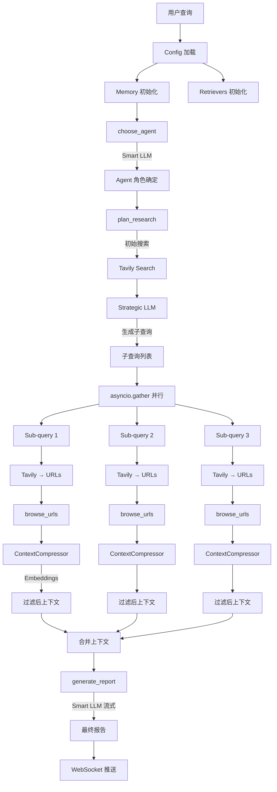

# Phase 8: 端到端流程串讲

> 本章目标：将前七章的知识串联起来，完整还原一次研究的数据流、决策链、组件交互。

---

## 8.1 完整研究流程（单Agent模式）

以查询 `"What is RAG and how does it work?"` 为例：

```
┌──────────────────── 完整流程 ────────────────────┐
│                                                    │
│  ① Config 加载                                     │
│  SMART_LLM=openai:gpt-4o                          │
│  FAST_LLM=openai:gpt-4o-mini                      │
│  STRATEGIC_LLM=openai:o4-mini                     │
│  EMBEDDING=openai:text-embedding-3-small           │
│  RETRIEVER=tavily                                  │
│  MAX_ITERATIONS=3                                  │
│                                                    │
│  ② 组件初始化                                      │
│  Memory(openai, text-embedding-3-small)            │
│  Retrievers=[TavilySearch]                         │
│  ResearchConductor, ContextManager, ReportGenerator│
│                                                    │
│  ③ conduct_research()                              │
│  │                                                 │
│  ├─ choose_agent()                                 │
│  │  [Smart LLM] → "🔬 Research Agent"              │
│  │  agent_role = "You are a research analyst..."    │
│  │                                                 │
│  ├─ research_conductor.conduct_research()          │
│  │  │                                              │
│  │  ├─ _get_context_by_web_search()                │
│  │  │  │                                           │
│  │  │  ├─ plan_research()                          │
│  │  │  │  ├─ 初始搜索: Tavily("What is RAG?")      │
│  │  │  │  │  → 5 个搜索结果                        │
│  │  │  │  │                                        │
│  │  │  │  ├─ [Strategic LLM] 生成子查询             │
│  │  │  │  │  → ["RAG architecture components",     │
│  │  │  │  │     "RAG vs fine-tuning comparison",    │
│  │  │  │  │     "RAG implementation best practices"]│
│  │  │  │  │                                        │
│  │  │  │  └─ 追加原始查询                           │
│  │  │  │     → + "What is RAG?"                     │
│  │  │  │                                           │
│  │  │  ├─ asyncio.gather × 4 子查询 ⚡              │
│  │  │  │  │                                        │
│  │  │  │  ├─ _process_sub_query("RAG architecture")│
│  │  │  │  │  ├─ Tavily 搜索 → 5 URLs               │
│  │  │  │  │  ├─ URL去重 (visited_urls)              │
│  │  │  │  │  ├─ browse_urls() → 抓取网页            │
│  │  │  │  │  └─ ContextCompressor                  │
│  │  │  │  │     ├─ Split(1000/100)                  │
│  │  │  │  │     ├─ EmbeddingsFilter(0.35)           │
│  │  │  │  │     └─ → "Source: ...\nContent: ..."    │
│  │  │  │  │                                        │
│  │  │  │  ├─ _process_sub_query("RAG vs fine-tune")│
│  │  │  │  │  └─ (同上流程)                          │
│  │  │  │  │                                        │
│  │  │  │  └─ ... (其他子查询并行)                    │
│  │  │  │                                           │
│  │  │  └─ 合并: context = " ".join(results)        │
│  │  │                                              │
│  │  └─ self.researcher.context = context           │
│  │                                                 │
│  └─ return context                                 │
│                                                    │
│  ④ write_report()                                  │
│  │                                                 │
│  ├─ report_generator.write_report()                │
│  │  │                                              │
│  │  ├─ generate_report()                           │
│  │  │  ├─ Prompt: generate_report_prompt(          │
│  │  │  │    query, context, "web", "apa",          │
│  │  │  │    tone=Objective, total_words=1000)       │
│  │  │  │                                           │
│  │  │  ├─ [Smart LLM] 流式生成报告                  │
│  │  │  │  → WebSocket 推送每个段落                   │
│  │  │  │                                           │
│  │  │  └─ return "# What is RAG?\n\n## ..."        │
│  │  │                                              │
│  │  └─ return report                               │
│  │                                                 │
│  └─ return report                                  │
│                                                    │
│  ⑤ 费用汇总                                        │
│  {"agent_selection": $0.01,                        │
│   "research": $0.15,                               │
│   "report_writing": $0.08}                         │
│  Total: $0.24                                      │
└────────────────────────────────────────────────────┘
```

---

## 8.2 完整数据流图



---

## 8.3 关键设计决策总结

### 决策 1：三级 LLM 分工

| 任务 | LLM 级别 | 原因 |
|------|---------|------|
| Agent 选择 | Smart | 需要理解查询领域 |
| 子查询生成 | Strategic | 需要推理规划能力 |
| 来源筛选 | Smart | 需要综合评估 |
| 报告生成 | Smart + Stream | 需要高质量写作 + 实时输出 |
| 摘要 | Fast | 简单任务，节省成本 |

### 决策 2：上下文管理策略

```
小文档 (<8000字符) → 跳过压缩，直接使用
大文档 (≥8000字符) → Split → Filter → 压缩
Deep Research → 裁剪到 25k 词
Detailed Report → 跨章节去重 (similarity=0.5)
```

### 决策 3：并行策略

```
单Agent:   asyncio.gather on 子查询    → N 个并行
多Agent:   asyncio.gather on 章节研究   → M 个并行
Deep:      Semaphore 控制并发           → max 2 个并行
```

### 决策 4：URL 去重粒度

```
单Agent:   单次研究内去重 (visited_urls = set())
Deep:      跨递归层级去重 (引用传递同一个 set)
多Agent:   每个 ResearchAgent 独立 (各自创建新 GPTResearcher)
```

---

## 8.4 三种研究模式对比

| 维度 | 单Agent (research_report) | 多Agent (detailed_report) | Deep Research |
|------|--------------------------|--------------------------|---------------|
| **入口** | `GPTResearcher` | `ChiefEditorAgent` | `DeepResearchSkill` |
| **编排** | Python 方法链 | LangGraph StateGraph | 递归 + Semaphore |
| **子任务** | 子查询 (N=3) | 章节 (N=max_sections) | 树状 (breadth×depth) |
| **并行方式** | asyncio.gather | asyncio.gather | Semaphore 限流 |
| **质量保证** | 无 | reviewer/reviser 循环 | 无 |
| **人工介入** | 不支持 | Human-in-the-Loop | 不支持 |
| **上下文** | 单次压缩 | 跨章节去重 | 裁剪到25k词 |
| **典型费用** | $0.10-$0.50 | $0.50-$2.00 | $1.00-$10.00 |

---

## 8.5 核心组件交互矩阵

```
              Config  Memory  Retriever  Compressor  LLM    WebSocket
GPTResearcher   ✓       ✓        ✓           -        ✓        ✓
ResearchCond.   ✓       -        ✓           -        ✓        ✓
ContextMgr      -       ✓        -           ✓        -        -
ContextCompr.   -       ✓        -           -        -        -
ReportGen       ✓       -        -           -        ✓        ✓
SourceCurator   ✓       -        -           -        ✓        ✓
DeepResearch    ✓       ✓        ✓           ✓        ✓        ✓
ChiefEditor     -       -        -           -        -        ✓
```

---

## 8.6 扩展点与二次开发建议

### 添加新的 Retriever

```python
# 1. 在 gpt_researcher/retrievers/ 下创建新模块
# 2. 实现 search() 方法返回标准格式
# 3. 在 actions/retriever.py 的 match-case 中注册
# 4. 在 retrievers/__init__.py 中导出
```

### 添加新的 LLM Provider

```python
# 1. 在 llm_provider/generic/base.py 的 _SUPPORTED_PROVIDERS 中注册
# 2. 在 from_provider() 中添加 elif 分支
# 3. 确保返回 LangChain ChatModel 实例
```

### 自定义 Prompt

```python
# 1. 继承 PromptFamily
class MyPromptFamily(PromptFamily):
    @staticmethod
    def generate_report_prompt(question, context, ...):
        return "我的自定义报告提示词..."

# 2. 在创建 GPTResearcher 时传入
researcher = GPTResearcher(
    query="...",
    prompt_family=MyPromptFamily,
)
```

### 添加新的报告类型

```python
# 1. 在 utils/enum.py 的 ReportType 中添加
# 2. 在 prompts.py 中添加对应的 Prompt 方法
# 3. 在 prompts.py 的 get_prompt_by_report_type() 中注册
```

---

## 8.7 性能优化关键点

| 优化点 | 位置 | 效果 |
|--------|------|------|
| 小文档跳过压缩 | `ContextCompressor` | 减少 Embedding API 调用 |
| URL 全局去重 | `visited_urls` set | 避免重复抓取 |
| 检索器预取 | `_search_relevant_source_urls` | 避免已有全文的二次抓取 |
| MCP 缓存 | `_mcp_results_cache` | fast 策略只调用一次 MCP |
| 并发信号量 | `Semaphore` | 防止 API 过载 |
| 懒加载导入 | Memory, LLM Provider | 避免安装所有依赖 |
| Strategic LLM降级 | `generate_sub_queries` | 自动回退到 Smart LLM |

---

## 8.8 错误处理策略

```
1. Agent选择失败 → json_repair → regex提取 → 默认Agent
2. Strategic LLM失败 → 重试(+max_tokens) → 降级到Smart LLM
3. 检索器失败 → 降级到默认Tavily
4. 网页抓取失败 → 跳过该URL，继续其他
5. 上下文压缩失败 → 返回空上下文
6. 报告生成失败 → 去掉system消息重试
7. MCP调用失败 → 降级到纯Web搜索
```

---

## 📌 全系列要点总结

### 记忆体管理
- Memory → Embedding 工厂（20+ 提供商）
- VectorStore → 可选的持久化向量库
- 隐式记忆 → context、visited_urls、research_costs

### RAG 检索增强生成
- 16 种检索器 + MCP 协议检索
- 查询分解 → 并行检索 → 上下文压缩 → 来源筛选

### 上下文管理
- 快速通道（小于8000字符）+ 标准压缩管道
- EmbeddingsFilter（similarity=0.35）
- 跨章节去重（similarity=0.5）
- Deep Research 裁剪（25k 词）

### LLM 调用与 Function Call
- GenericLLMProvider 统一 30+ LLM
- 三级 LLM（fast/smart/strategic）
- Agent 选择 ≈ 结构化输出
- MCP 工具选择 ≈ 真正 Function Call

### 多 Agent 协作
- LangGraph StateGraph 编排
- ResearchState / DraftState 状态分层
- Human-in-the-Loop 条件边
- Reviewer/Reviser 质量保证循环

### 深度研究
- 树状递归（breadth×depth）
- Semaphore 并发控制
- visited_urls 跨实例共享
- 学习成果聚合 + 上下文裁剪
