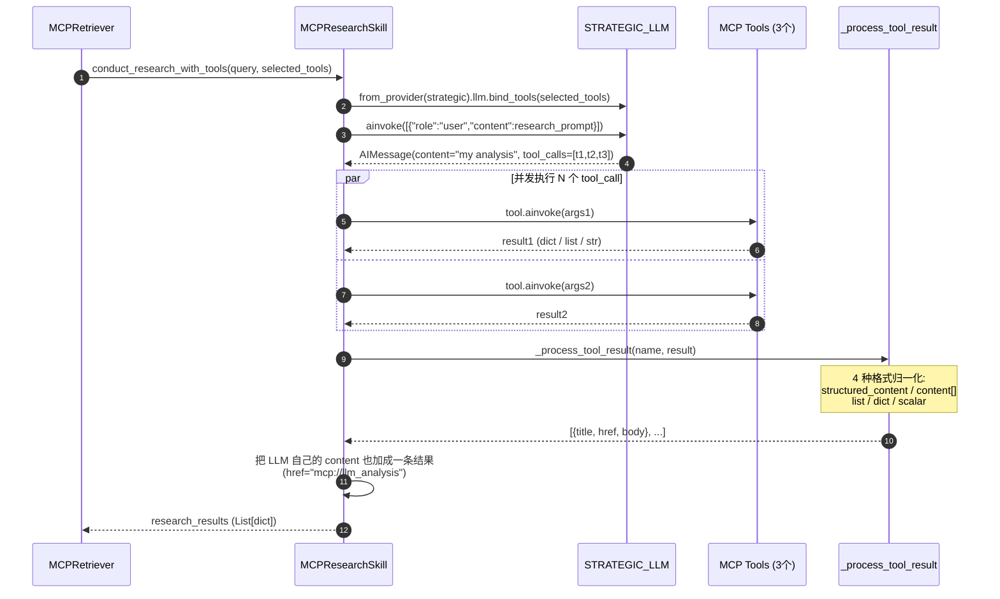

# 09. MCP 下篇：Research 执行、Streaming、Deep Research 引擎与反向暴露

## 模块概述

08 篇解决了"工具从哪来"——这一篇讲"工具怎么用"以及两个相关引擎：

| 模块 | 文件 | 职责 |
|---|---|---|
| `MCPResearchSkill` | `gpt_researcher/mcp/research.py` | 用 LLM `bind_tools` + `ainvoke` 跑研究，工具结果归一化 |
| `MCPStreamer` | `gpt_researcher/mcp/streaming.py` | 把 MCP 各阶段进度推到 WebSocket |
| `DeepResearchSkill` | `gpt_researcher/skills/deep_research.py` | 跟 MCP 没有强依赖、但同属"高级 research 引擎"——递归 breadth × depth × concurrency 三维深挖 |
| `mcp-server/` | `mcp-server/README.md` | **反向**：把 GPT-Researcher 自身暴露成 MCP server，给 Claude Desktop 等用 |

四个东西看起来散，但都围绕同一主题：**当一次"普通 search"不够时，怎么用更复杂的执行策略拿到深度内容**。MCP 用 LLM ReAct 解决，DeepResearch 用递归套娃解决，反向 server 让别人也能用上这套能力。

---

## 架构 / 流程图

### MCPResearchSkill：bind_tools + 一次性 ReAct



> **重要：这是"一次性"ReAct，不是循环**。LLM 第一轮调几个 tool 就停，本项目不让它再迭代——简化是为了适配 retriever 协议（必须返回结果）。

### DeepResearchSkill：递归套娃

```mermaid
flowchart TB
    Q[原始 query]
    Q --> RP[generate_research_plan<br/>STRATEGIC LLM 生成 N 个follow-up]
    RP --> Combined[combined_query = 原 query + Q&A pairs]
    Combined --> DR[deep_research<br/>breadth, depth]

    subgraph DR_inner["deep_research 内部"]
        SQ[generate_search_queries<br/>STRATEGIC 生成 'breadth' 个 sub-query]
        SQ --> Sem[asyncio.Semaphore<br/>concurrency=4]
        Sem --> N["对每个 sub-query 并发"]
        N --> SubGR[new GPTResearcher(...)<br/>conduct_research()]
        SubGR --> PR[process_research_results<br/>STRATEGIC 提取 learnings + follow_ups]
        PR --> RecCheck{depth > 1?}
        RecCheck -- yes --> SubDR[deep_research(<br/> 'follow_ups' 当 query,<br/>breadth/2, depth-1)]
        RecCheck -- no --> Out[累积 learnings, citations, sources]
        SubDR --> Out
    end

    DR --> Final[trim_context_to_word_limit<br/>≤25k words]
    Final --> SetCtx[researcher.context = ...]
    SetCtx --> WriteReport["（外部）write_report(deep_research_prompt)"]
```

**三个维度的语义**：

| 参数 | 默认 | 含义 | 总调用量级 |
|---|---|---|---|
| `breadth` | 4 | 每层生成多少个 sub-query | breadth^depth |
| `depth` | 2 | 递归层数 | × |
| `concurrency` | 4 | 同时并发的 sub-query 数 | 控制 API 压力 |

> 默认配置 `4 × 2 × 4` = 每次研究底下要 new ~20 个 GPTResearcher 实例！这就是为什么 01 篇 `GlobalRateLimiter` 是必需的。

### MCP 双向集成全景

```
Inbound:  外部 MCP server  → MCPRetriever  → 单 Agent 流水线
                            (08 篇)
Outbound: 单 Agent 能力      → mcp-server/ → 外部 MCP client
          (deep_research,       (FastMCP)     (Claude Desktop)
           quick_search,
           write_report,...)
```

---

## 核心源码解析

### 1) `MCPResearchSkill.conduct_research_with_tools`：一次性 ReAct

`gpt_researcher/mcp/research.py`

```python
async def conduct_research_with_tools(self, query, selected_tools):
    if not selected_tools: return []

    from ..llm_provider.generic.base import GenericLLMProvider

    # ① 用 STRATEGIC_LLM（推理模型）
    provider_kwargs = {'model': self.cfg.strategic_llm_model, **self.cfg.llm_kwargs}
    llm_provider = GenericLLMProvider.from_provider(
        self.cfg.strategic_llm_provider, **provider_kwargs)

    # ② bind_tools：把 3 个选中工具绑给 LLM
    llm_with_tools = llm_provider.llm.bind_tools(selected_tools)

    # ③ 调研究 prompt（→ 03 篇）
    from ..prompts import PromptFamily
    research_prompt = PromptFamily.generate_mcp_research_prompt(query, selected_tools)
    messages = [{"role": "user", "content": research_prompt}]

    # ④ 一次 ainvoke：LLM 返回 AIMessage(content=..., tool_calls=[...])
    response = await llm_with_tools.ainvoke(messages)

    research_results = []

    # ⑤ 处理 tool_calls
    if hasattr(response, 'tool_calls') and response.tool_calls:
        for i, tool_call in enumerate(response.tool_calls, 1):
            tool_name = tool_call.get("name")
            tool_args = tool_call.get("args", {})

            tool = next((t for t in selected_tools if t.name == tool_name), None)
            if not tool: continue

            # 执行工具：兼容 ainvoke / invoke / bare callable
            try:
                if hasattr(tool, 'ainvoke'):
                    result = await tool.ainvoke(tool_args)
                elif hasattr(tool, 'invoke'):
                    result = tool.invoke(tool_args)
                else:
                    result = await tool(tool_args) if asyncio.iscoroutinefunction(tool) else tool(tool_args)

                if result:
                    formatted = self._process_tool_result(tool_name, result)
                    research_results.extend(formatted)
            except Exception as e:
                logger.error(f"Error executing tool {tool_name}: {e}")
                continue

    # ⑥ 把 LLM 自己的 content 也当一条结果（兜底）
    if hasattr(response, 'content') and response.content:
        research_results.append({
            "title": f"LLM Analysis: {query}",
            "href":  "mcp://llm_analysis",
            "body":  response.content,
        })

    return research_results
```

**几个易被忽视的细节**：

- **没有 ReAct 循环**：调一次就停，工具结果不再回喂给 LLM。如果你想 LLM 看了结果继续推理，需要自己在外层加 while 循环。
- **三种调用约定的兼容**：`ainvoke` / `invoke` / `__call__` —— LangChain Tool 抽象在不同版本里这三种都见过，全兼容。
- **顺序执行 tool_calls**：循环串行 `await tool.ainvoke(args)`。如果某个工具特别慢（如 GitHub API），后面的全得等。可以改成 `asyncio.gather` 并发，但要小心 server 的并发限制。
- **`mcp://llm_analysis` 这个伪 URL**：让 LLM 的"综合分析"能像普通搜索结果一样接进 ResearchConductor 的 context 拼接。

### 2) `_process_tool_result`：4 种格式归一化

```python
def _process_tool_result(self, tool_name, result):
    search_results = []
    try:
        # ① MCP 标准包装：{"structured_content": {...}, "content": [...]}
        if isinstance(result, dict) and ("structured_content" in result or "content" in result):
            structured = result.get("structured_content")
            if isinstance(structured, dict):
                items = structured.get("results")
                if isinstance(items, list):
                    # 1a) results 数组
                    for i, item in enumerate(items):
                        if isinstance(item, dict):
                            search_results.append({
                                "title": item.get("title", f"Result from {tool_name} #{i+1}"),
                                "href":  item.get("href", item.get("url", f"mcp://{tool_name}/{i}")),
                                "body":  item.get("body", item.get("content", str(item))),
                            })
                elif isinstance(structured, dict):
                    # 1b) 单 dict
                    search_results.append({
                        "title": structured.get("title", f"Result from {tool_name}"),
                        "href":  structured.get("href", structured.get("url", f"mcp://{tool_name}")),
                        "body":  structured.get("body", structured.get("content", str(structured))),
                    })

            # 1c) 如果上面没产出，fallback 到 content[]（MCP 标准 [{type:"text", text:"..."}, ...]）
            if not search_results:
                content_field = result.get("content")
                if isinstance(content_field, list):
                    texts = []
                    for part in content_field:
                        if isinstance(part, dict):
                            if part.get("type") == "text" and isinstance(part.get("text"), str):
                                texts.append(part["text"])
                            elif "text" in part:
                                texts.append(str(part.get("text")))
                            else:
                                texts.append(str(part))
                        else:
                            texts.append(str(part))
                    body_text = "\n\n".join([t for t in texts if t])
                elif isinstance(content_field, str):
                    body_text = content_field
                else:
                    body_text = str(result)
                search_results.append({"title": f"Result from {tool_name}",
                                       "href": f"mcp://{tool_name}",
                                       "body": body_text})
            return search_results

        # ② 普通 list
        if isinstance(result, list):
            for i, item in enumerate(result):
                if isinstance(item, dict):
                    if "title" in item and ("content" in item or "body" in item):
                        search_results.append({...})         # 标准搜索结果形态
                    else:
                        search_results.append({
                            "title": f"Result from {tool_name}",
                            "href":  f"mcp://{tool_name}/{i}",
                            "body":  str(item),
                        })

        # ③ 普通 dict
        elif isinstance(result, dict):
            search_results.append({
                "title": result.get("title", f"Result from {tool_name}"),
                "href":  result.get("href", result.get("url", f"mcp://{tool_name}")),
                "body":  result.get("body", result.get("content", str(result))),
            })

        # ④ scalar / 其他
        else:
            search_results.append({
                "title": f"Result from {tool_name}",
                "href":  f"mcp://{tool_name}",
                "body":  str(result),
            })
    except Exception:
        # 兜底
        search_results.append({"title": f"Result from {tool_name}",
                               "href": f"mcp://{tool_name}",
                               "body": str(result)})
    return search_results
```

**为什么要 4 种处理**？因为 MCP 协议虽然定义了 `CallToolResult`（应该是 `{"content": [{type, text/...}]}`），但**实际生态里各 server 实现差异巨大**：

- `langchain-mcp-adapters` 包装后有的返回原始 `CallToolResult`、有的已展开；
- 自定义 server 经常不遵守标准，直接返回 list / dict / 字符串；
- 第三方 SDK（如 Brave Search MCP）会包一层 `structured_content`。

这套适配代码**就是为了在异构生态里活下来**——它没有"漂亮"，但有"能跑"。

### 3) `MCPStreamer`：双轨日志

`gpt_researcher/mcp/streaming.py`

```python
class MCPStreamer:
    def __init__(self, websocket=None):
        self.websocket = websocket

    # ① 异步：在协程内调用
    async def stream_log(self, message, data=None):
        logger.info(message)
        if self.websocket:
            try:
                from ..actions.utils import stream_output
                await stream_output(
                    type="logs", content="mcp_retriever",
                    output=message, websocket=self.websocket, metadata=data
                )
            except Exception as e:
                logger.error(f"Error streaming log: {e}")

    # ② 同步：在 sync 上下文里也能推（如 __init__ 阶段）
    def stream_log_sync(self, message, data=None):
        logger.info(message)
        if self.websocket:
            try:
                try:
                    loop = asyncio.get_event_loop()
                    if loop.is_running():
                        asyncio.create_task(self.stream_log(message, data))   # ← fire-and-forget
                    else:
                        loop.run_until_complete(self.stream_log(message, data))
                except RuntimeError:
                    logger.debug("Could not stream log: no running event loop")
            except Exception as e:
                logger.error(f"Error in sync log streaming: {e}")
```

注意 sync 版本有两条路径：
- 已有事件循环 → `asyncio.create_task` 后立刻返回（**不等推送完成**！消息可能晚到）
- 没事件循环 → `run_until_complete`（等完成）

加各种 emoji 标签的语义化方法：

```python
async def stream_stage_start(self, stage, description):
    await self.stream_log(f"🔧 {stage}: {description}")

async def stream_tool_execution(self, tool_name, step, total):
    await self.stream_log(f"🔍 Executing tool {step}/{total}: {tool_name}")

async def stream_research_results(self, result_count, total_chars=None):
    if total_chars:
        await self.stream_log(f"✅ MCP research completed: {result_count} results obtained ({total_chars:,} chars)")
    else:
        await self.stream_log(f"✅ MCP research completed: {result_count} results obtained")

async def stream_error(self, error_msg):
    await self.stream_log(f"❌ {error_msg}")
async def stream_warning(self, warning_msg):
    await self.stream_log(f"⚠️ {warning_msg}")
```

> **设计意义**：把"日志做成事件流"。前端 / Claude Desktop 这类 client 拿到的是 `🔧 Stage 1: ...` 这种带状态机意图的串，可以直接渲染进度条。

### 4) `DeepResearchSkill`：递归 breadth × depth × concurrency

`gpt_researcher/skills/deep_research.py`

#### 三维参数

```python
class DeepResearchSkill:
    def __init__(self, researcher):
        self.researcher = researcher
        self.breadth          = getattr(researcher.cfg, 'deep_research_breadth', 4)
        self.depth            = getattr(researcher.cfg, 'deep_research_depth', 2)
        self.concurrency_limit = getattr(researcher.cfg, 'deep_research_concurrency', 2)
        ...
        self.learnings = []
        self.research_sources = []
        self.context = []
```

#### 入口 `run`：先生成 follow-up，再进 deep_research

```python
async def run(self, on_progress=None):
    initial_costs = self.researcher.get_costs()

    # ① 生成 follow-up 问题（HighReasoning）
    follow_up_questions = await self.generate_research_plan(self.researcher.query)
    answers = ["Automatically proceeding with research"] * len(follow_up_questions)

    # ② 拼成 combined_query：原 query + Q&A
    qa_pairs = [f"Q: {q}\nA: {a}" for q, a in zip(follow_up_questions, answers)]
    combined_query = f"""
    Initial Query: {self.researcher.query}\nFollow-up Questions and Answers:\n
    """ + "\n".join(qa_pairs)

    # ③ 真正的递归
    results = await self.deep_research(
        query=combined_query,
        breadth=self.breadth,
        depth=self.depth,
        on_progress=on_progress,
    )

    # ④ 汇总成 context
    context_with_citations = []
    for learning in results['learnings']:
        citation = results['citations'].get(learning, '')
        if citation:
            context_with_citations.append(f"{learning} [Source: {citation}]")
        else:
            context_with_citations.append(learning)
    if results.get('context'):
        context_with_citations.extend(results['context'])

    final_context = trim_context_to_word_limit(context_with_citations)    # ★ 25k words 上限
    self.researcher.context = "\n".join(final_context)
    self.researcher.visited_urls = results['visited_urls']
    if results.get('sources'):
        self.researcher.research_sources = results['sources']
    return self.researcher.context
```

#### 核心 `deep_research`：递归 + 并发

```python
async def deep_research(self, query, breadth, depth, learnings=None,
                        citations=None, visited_urls=None, on_progress=None):
    if learnings is None: learnings = []
    if citations is None: citations = {}
    if visited_urls is None: visited_urls = set()

    progress = ResearchProgress(depth, breadth)

    # ★ 用 STRATEGIC LLM 生成 N 个 'Query+Goal' 对
    serp_queries = await self.generate_search_queries(query, num_queries=breadth)

    all_learnings = learnings.copy()
    all_citations = citations.copy()
    all_visited_urls = visited_urls.copy()
    all_context = []
    all_sources = []

    semaphore = asyncio.Semaphore(self.concurrency_limit)        # ★ 并发上限

    async def process_query(serp_query):
        async with semaphore:
            try:
                from .. import GPTResearcher
                # ★ 嵌套实例化单 Agent
                researcher = GPTResearcher(
                    query=serp_query['query'],
                    report_type=ReportType.ResearchReport.value,
                    report_source=ReportSource.Web.value,
                    tone=self.tone, websocket=self.websocket,
                    config_path=self.config_path, headers=self.headers,
                    visited_urls=self.visited_urls,
                    mcp_configs=self.researcher.mcp_configs,    # ★ 透传 MCP 配置
                    mcp_strategy=self.researcher.mcp_strategy,
                )
                context = await researcher.conduct_research()

                # ★ 用 STRATEGIC + reasoning_effort=High 提取 learnings
                results = await self.process_research_results(
                    query=serp_query['query'], context=context)

                return {
                    'learnings':         results['learnings'],
                    'visited_urls':      list(researcher.visited_urls),
                    'followUpQuestions': results['followUpQuestions'],
                    'researchGoal':      serp_query['researchGoal'],
                    'citations':         results['citations'],
                    'context':           "\n".join(context) if isinstance(context, list) else context,
                    'sources':           researcher.research_sources or [],
                }
            except Exception as e:
                logger.error(f"Error processing query: {e}")
                return None

    # ★ 并发处理 breadth 个 sub-query
    tasks   = [process_query(q) for q in serp_queries]
    results = await asyncio.gather(*tasks)
    results = [r for r in results if r is not None]

    # 累积 + 递归
    for result in results:
        all_learnings.extend(result['learnings'])
        all_visited_urls.update(result['visited_urls'])
        all_citations.update(result['citations'])
        if result['context']: all_context.append(result['context'])
        if result['sources']: all_sources.extend(result['sources'])

        # ★ 递归深挖
        if depth > 1:
            new_breadth = max(2, breadth // 2)        # 每层 breadth 减半（4→2）
            new_depth = depth - 1

            next_query = f"""
            Previous research goal: {result['researchGoal']}
            Follow-up questions: {' '.join(result['followUpQuestions'])}
            """

            deeper_results = await self.deep_research(
                query=next_query,
                breadth=new_breadth, depth=new_depth,
                learnings=all_learnings, citations=all_citations,
                visited_urls=all_visited_urls,
                on_progress=on_progress,
            )

            all_learnings = deeper_results['learnings']
            all_visited_urls.update(deeper_results['visited_urls'])
            all_citations.update(deeper_results['citations'])
            if deeper_results.get('context'):
                all_context.extend(deeper_results['context'])
            if deeper_results.get('sources'):
                all_sources.extend(deeper_results['sources'])

    self.context.extend(all_context)
    self.research_sources.extend(all_sources)

    trimmed_context = trim_context_to_word_limit(all_context)        # ← 防爆掉
    return {
        'learnings':    list(set(all_learnings)),                    # 去重
        'visited_urls': list(all_visited_urls),
        'citations':    all_citations,
        'context':      trimmed_context,
        'sources':      all_sources,
    }
```

#### 生成 sub-query 的"Query + Goal" prompt

```python
async def generate_search_queries(self, query, num_queries=3):
    messages = [
        {"role": "system", "content": "You are an expert researcher generating search queries."},
        {"role": "user",
         "content": f"Given the following prompt, generate {num_queries} unique search queries to research the topic thoroughly. "
                    f"For each query, provide a research goal. "
                    f"Format as 'Query: <query>' followed by 'Goal: <goal>' for each pair: {query}"}
    ]
    response = await create_chat_completion(
        messages=messages,
        llm_provider=self.researcher.cfg.strategic_llm_provider,
        model=self.researcher.cfg.strategic_llm_model,
        reasoning_effort=self.researcher.cfg.reasoning_effort,
        temperature=0.4,
    )

    # 简单的逐行解析（不走 JSON parser）
    lines = response.split('\n')
    queries = []
    current_query = {}
    for line in lines:
        line = line.strip()
        if line.startswith('Query:'):
            if current_query: queries.append(current_query)
            current_query = {'query': line.replace('Query:', '').strip()}
        elif line.startswith('Goal:') and current_query:
            current_query['researchGoal'] = line.replace('Goal:', '').strip()
    if current_query: queries.append(current_query)
    return queries[:num_queries]
```

> **`Query + Goal` 配对**是 deep research 的核心 trick：每个 sub-query 不只是字符串，还附带"为什么要查这个"。Goal 在递归里成为下一轮的 `previous research goal`，让 LLM 能"接着上一步思路深挖"——这是简易版的 ReWOO/Reflexion 思路。

#### Token 预算控制

```python
MAX_CONTEXT_WORDS = 25000

def trim_context_to_word_limit(context_list, max_words=MAX_CONTEXT_WORDS):
    total_words = 0
    trimmed_context = []
    # 倒序遍历，保留最近的（最深层的）
    for item in reversed(context_list):
        words = count_words(item)
        if total_words + words <= max_words:
            trimmed_context.insert(0, item)    # 头插保持原顺序
            total_words += words
        else:
            break
    return trimmed_context
```

> 25000 词 ≈ 32-35k token，安全留给 GPT-4 / Claude 主流 128k 上下文模型。**逆序保留最新**符合 deep research 的"越深越精"假设。

### 5) `mcp-server/`：把 GPT-Researcher 反向暴露成 MCP server

仓库内 `mcp-server/README.md`：

```markdown
> Note: This content has been moved to a dedicated repository: https://github.com/assafelovic/gptr-mcp

## Features
### Resources
* research_resource: Get web resources related to a given task via research.

### Primary Tools
* deep_research:        Performs deep web research on a topic
* quick_search:         Performs a fast web search optimized for speed
* write_report:         Generate a report based on research results
* get_research_sources: Get the sources used in the research
* get_research_context: Get the full context of the research
```

> 项目主仓 `mcp-server/` 只保留了说明文档，**实际实现已迁移到 [`assafelovic/gptr-mcp`](https://github.com/assafelovic/gptr-mcp)**。该独立仓库用 `FastMCP` 框架把单 Agent 的几个核心动作（deep_research / quick_search / write_report / get_sources / get_context）包装成 MCP tools。

**关键意义**：

```
任何 MCP-aware client (Claude Desktop / Cursor / 自家 Agent)
    ↓ MCP 协议（stdio）
gptr-mcp server (FastMCP)
    ↓ 调用本地
GPTResearcher.conduct_research() / write_report()
    ↓
单 Agent 全套（Retrievers / Scrapers / VectorStore / Compressor）
```

**对外用户体验**：在 Claude Desktop 配置里加一行：

```json
{
  "mcpServers": {
    "gptr": {
      "command": "python",
      "args": ["/path/to/gptr-mcp/server.py"],
      "env": {"OPENAI_API_KEY": "...", "TAVILY_API_KEY": "..."}
    }
  }
}
```

Claude 就能调 `deep_research(query)` 拿到一份 5-10 页的研究报告。**这是 GPT-Researcher 给非 Python 用户的"出口"**——不需要在自己应用里嵌代码，只需要 MCP 协议。

---

## 技术原理深度解析

### A. 为什么 MCPResearchSkill 是"一次性 ReAct"

理论上完整 ReAct 是 `Reason → Act → Observe → Reason → ...` 的循环。本项目只跑一轮的原因：

1. **接口契约约束**：`retriever.search()` 必须返回结果列表，不能"还在思考"。
2. **单 Agent 上层有自己的 sub-query 循环**：ResearchConductor 已经会针对一个原始 query 生成 N 个子查询，每个子查询走一遍这个流程——**外层循环已经在了**。
3. **成本控制**：完整 ReAct 容易跑 5-10 轮，对 STRATEGIC LLM 来说成本爆炸。

如果你**确实需要 ReAct 循环**（如长链工具组合：search → read_file → grep → search 再深挖），可以用 LangGraph `create_react_agent` 替换本类。

### B. DeepResearch 的成本爆炸点

```
默认 (breadth=4, depth=2, concurrency=2):
  Layer 1: 4 sub-queries × 1 GPTResearcher each = 4 inner researches
  Layer 2: for each Layer 1, recursively (breadth=2, depth=1):
                                  2 sub-queries × 1 GPTResearcher each = 2 inner
           total Layer 2: 4 × 2 = 8 inner researches
  Total: 4 + 8 = 12 inner researches

每个 inner research 内部：
  - 1 SMART (choose_agent)
  - 1 STRATEGIC (plan_research_outline)
  - 3+1 sub-queries × {retrieve + scrape + embed-filter}
  - 1 SMART stream (write_report) — 但 deep research 路径上 conduct_research 之后没立刻 write
  - 加上 deep research 自己每个 sub-query 的：
      - process_research_results: 1 STRATEGIC (HighReasoning)
      - 1 generate_search_queries: 1 STRATEGIC

实测一次 query 总成本: $0.5 - $5（取决于 query 复杂度）
```

> 这就是 `concurrency_limit=2` 默认的原因——避免一次研究让 OpenAI 月度 quota 警报响。

### C. 递归 breadth 减半的设计

```python
new_breadth = max(2, breadth // 2)        # 4 → 2 → 2 → 2 ...
new_depth   = depth - 1                   # 2 → 1 → 0 (停)
```

随深度递减 breadth 是经典做法（参考 [DeepResearch from Stanford](https://github.com/stanford-oval/storm) 的设计）：

- 初层广而粗——抓全景；
- 深层窄而精——只挖最有信息量的几条线索。
- 加 `max(2, ...)` 兜底——保证至少 2 条候选，不至于"瓶颈到 1"。

### D. `learnings` 提取与 url 关联的 prompt 巧思

`process_research_results` 这段：

```
Format each learning as 'Learning [source_url]: <insight>' and each question as 'Question: <question>'
```

让 LLM 在输出里**直接把 URL 嵌进每条 learning 旁边**——下游用正则 `\[(.*?)\]:` 抓 URL。

```python
url_match = re.search(r'\[(.*?)\]:', line)
if url_match:
    url = url_match.group(1)
    learning = line.split(':', 1)[1].strip()
    learnings.append(learning); citations[learning] = url
```

如果 LLM 没按格式输出，再 fallback 到正则抓行内任意 URL。这种"prompt 强约束 + 正则 fallback"是 03 篇 JSON 自愈漏斗的孪生兄弟。

### E. `mcp-server/` 反向暴露的"产品意义"

GPT-Researcher 通过 MCP server **打通了"无代码集成"**：

```
传统 SaaS API：    用户写 Python 代码 → import gpt_researcher → 部署
MCP 暴露：         用户改 Claude Desktop 配置 → 直接对话调用
```

用户不需要：
- 部署 Python 服务
- 处理 WebSocket / SSE
- 自建前端

只需要把 server 二进制（pip install 后的命令）配到 Claude Desktop 里。这是把 Agent 能力"标准化分发"的最干净路径。

---

## 关键设计决策

| 决策 | 取舍 |
|---|---|
| **MCPResearch 用一次性 ReAct** | 简单 + 成本可控；牺牲深链路工具组合能力 |
| **`_process_tool_result` 4 种格式兜底** | 兼容杂乱 MCP 生态；代码丑但可靠 |
| **LLM analysis 也作为一条结果** | 即使工具全失败，至少有 LLM 自己的回答 |
| **MCPStreamer 双轨日志（async + sync）** | 兼容初始化阶段（同步上下文）的进度推送 |
| **DeepResearch breadth/depth/concurrency 三维** | 给用户精细成本控制；但需要理解 `breadth^depth` 才能调 |
| **递归里嵌套 new GPTResearcher** | 复用单 Agent 全栈；但每层都重建 retrievers/Memory，浪费 |
| **`MAX_CONTEXT_WORDS=25000` 写死** | 适配 128k 模型；不同模型应该按 cfg 配 |
| **mcp-server 迁出主仓** | 单一职责；但搜索可发现性下降 |

替代方案：

- MCPResearchSkill 改用 LangGraph `create_react_agent`：天然支持多轮，state 可视化好；代价是循环上限/工具调用预算需要自己加。
- DeepResearch 共享 retrievers/Memory：在 `__init__` 里新增 `pre_built_retrievers` 参数，所有嵌套 GPTResearcher 共用，能省 30-40% 启动开销。
- MAX_CONTEXT_WORDS 从 cfg 读：参考 `tiktoken.encoding_for_model(...)` 算精确 token 数。

---

## 与其他模块的关联

```
本模块依赖：
  ├─ GenericLLMProvider.bind_tools (→ 01 篇)
  ├─ create_chat_completion (→ 01 篇)
  ├─ 08 篇：MCPClientManager / MCPToolSelector
  ├─ GPTResearcher (→ 02 篇) 被 DeepResearch 嵌套实例化
  └─ PromptFamily.generate_mcp_research_prompt / generate_deep_research_prompt (→ 03 篇)

下游：
  ├─ MCPRetriever 调用 MCPResearchSkill.conduct_research_with_tools
  ├─ GPTResearcher._handle_deep_research (→ 02 篇) 调用 DeepResearchSkill.run
  └─ mcp-server (gptr-mcp) 反向暴露 GPTResearcher
```

---

## 实操教程

### 例 1：观察 MCPResearchSkill 的 tool_calls 流

```python
# scripts/mcp_research_observation.py
import asyncio, logging
from dotenv import load_dotenv; load_dotenv()
logging.basicConfig(level=logging.DEBUG)
logging.getLogger('gpt_researcher.mcp').setLevel(logging.DEBUG)

from gpt_researcher import GPTResearcher

async def main():
    r = GPTResearcher(
        query="Find recent files mentioning Project X in my notes",
        report_type="research_report",
        mcp_configs=[{
            "name": "files", "command": "npx",
            "args": ["-y", "@modelcontextprotocol/server-filesystem", "./my-notes"]
        }],
        mcp_strategy="fast",
        verbose=True,
    )
    await r.conduct_research()
    # debug 日志里能看到:
    #   "LLM made N tool calls"
    #   "Executing tool 1/N: search_files"
    #   "Tool search_files returned 3 formatted results"
    print(r.get_research_context()[:500])

asyncio.run(main())
```

### 例 2：跑 DeepResearch（深度研究）

```python
# scripts/deep_research_demo.py
import asyncio, os
from dotenv import load_dotenv; load_dotenv()

# 调小默认值省钱
os.environ["DEEP_RESEARCH_BREADTH"]     = "3"
os.environ["DEEP_RESEARCH_DEPTH"]       = "2"
os.environ["DEEP_RESEARCH_CONCURRENCY"] = "2"

from gpt_researcher import GPTResearcher

async def main():
    r = GPTResearcher(
        query="State of test-time compute scaling in language models, 2025",
        report_type="deep",        # ← 关键：触发 DeepResearchSkill
        verbose=True,
    )
    # progress callback 看进度
    async def on_progress(p):
        print(f"depth={p.current_depth}/{p.total_depth} "
              f"breadth={p.current_breadth}/{p.total_breadth} "
              f"completed_queries={p.completed_queries}/{p.total_queries}")

    await r.conduct_research(on_progress=lambda p: print(f"Δ {p.completed_queries}/{p.total_queries}"))
    md = await r.write_report()

    print(f"\nReport len: {len(md.split())} words")
    print(f"Sources: {len(r.get_source_urls())}")
    print(f"Cost: ${r.get_costs():.2f}")

asyncio.run(main())
```

### 例 3：自定义 streamer 把进度发钉钉

```python
# my_dingding_streamer.py
import requests
from gpt_researcher.mcp.streaming import MCPStreamer

class DingDingStreamer(MCPStreamer):
    def __init__(self, webhook_url):
        super().__init__(websocket=None)
        self.webhook = webhook_url

    async def stream_log(self, message, data=None):
        # 仍走父类 logger
        await super().stream_log(message, data)
        # 关键阶段额外发钉钉
        if any(emoji in message for emoji in ["✅", "❌"]):
            try:
                requests.post(self.webhook, json={
                    "msgtype": "text",
                    "text": {"content": f"[GPTR] {message}"}
                }, timeout=3)
            except Exception:
                pass

# 然后 monkey-patch:
import gpt_researcher.retrievers.mcp.retriever as mr
mr.MCPStreamer = lambda websocket=None: DingDingStreamer(YOUR_WEBHOOK)
```

### 例 4：用 gptr-mcp 在 Claude Desktop 里调

```bash
git clone https://github.com/assafelovic/gptr-mcp
cd gptr-mcp
pip install -r requirements.txt
cat > .env <<EOF
OPENAI_API_KEY=sk-...
TAVILY_API_KEY=tvly-...
EOF

# 测试 server 能跑
python server.py
```

然后编辑 `~/Library/Application\ Support/Claude/claude_desktop_config.json`：

```json
{
  "mcpServers": {
    "gptr": {
      "command": "python",
      "args": ["/abs/path/to/gptr-mcp/server.py"]
    }
  }
}
```

重启 Claude Desktop，用：
```
请用 deep_research 帮我研究"2025 年小语言模型生产部署趋势"
```

Claude 会自动调用 GPT-Researcher 跑研究，回复格式化报告。

### 常见问题与 Debug 技巧

| 症状 | 排查 |
|---|---|
| MCPResearchSkill 没调任何 tool | LLM 没产生 tool_calls；通常是 prompt 不够明确，或者 model 不支持 function calling（Ollama 老版本） |
| `_process_tool_result` 全部走默认分支 | server 返回了奇怪格式；加 `logger.debug(f"raw result: {result}")` 看 |
| DeepResearch 跑半小时没结束 | breadth/depth 调太大；先 `breadth=2, depth=1` 跑通再放大 |
| `RecursionError` | 极端 query 让 follow-ups 互相套娃；加 absolute depth limit |
| Trim 后 context 还是爆 prompt | 25k words ≠ 25k tokens，中文/代码 token 比英文多 2-3 倍；减小 MAX_CONTEXT_WORDS |
| Streamer 在新线程里报 "no running event loop" | 已知问题（线程隔离场景），不影响逻辑，只是少推这条进度 |
| Claude Desktop 调 deep_research 超时 | 30+ 秒响应 vs Claude Desktop 默认超时；改用 quick_search 或拆分 |

### 进阶练习建议

1. **改 MCPResearchSkill 为多轮 ReAct**：用 `while True:` + `tool_calls` 是否为空判停，模型能基于工具结果继续推理。
2. **DeepResearch 共享 Memory**：`__init__` 里建一个共享 `Memory` 实例，所有嵌套 `GPTResearcher` 通过 kwargs 注入，省 embedding 实例化。
3. **加 Web UI 看进度**：基于 `MCPStreamer` 的事件流，写个 Streamlit / Gradio 实时显示 deep research 树状进度。
4. **写个最小 FastMCP server**：暴露一个 `lookup_internal_kb` 工具，让 GPT-Researcher 通过 MCP 接你公司内部知识库。
5. **deep_research vs MCP comprehensive 对比**：跑同一 query，比成本与覆盖度。

---

## 延伸阅读

1. [Stanford STORM (Open Deep Research)](https://github.com/stanford-oval/storm) — DeepResearchSkill 的论文同源工作。
2. [`assafelovic/gptr-mcp`](https://github.com/assafelovic/gptr-mcp) — 反向 MCP server 的真正实现仓库。
3. [FastMCP Python 库](https://github.com/jlowin/fastmcp) — 快速写 MCP server 的脚手架。
4. [LangChain `bind_tools` 文档](https://python.langchain.com/docs/how_to/tool_calling/) — MCPResearchSkill 的核心 API。
5. [LangGraph `create_react_agent`](https://langchain-ai.github.io/langgraph/reference/prebuilt/) — 替换"一次性 ReAct"为完整循环的便捷做法。
6. [ReWOO: Decoupling Reasoning from Observations](https://arxiv.org/abs/2305.18323) — DeepResearch 的"Goal + Query"配对的理论近亲。

---

> ✅ 本篇结束。MCP 与 Deep Research 完结。下一篇 **`10_backend_observability.md`** 切到生产视角：
> 1. `backend/server/app.py` 的 FastAPI + WebSocket 编排；
> 2. `multi_agent_runner.py` / `report_store.py` 怎么管理长任务与磁盘落盘；
> 3. LangSmith Tracing、`logging_config.py`、`costs.py` 的可观测性闭环；
> 4. Docker / Procfile / Terraform 部署。
> 回复 **"继续"** 即可。
