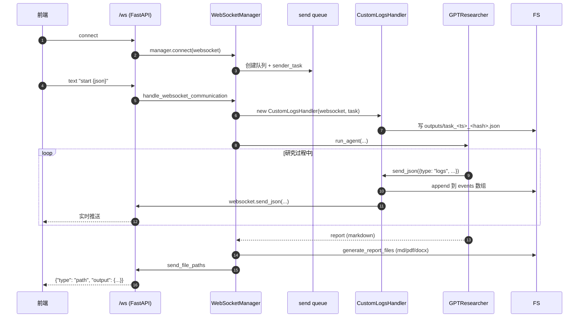

# 10. Backend、可观测性与部署

## 模块概述

前 9 篇都在讲"研究怎么算"——这一篇切换到生产视角："**怎么把它跑成服务、看清楚它在做什么、出问题怎么排**"。

四件事：

| 维度 | 主要文件 |
|---|---|
| **HTTP/WebSocket 服务** | `backend/server/app.py`（FastAPI 路由）+ `websocket_manager.py`（连接池） |
| **多 Agent 桥接 + 报告类型** | `backend/server/multi_agent_runner.py`、`backend/report_type/{basic_report, detailed_report, deep_research}/` |
| **可观测性闭环** | `backend/server/server_utils.py:CustomLogsHandler`、`logging_config.py:JSONResearchHandler`、`gpt_researcher/utils/costs.py` + LangSmith Tracing 环境变量 |
| **持久化与部署** | `report_store.py`（基于文件的 KV）、`Dockerfile` / `Dockerfile.fullstack` / `Procfile` / `terraform/` |

理解这一层后你就能：
- 把 GPT-Researcher 嵌到自家产品的后端（用 REST or WebSocket）；
- 接入 LangSmith / 自家 APM 看每一次研究的精确成本与延迟；
- 用 Docker 一键部署到 EC2 / Heroku / Render。

---

## 架构 / 流程图

### Backend 整体调用栈

```mermaid
flowchart TB
    Client[前端 / API 调用方]

    subgraph FastAPI["backend/server/app.py"]
        REST["REST 路由<br/>POST /report<br/>GET /api/reports<br/>POST /api/chat"]
        WS["WS 路由<br/>/ws"]
    end

    Client -->|HTTP| REST
    Client -->|WebSocket| WS

    REST -->|background_tasks| WriteReport[write_report]
    WS --> WSM[WebSocketManager<br/>连接池 + 队列]
    WSM --> HC[handle_websocket_communication]
    HC --> CMD{command}
    CMD -- "start" --> HSC[handle_start_command]
    CMD -- "human_feedback" --> HFD[handle_human_feedback]
    CMD -- "chat" --> HCC[handle_chat_command]

    HSC --> Streaming[manager.start_streaming]
    Streaming --> RA[run_agent]
    WriteReport --> RA

    RA --> CL[CustomLogsHandler<br/>WS + JSON 双写]
    RA --> RT{report_type}
    RT -- "multi_agents" --> MAR[multi_agent_runner<br/>→ multi_agents/main]
    RT -- "detailed_report" --> DR[DetailedReport]
    RT -- "deep" --> DEEP[BasicReport(deep)]
    RT -- "research_report 等" --> BR[BasicReport]

    BR --> GR[GPTResearcher<br/>→ 02 篇]
    DR --> GR
    DEEP --> GR
    MAR --> GRM[GPTResearcher 实例 × N<br/>→ 06/07 篇]

    GR --> Out[Markdown report]
    Out --> Files[generate_report_files<br/>md/pdf/docx]
    Out --> Store[ReportStore<br/>JSON 文件 KV]

    CL -. 实时推送 .-> Client
```

### 关键数据流：一次 WebSocket 研究



---

## 核心源码解析

### 1) FastAPI 应用骨架

`backend/server/app.py`

```python
@asynccontextmanager
async def lifespan(app: FastAPI):
    # Startup
    os.makedirs("outputs", exist_ok=True)
    app.mount("/outputs", StaticFiles(directory="outputs"), name="outputs")

    frontend_path = os.path.join(os.path.dirname(...), "frontend")
    if os.path.exists(frontend_path):
        app.mount("/site",   StaticFiles(directory=frontend_path), name="frontend")
        app.mount("/static", StaticFiles(directory=os.path.join(frontend_path, "static")), name="static")
    yield
    # Shutdown
    logger.info("Research API shutting down")

app = FastAPI(lifespan=lifespan)

# CORS
allowed_origins_env = os.getenv("CORS_ALLOW_ORIGINS")
ALLOWED_ORIGINS = (
    [o.strip() for o in allowed_origins_env.split(",") if o.strip()]
    if allowed_origins_env
    else ["http://localhost:3000", "http://127.0.0.1:3000", "https://app.gptr.dev"]
)
app.add_middleware(CORSMiddleware,
                   allow_origins=ALLOWED_ORIGINS, allow_credentials=True,
                   allow_methods=["*"], allow_headers=["*"])

manager = WebSocketManager()
report_store = ReportStore(Path(os.getenv('REPORT_STORE_PATH',
                                          os.path.join('data', 'reports.json'))))
DOC_PATH = os.getenv("DOC_PATH", "./my-docs")
```

**几个关键点**：

1. **`lifespan` 替代旧的 `startup` 事件**——FastAPI 0.93+ 推荐写法。
2. **`/outputs` 静态挂载**：研究产物（pdf/docx/json）直接通过 HTTP 下载。
3. **CORS 默认放行 3 个 origin**：localhost:3000（Next.js dev）+ 官方 SaaS 域名。生产环境用 `CORS_ALLOW_ORIGINS=https://your.app` 覆盖。
4. **`manager` 是模块级单例**：所有 WebSocket 连接共享一个池。
5. **`ReportStore` 仍是模块级单例**：基于文件的 KV，没有数据库依赖。

### 2) `WebSocketManager`：每连接一队列 + 一发送协程

`backend/server/websocket_manager.py:21-99`

```python
class WebSocketManager:
    def __init__(self):
        self.active_connections: List[WebSocket] = []
        self.sender_tasks:  Dict[WebSocket, asyncio.Task]  = {}
        self.message_queues: Dict[WebSocket, asyncio.Queue] = {}

    async def connect(self, websocket: WebSocket):
        await websocket.accept()
        self.active_connections.append(websocket)
        self.message_queues[websocket] = asyncio.Queue()
        # 每个 connection 一个独立 sender 协程
        self.sender_tasks[websocket] = asyncio.create_task(
            self.start_sender(websocket))

    async def start_sender(self, websocket):
        queue = self.message_queues.get(websocket)
        if not queue: return
        while True:
            try:
                message = await queue.get()
                if message is None:                # ← shutdown 信号
                    break
                if websocket in self.active_connections:
                    if message == "ping":
                        await websocket.send_text("pong")
                    else:
                        await websocket.send_text(message)
                else:
                    break
            except Exception as e:
                print(f"Error in sender task: {e}")
                break
```

**设计模式**：典型的 **producer-consumer**——业务逻辑（研究流程）往队列扔消息，sender 协程取消息发 WS。这样：

1. 业务侧不直接持有 WS 引用 → 解耦；
2. WS 偶尔慢/掉线时业务不会被阻塞；
3. 优雅停机：往队列 put `None` 即可。

`disconnect` 实现里 `await self.message_queues[websocket].put(None)` 就是这个停机信号——最近一次更新加了多层异常兜底。

### 3) `CustomLogsHandler`：研究事件的"双写者"

`backend/server/server_utils.py:33-80`

```python
class CustomLogsHandler:
    def __init__(self, websocket, task: str):
        self.logs = []
        self.websocket = websocket
        sanitized_filename = sanitize_filename(f"task_{int(time.time())}_{task}")
        self.log_file = os.path.join("outputs", f"{sanitized_filename}.json")
        self.timestamp = datetime.now().isoformat()

        # 启动时初始化结构化日志文件
        os.makedirs("outputs", exist_ok=True)
        with open(self.log_file, 'w') as f:
            json.dump({
                "timestamp": self.timestamp,
                "events": [],
                "content": {
                    "query": "",
                    "sources": [],
                    "context": [],
                    "report": "",
                    "costs": 0.0
                }
            }, f, indent=2)

    async def send_json(self, data: Dict[str, Any]) -> None:
        # ① 实时推 WS（前端立刻看到字）
        if self.websocket:
            await self.websocket.send_json(data)

        # ② 同时写到本地 JSON（事后审计/重放）
        with open(self.log_file, 'r') as f:
            log_data = json.load(f)

        if data.get('type') == 'logs':
            log_data['events'].append({
                "timestamp": datetime.now().isoformat(),
                "type": "event",
                "data": data
            })
        else:
            log_data['content'].update(data)

        with open(self.log_file, 'w') as f:
            json.dump(log_data, f, indent=2)
```

**这个类是整个 backend 可观测性的"心脏"**：

- **WS 上的事件流 ≡ 文件里的事件流**——前端看到的东西，磁盘上一份不少。
- **不同 type 走不同字段**：`type=logs` 进 `events` 数组，其它（如 `query`/`sources`/`report`）合并进 `content` 字段。
- **每个研究一个独立 JSON 文件**——文件名就是研究 ID，永久存档。

> ⚠️ 性能隐患：每条事件都"读整个 JSON → append → 写整个 JSON"。一次研究可能 100+ 事件，I/O 不少。生产建议改成 **append-only JSONL** 或集中写一次。

### 4) `run_agent`：报告类型的总分发器

`backend/server/websocket_manager.py:116-189`

```python
async def run_agent(task, report_type, report_source, source_urls, document_urls,
                    tone: Tone, websocket, stream_output=stream_output,
                    headers=None, query_domains=[], config_path="",
                    return_researcher=False, mcp_enabled=False,
                    mcp_strategy="fast", mcp_configs=[], max_search_results=None):

    logs_handler = CustomLogsHandler(websocket, task)        # ← 每次都新建

    # ★ MCP 启用时动态修改 env（影响整个进程！）
    if mcp_enabled and mcp_configs:
        current_retriever = os.getenv("RETRIEVER", "tavily")
        if "mcp" not in current_retriever:
            os.environ["RETRIEVER"] = f"{current_retriever},mcp"
        os.environ["MCP_STRATEGY"] = mcp_strategy

    # ★ 按 report_type 分发到不同实现
    if report_type == "multi_agents":
        report = await run_multi_agent_task(
            query=task, websocket=logs_handler, ...
        )
        report = report.get("report", "")

    elif report_type == ReportType.DetailedReport.value:
        researcher = DetailedReport(
            query=task, ...,
            websocket=logs_handler,            # ← 注意传的是 handler 不是裸 ws
            mcp_configs=mcp_configs if mcp_enabled else None,
            mcp_strategy=mcp_strategy if mcp_enabled else None,
            ...
        )
        report = await researcher.run()

    else:                                       # 包含 deep / research_report / outline / ...
        researcher = BasicReport(query=task, ..., websocket=logs_handler, ...)
        report = await researcher.run()

    if report_type != "multi_agents" and return_researcher:
        return report, researcher.gpt_researcher
    return report
```

**几个值得注意的设计选择**：

1. **`websocket=logs_handler` 而非裸 WS**——下游所有 `stream_output(...)` 调用都打到 handler，handler 再决定推 WS / 落盘。
2. **MCP 用环境变量传递**——`os.environ["RETRIEVER"] = "..."`：**这是进程级别副作用，多任务并发会互相覆盖**！这是个潜在的并发 bug，单进程单任务时无碍。
3. **`return_researcher=True`** 让 REST `/report` 路径能拿到 `GPTResearcher` 实例，提取成本和源 URL。

### 5) `report_type/`：三种报告分流

```
backend/report_type/
├─ basic_report/basic_report.py        # 标准 + outline + custom + subtopic + deep（共用）
├─ detailed_report/detailed_report.py  # 多章节并行（自己内嵌一套子主题逻辑，不是 multi_agents）
└─ deep_research/                      # 仅作占位（实际 deep 走 BasicReport）
```

`BasicReport.run()`（简化版）：

```python
class BasicReport:
    def __init__(self, query, ...):
        self.gpt_researcher = GPTResearcher(query, ...)

    async def run(self):
        await self.gpt_researcher.conduct_research()
        return await self.gpt_researcher.write_report()
```

**对比 `DetailedReport`**：它在外层组装多个 `GPTResearcher` 实例（一个跑 outline、N 个跑 subtopic），**不走 LangGraph multi_agents**——这是历史并行实现，与 06/07 篇 `multi_agents/` 平行存在。

```
单 Agent → BasicReport
        ↘
            ┌── DetailedReport(自己写 detailed 流程)
            │
            └── multi_agents (LangGraph 编排，→ 06/07 篇)
        ↗
报告类型字符串映射：
   "research_report"    → BasicReport
   "outline_report"     → BasicReport
   "custom_report"      → BasicReport
   "subtopic_report"    → BasicReport
   "deep"               → BasicReport (with DeepResearchSkill)
   "detailed_report"    → DetailedReport
   "multi_agents"       → run_multi_agent_task → multi_agents/main.py
```

### 6) `multi_agent_runner.py`：可降级到 AG2 的桥接

```python
def _resolve_run_research_task() -> RunResearchTask:
    _ensure_repo_root_on_path()
    try:
        from multi_agents.main import run_research_task        # ← 优先 LangGraph 版
        return run_research_task
    except Exception:
        try:
            from multi_agents_ag2.main import run_research_task # ← 兜底 AG2 版
            return run_research_task
        except Exception as ag2_error:
            raise ImportError("Could not import run_research_task ...") from ag2_error

async def run_multi_agent_task(*args, **kwargs) -> Any:
    run_research_task = _resolve_run_research_task()
    return await run_research_task(*args, **kwargs)
```

> 这是少见的"Agent 框架降级"模式：LangGraph import 不上（如版本冲突），自动 fallback 到 AG2。运行时灵活，但用户感知不到——日志最好打个明显标识。

### 7) `ReportStore`：极简文件 KV（替代数据库）

`backend/server/report_store.py`

```python
class ReportStore:
    def __init__(self, path: Path):
        self._path = path
        self._lock = asyncio.Lock()       # ← 关键：协程级锁

    async def _read_all_unlocked(self) -> Dict[str, Dict[str, Any]]:
        if not self._path.exists():
            return {}
        try:
            data = json.loads(self._path.read_text(encoding="utf-8"))
            if isinstance(data, dict): return data
        except Exception:
            return {}                      # ← 文件损坏静默兜底
        return {}

    async def _write_all_unlocked(self, data) -> None:
        await self._ensure_parent_dir()
        tmp_path = self._path.with_suffix(self._path.suffix + ".tmp")
        tmp_path.write_text(json.dumps(data, ensure_ascii=False), encoding="utf-8")
        tmp_path.replace(self._path)        # ← 原子替换防中途崩溃

    async def upsert_report(self, report_id, report) -> None:
        async with self._lock:
            data = await self._read_all_unlocked()
            data[report_id] = report
            await self._write_all_unlocked(data)
```

**3 个值得记住的工程巧思**：

1. **协程锁防并发写**：`asyncio.Lock` 而不是 threading.Lock——只防 asyncio 调度内的并发，但 ReportStore 只在事件循环里被调用，足够。
2. **tmp_path → replace 原子写**：写入中途断电/崩溃也不会损坏老文件。
3. **解析失败返回 `{}` 而非 raise**：极简兜底，让服务"哪怕日志丢了也能继续跑"。

注意：注释里写 `MongoDB services removed - no database persistence needed`——这意味着**原版本曾用 MongoDB**，现在简化到文件。生产高并发场景应该换回 SQLite/Postgres。

### 8) `JSONResearchHandler`：`gpt_researcher` 内部的另一套结构化日志

`backend/server/logging_config.py`

```python
class JSONResearchHandler:
    def __init__(self, json_file):
        self.json_file = json_file
        self.research_data = {
            "timestamp": datetime.now().isoformat(),
            "events": [], "content": {...}
        }

    def log_event(self, event_type, data: dict):
        self.research_data["events"].append({
            "timestamp": datetime.now().isoformat(),
            "type": event_type, "data": data
        })
        self._save_json()

    def update_content(self, key, value):
        self.research_data["content"][key] = value
        self._save_json()
```

```python
def setup_research_logging():
    logs_dir = Path("logs"); logs_dir.mkdir(exist_ok=True)
    timestamp = datetime.now().strftime("%Y%m%d_%H%M%S")
    log_file  = logs_dir / f"research_{timestamp}.log"
    json_file = logs_dir / f"research_{timestamp}.json"

    file_handler = logging.FileHandler(log_file)
    file_handler.setLevel(logging.INFO)
    file_handler.setFormatter(logging.Formatter('%(asctime)s - %(name)s - %(levelname)s - %(message)s'))

    research_logger = logging.getLogger('research')
    research_logger.setLevel(logging.INFO)
    research_logger.handlers.clear()
    research_logger.addHandler(file_handler)
    research_logger.addHandler(logging.StreamHandler())
    research_logger.propagate = False                  # ← 不冒泡到 root，避免重复

    json_handler = JSONResearchHandler(json_file)
    return str(log_file), str(json_file), research_logger, json_handler
```

> ⚠️ **跟 `CustomLogsHandler` 是两套日志机制**！`CustomLogsHandler` 用于 backend 视角（每个 task 一个 outputs/*.json），`JSONResearchHandler` 用于 `gpt_researcher` 内部视角（每个会话一个 logs/*.json）。**两者并存**——历史遗留，未来应统一。

### 9) 成本与可观测性闭环

回顾 01 篇讲过的 `add_costs`：

```python
# gpt_researcher/agent.py:718
def add_costs(self, cost: float) -> None:
    self.research_costs += cost
    step = self._current_step
    self.step_costs[step] = self.step_costs.get(step, 0.0) + cost
```

回到 backend 后路径：

```
LLM 调用
  ↓ create_chat_completion 内部估算 cost (utils/costs.py)
  ↓ cost_callback=researcher.add_costs
researcher.research_costs / step_costs 累加
  ↓ get_costs() / get_step_costs()
backend 在 write_report 返回时把 research_costs 嵌进 response
  ↓
前端展示
```

**配合 LangSmith Tracing**：

```bash
export LANGCHAIN_TRACING_V2=true
export LANGCHAIN_API_KEY=ls__...
export LANGCHAIN_PROJECT=gpt-researcher
```

LangChain 会把每个 LLM 调用、链调用、Tool 调用都自动推到 LangSmith UI。`multi_agents/main.py` 里专门检测这个：

```python
if os.environ.get("LANGCHAIN_API_KEY"):
    os.environ["LANGCHAIN_TRACING_V2"] = "true"
```

> **三层日志体系**：
> 1. **本地结构化** — `outputs/task_*.json`（CustomLogsHandler）+ `logs/research_*.json`（JSONResearchHandler）
> 2. **远程 Trace** — LangSmith（可选）
> 3. **应用日志** — 标准 Python logging（`logger.info` / `print_agent_output`）

### 10) 部署：Dockerfile 三阶段

`Dockerfile`

```dockerfile
# Stage 1: 浏览器和构建工具（镜像最大的一层）
FROM python:3.12-slim-bookworm AS install-browser
RUN apt-get update && apt-get install -y chromium chromium-driver firefox-esr ...
RUN wget .../geckodriver... && tar -xvzf ... && mv geckodriver /usr/local/bin/

# Stage 2: Python 依赖
FROM install-browser AS gpt-researcher-install
WORKDIR /usr/src/app
COPY ./requirements.txt ./requirements.txt
COPY ./multi_agents/requirements.txt ./multi_agents/requirements.txt
RUN pip install -r requirements.txt -r multi_agents/requirements.txt --upgrade --prefer-binary

# Stage 3: 非 root 用户运行
FROM gpt-researcher-install AS gpt-researcher
ENV HOST=0.0.0.0 PORT=8000 WORKERS=1
EXPOSE ${PORT}

RUN useradd -ms /bin/bash gpt-researcher && \
    chown -R gpt-researcher:gpt-researcher /usr/src/app && \
    mkdir -p /usr/src/app/outputs && \
    chown -R gpt-researcher:gpt-researcher /usr/src/app/outputs && \
    chmod 777 /usr/src/app/outputs
USER gpt-researcher
WORKDIR /usr/src/app
COPY --chown=gpt-researcher:gpt-researcher ./ ./
CMD uvicorn main:app --host ${HOST} --port ${PORT} --workers ${WORKERS}
```

**几个最佳实践都做了**：

- **多阶段构建**：浏览器层（变更少）和 Python 依赖层（变更多）分离，加快重建。
- **非 root 用户**：安全最佳实践（除非用 `_check_pkg` 动态 pip install——注释也提示了）。
- **`outputs` 目录 777**：开发友好，生产应该收紧到 770。
- **Chromium + Firefox + Geckodriver**：兼容 BrowserScraper / NoDriverScraper（→ 04 篇）。

`Dockerfile.fullstack` 是 frontend Next.js + backend Python 一体化镜像，体积大但部署省事。

`Procfile`（Heroku 风格）：

```
web: uvicorn backend.server.app:app --host 0.0.0.0 --port $PORT
```

`terraform/`：完整的 ECR setup + GitHub Actions OIDC 部署模板，AWS 部署用得上。

---

## 技术原理深度解析

### A. WebSocket 队列模型 vs 直接发送

```
直接发送 (反例):
  for event in events:
      await websocket.send_text(event)    # WS 慢就阻塞业务

队列模型 (本项目):
  Producer:  await queue.put(event)        # 立刻返回
  Consumer:  while True: await queue.get(); send_text  # 独立协程
```

队列模型的额外好处：
- 业务/IO 解耦；
- 容易加优先级（用 PriorityQueue）；
- 容易加批量发送（`while not queue.empty(): aggregate ...`）；
- WS 短暂掉线时队列仍可累积（队列大小有上限保护）。

### B. CustomLogsHandler 的"双写一致性"

```
研究产生事件
  ↓
handler.send_json
  ├─ websocket.send_json (网络)   ─┐
  └─ append 到 outputs/*.json (磁盘) ┴─ 没有事务保证
```

**理论上**两个写入可能不同步：网络发了但磁盘崩溃 / 磁盘写了但网络断开。本项目用先发 WS 再写盘的顺序，前端先看到事件、磁盘晚一点——对用户体验最好，但**磁盘日志严格意义上不是"完整事件流的副本"**，可能丢最后几条。

> 真要保证一致性，应该换成 append-only JSONL，或先写盘再发 WS（牺牲实时性）。

### C. 后台任务 vs WebSocket：两条研究路径的取舍

```
路径 1：POST /report?generate_in_background=true
  ↓
  background_tasks.add_task(write_report, ...)
  ↓
  返回 {"research_id": "...", "message": "background"}
  ↓
  用户后续 GET /api/reports/{research_id} 拿结果
  
  优点：HTTP 简单
  缺点：没有进度反馈，用户必须轮询

路径 2：WebSocket /ws + "start" command
  ↓
  实时事件流 → 前端可做进度条
  ↓
  研究完成时收到 {"type": "path", "output": {...}}
  
  优点：UX 好
  缺点：需要保持长连接、CORS/反向代理配置复杂
```

> 实测：HTTP 路径适合服务集成（你的服务调本服务），WS 路径适合面向最终用户的产品。

### D. 进程级 env 改写的风险

`run_agent` 里的：

```python
os.environ["RETRIEVER"] = f"{current_retriever},mcp"
os.environ["MCP_STRATEGY"] = mcp_strategy
```

**单进程单 worker** 时无害——同一时间只有一个研究在跑。但：

- `WORKERS=4` 时多进程隔离 ✓
- **同一 worker 同时跑多个研究**（前端开多个 tab 同时点 start）→ 后一个会覆盖前一个的 env，第一个研究中段被改 retriever ✗

修复思路：把 MCP 配置打包传进 `GPTResearcher(...)` 构造函数（02 篇 `mcp_configs` 参数已支持），不要走 env。

### E. Cost callback 真实路径

```
ChatModel.invoke(messages)
  → create_chat_completion (utils/llm.py)
       → estimate_llm_cost(input, output)        # tiktoken 计 token
            return tokens * RATE                  # 用 OpenAI 价格
       → cost_callback(cost)                      # = self.add_costs
  → researcher.research_costs += cost
  → researcher.step_costs[self._current_step] += cost

后端拿到：
  response["research_information"]["research_costs"] = researcher.get_costs()
```

> ⚠️ 01 篇提过：用 Anthropic / Cohere 时，价格写死成 OpenAI 不准。生产建议在 `costs.py` 加 provider 判断或重写 `cost_callback`。

### F. JSONResearchHandler 与 CustomLogsHandler 的并存

| 维度 | CustomLogsHandler | JSONResearchHandler |
|---|---|---|
| 位置 | `backend/server/server_utils.py` | `backend/server/logging_config.py` |
| 文件 | `outputs/task_<ts>_<hash>.json` | `logs/research_<ts>.json` |
| 入口 | WS 流入研究启动时构造 | `setup_research_logging()` 模块级 |
| 推送 | 同时推 WS 和写盘 | 只写盘 |
| 当前实际使用 | **是**（每次 run_agent 用） | **几乎没用**（gpt_researcher 内部 fall back 到 logger） |

> 看上去 `JSONResearchHandler` 是早期设计、`CustomLogsHandler` 是迭代后的版本。代码里残留两套是技术债。生产清理建议：删除 `JSONResearchHandler`，统一到 `CustomLogsHandler`。

---

## 关键设计决策

| 决策 | 取舍 |
|---|---|
| **REST 后台任务 + WS 实时双路径** | 同时服务 API 集成与 UI 用户；代价是两条路径维护成本 |
| **CustomLogsHandler 双写** | 实时性 + 持久化兼得；牺牲严格一致性 |
| **WebSocketManager 队列模型** | 业务/IO 解耦；增加队列内存占用 |
| **ReportStore 文件 KV** | 零依赖部署；不适合高并发/查询复杂度 |
| **多 Agent 自动降级 AG2** | 容错好；用户感知不明显（应在日志里高亮） |
| **MCP 用 env 传递配置** | 兼容 cfg 加载机制；多任务并发会冲突 |
| **logs 双套并存** | 历史遗留；待清理 |
| **Docker 多阶段构建** | 镜像缓存高效；首次构建仍慢（浏览器层 1G+） |

替代方案：

- ReportStore 替换成 SQLite：高并发、原子事务、查询复杂；只多 1 个文件依赖。
- `outputs/*.json` 改 JSONL：append-only，IOPS 大降。
- MCP 配置改走构造函数 + per-task 隔离：避免 env race。
- LangSmith → 自家 Phoenix/Arize：开源 trace 后端，不依赖 SaaS。

---

## 与其他模块的关联

```
本模块依赖：
  ├─ GPTResearcher 类（→ 02 篇）
  ├─ multi_agents/main.run_research_task（→ 06 篇）
  ├─ DetailedReport / BasicReport（report_type/）
  ├─ ChatAgentWithMemory（chat/chat.py）
  └─ FastAPI / uvicorn / Pydantic

下游：
  ├─ frontend/（→ 12 篇）通过 REST + WS 调用
  ├─ Docker 部署
  └─ Terraform AWS 部署
```

---

## 实操教程

### 例 1：起本地服务并跑通 REST

```bash
export OPENAI_API_KEY=sk-...
export TAVILY_API_KEY=tvly-...
python -m uvicorn backend.server.app:app --reload --port 8000

# 在另一个终端
curl -X POST http://localhost:8000/report/ \
  -H "Content-Type: application/json" \
  -d '{
    "task": "What is GPT-Researcher?",
    "report_type": "research_report",
    "report_source": "web",
    "tone": "Objective",
    "headers": {},
    "repo_name": "",
    "branch_name": "",
    "generate_in_background": false
  }'
```

返回 JSON 包括：

```json
{
  "research_id": "task_xxx",
  "research_information": {
    "source_urls": [...],
    "research_costs": 0.184,
    "visited_urls": [...],
    "research_images": [...]
  },
  "report": "# GPT-Researcher\n...",
  "docx_path": "outputs/...docx",
  "pdf_path":  "outputs/...pdf"
}
```

### 例 2：用 wscat 测 WebSocket 流

```bash
npm install -g wscat
wscat -c ws://localhost:8000/ws

> start {"task": "small language models 2025", "report_type": "research_report", "report_source": "web", "tone": "Objective", "headers": {}, "source_urls": [], "document_urls": [], "query_domains": []}
```

会持续看到 `{"type": "logs", "content": "...", "output": "🌐 Browsing the web..."}` 这样的事件。

### 例 3：开 LangSmith Tracing

```bash
export LANGCHAIN_TRACING_V2=true
export LANGCHAIN_ENDPOINT=https://api.smith.langchain.com
export LANGCHAIN_API_KEY=ls__...
export LANGCHAIN_PROJECT=gpt-researcher-dev
python main.py
```

跑一次研究后，去 [smith.langchain.com](https://smith.langchain.com/) 项目里看：
- 每次 LLM 调用的 input/output/latency；
- token 数和成本估算（LangSmith 自家算的，比 `costs.py` 准）；
- LangGraph 节点执行图（多 Agent 形态）。

### 例 4：自定义 cost callback 写到 Prometheus

```python
# scripts/server_with_metrics.py
import asyncio
from prometheus_client import Counter, start_http_server
from gpt_researcher import GPTResearcher

llm_cost_counter = Counter('gptr_llm_cost_usd', 'Total LLM cost in USD',
                            ['step', 'provider'])

class MeteredResearcher(GPTResearcher):
    def add_costs(self, cost):
        super().add_costs(cost)
        llm_cost_counter.labels(step=self._current_step,
                                 provider=self.cfg.smart_llm_provider).inc(cost)

async def main():
    start_http_server(9100)             # Prometheus 抓 :9100/metrics
    r = MeteredResearcher(query="test", verbose=False)
    await r.conduct_research()
    await r.write_report()

asyncio.run(main())
```

### 例 5：用 Docker 跑

```bash
docker build -t gptr .
docker run -p 8000:8000 \
  -e OPENAI_API_KEY=sk-... \
  -e TAVILY_API_KEY=tvly-... \
  -e LANGCHAIN_TRACING_V2=true \
  -e LANGCHAIN_API_KEY=ls__... \
  -v $(pwd)/outputs:/usr/src/app/outputs \
  gptr
```

挂载 outputs 让宿主机能看到生成的报告。

### 例 6：拿 outputs/*.json 重放一次研究流程

```python
# scripts/replay_research.py
import json
with open("outputs/task_1730000000_xxxxxxxxxx.json") as f:
    log = json.load(f)

print(f"Query   : {log['content']['query']}")
print(f"Costs   : ${log['content']['costs']}")
print(f"Sources : {len(log['content']['sources'])}")

print("\n=== Events ===")
for ev in log["events"]:
    data = ev["data"]
    print(f"[{ev['timestamp'][-8:]}] {data.get('content','')[:80]} - "
          f"{data.get('output','')[:80]}")
```

可以分析：每个阶段耗时分布、哪一步报错最多、token 消耗集中在哪。

### 常见问题与 Debug 技巧

| 症状 | 排查 |
|---|---|
| WS 立刻断开 | CORS 配置不对；env `CORS_ALLOW_ORIGINS=https://your.app` |
| 后台任务无返回 | 看 `outputs/task_*.json`：events 是否有进度；多半是 LLM/scraper 卡住 |
| 多任务并发研究互相影响 | MCP env 改写副作用；要么单 worker，要么显式传 `mcp_configs` 参数 |
| 报告生成完磁盘没有 docx | wkhtmltopdf 或 pandoc 没装；Dockerfile 有装，本机要 brew/apt |
| `/report/` 返回 200 但没数据 | `generate_in_background=true` → 只回 ack，去查 `/api/reports/<id>` |
| `LangSmith 看不到 tracing` | env 没在 main.py 启动**之前**设；`load_dotenv()` 调用时机也重要 |
| `outputs/*.json` 越来越多 | 没有自动清理；加 cron 或在 `lifespan` 里 startup 时清理 30 天前的 |
| MongoDB 错误 | 已废弃；项目早期版本有 mongo，确保你装的是新版 requirements.txt |

调试时打开三个 logger：

```python
import logging
logging.getLogger('uvicorn').setLevel(logging.INFO)
logging.getLogger('backend.server').setLevel(logging.DEBUG)
logging.getLogger('research').setLevel(logging.DEBUG)
```

### 进阶练习建议

1. **改 ReportStore 为 SQLite**：用 `aiosqlite`，加索引，支持按时间范围/关键字检索。
2. **统一日志体系**：删除 `JSONResearchHandler`，所有事件入 `CustomLogsHandler`，再加一个 `LangSmithHandler` 统一走 trace API。
3. **加 `/api/health` 与 `/api/metrics`**：提供 Prometheus exposition 格式。
4. **用 Redis Pub/Sub 替代 in-memory queue**：跨进程共享 WS 事件，支持横向扩展（多 worker）。
5. **写 docker-compose**：app + Redis + Postgres，一条 `docker-compose up`。

---

## 延伸阅读

1. [FastAPI Lifespan Events](https://fastapi.tiangolo.com/advanced/events/) — `lifespan` 替代旧 startup/shutdown 的标准做法。
2. [FastAPI WebSockets](https://fastapi.tiangolo.com/advanced/websockets/) — 项目 WS 实现的官方对位文档。
3. [LangSmith Tracing](https://docs.smith.langchain.com/) — 端到端 LLM 应用 trace 平台。
4. [12-Factor App: Logs](https://12factor.net/logs) — 把日志当事件流处理的方法论。
5. [Anthropic 关于 prompt 缓存与成本控制](https://docs.claude.com/en/docs/build-with-claude/prompt-caching) — 进一步降本的方向。
6. [`prometheus_client` Python](https://github.com/prometheus/client_python) — 进阶练习 3 的库。

---

> ✅ 本篇结束。下一篇 **`11_evaluation_and_ragas.md`** 切到"质量评估"维度：
> 1. 项目自带的 `evals/hallucination_eval`（用 judges 库）和 `evals/simple_evals`（SimpleQA）；
> 2. 接入 RAGAS 做 faithfulness / answer_relevance / context_precision 的端到端管道；
> 3. LLM-as-Judge 的"朴素"vs"高级"对比；
> 4. 如何把这些指标整合成 CI 用的"单分数"。
> 回复 **"继续"** 即可。
