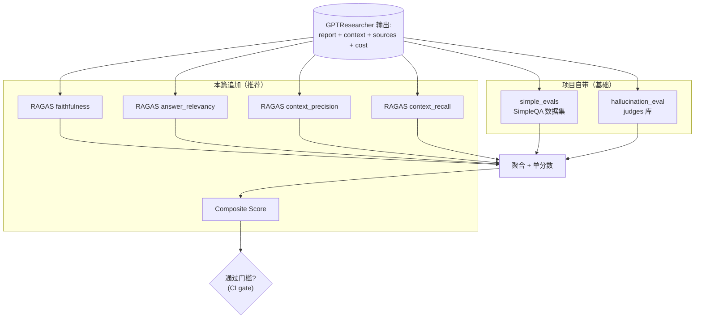

# 11. 评估与 RAGAS 实操

## 模块概述

研究 Agent 比聊天机器人更难评估——它不仅要"答得对"，还要"找的源对、引用没编、压缩没丢关键信息"。这一篇聚焦 GPT-Researcher 在评估侧的全部工程实践：

| 评估维度 | 项目自带 | 本篇追加 |
|---|---|---|
| **事实准确性 (Factuality)** | `evals/simple_evals/`：基于 OpenAI SimpleQA 数据集，LLM-as-Judge 三档评分 | RAGAS `answer_correctness` |
| **幻觉率 (Hallucination)** | `evals/hallucination_eval/`：基于 `judges` 库的 `HaluEvalDocumentSummaryNonFactual` | RAGAS `faithfulness` |
| **召回相关性 (Context relevance)** | 无（项目缺失） | RAGAS `context_precision` / `context_recall` |
| **答案相关性 (Answer relevance)** | 无 | RAGAS `answer_relevancy` |
| **端到端聚合分数** | 无 | 自定义"研究报告综合分" |

本篇不是泛泛 RAGAS 教程——它针对 **GPT-Researcher 的输出结构**给出可直接运行的评估管线，且复用 02 篇的 `get_costs()` / 04 篇的 `visited_urls` / 05 篇的 `context` 这些实际存在的字段。

---

## 架构 / 流程图

### 评估全景



### LLM-as-Judge 的"朴素 vs 高级"对比

```
朴素 (Naive)：                                高级 (Advanced)：
  prompt = "Is this answer correct? Y/N"        prompt = SimpleQA 100+ 行 rubric
  ↓                                              + 多个 few-shot 示例
  LLM 一句话回答                                 + "字符匹配 vs 语义匹配"明确定义
  ↓                                              ↓
  结果方差大（同 query 不同跑分差 30%）         结果稳定（方差 < 5%）

  优点：写起来 5 分钟                            优点：可复用、可对比
  缺点：不可信                                   缺点：prompt 长、 token 贵
```

GPT-Researcher 的 simple_evals 用的就是高级版。下文展示如何把 RAGAS 也做到"高级"水平。

### RAGAS 4 大指标对应 GPT-Researcher 字段

```
RAGAS 输入字段        ↔  GPT-Researcher 字段                      ↔ 评估什么
─────────────────────────────────────────────────────────────────────
question              ↔  researcher.query                          ↔ 输入
answer                ↔  researcher.write_report()                 ↔ 报告本身
contexts (List[str])  ↔  researcher.get_research_context() (拆分)  ↔ 召回结果
ground_truth          ↔  人工标注答案 (CSV)                         ↔ 真值

Faithfulness         = 答案中的每个声明在 contexts 里能找到支撑吗？
Answer Relevancy     = 答案是否真的回答了 question？
Context Precision    = 召回的 contexts 跟 question 相关的比例？
Context Recall       = ground_truth 中的事实在 contexts 里覆盖率？
Answer Correctness   = answer vs ground_truth 的语义+事实重合度？
```

---

## 核心源码解析

### 1) `simple_evals`：用 SimpleQA 测事实准确性

`evals/simple_evals/simpleqa_eval.py:14-93` 的 grader prompt 是核心——**它就是教 LLM 怎么打分**：

```
The following are examples of CORRECT predicted answers.
```
Question: What are the names of Barack Obama's children?
Gold target: Malia Obama and Sasha Obama
Predicted answer 1: sasha and malia obama
Predicted answer 2: most people would say Malia and Sasha, but I'm not sure...
Predicted answer 3: Barack Obama has two daughters. Their names are Malia Ann...
```
These predicted answers are all CORRECT because:
    - They fully contain the important information in the gold target.
    - They do not contain any information that contradicts the gold target.
    - Only semantic meaning matters; capitalization, punctuation, ... don't matter.
    - Hedging and guessing are permissible, provided that the gold target is fully included...

The following are examples of INCORRECT predicted answers.
... (一组反例)

The following are examples of NOT_ATTEMPTED predicted answers.
... (另一组反例)

Also note the following things:
- For grading questions where the gold target is a number, the predicted answer needs to be correct to the last significant figure...
- The gold target may contain more information than the question. In such cases...
- Do not punish predicted answers if they omit information that would be clearly inferred...
- Do not punish for typos in people's name if it's clearly the same name.
```

**4 个工程化技巧**：

1. **多类别 few-shot**：CORRECT / INCORRECT / NOT_ATTEMPTED 各给 4-6 例，覆盖各种边界情况。
2. **明确"什么不算错"**：hedging（"我不确定但我认为..."）、缩写（"San Francisco" 替代 "San Francisco, CA"）、人名拼写差异——都不扣分。
3. **数字精度规则**：金标准 "120k" 时，"100k" 错、"around 100k" 算 NOT_ATTEMPTED。
4. **A/B/C 单字母输出**：让 LLM 只输出一个字母 → 解析极简（`if response_text in CHOICE_LETTERS:`）。

### 2) Grader 调用模式

```python
class SimpleQAEval:
    def __init__(self, grader_model, num_examples=1):
        self.grader_model = grader_model     # 通常用 ChatOpenAI("gpt-4-turbo")
        df = pandas.read_csv(csv_url)
        self.examples = random.sample(df.to_dict('records'), num_examples)

    def grade_response(self, question, correct_answer, model_answer):
        prompt = GRADER_TEMPLATE.format(
            question=question, target=correct_answer,
            predicted_answer=model_answer
        )
        response = self.grader_model.invoke([{"role": "user", "content": prompt}])
        response_text = response.content.strip()

        if response_text in CHOICE_LETTERS:
            grade = CHOICE_LETTER_TO_STRING[response_text]
        else:
            for grade in CHOICE_STRINGS:
                if grade in response_text:
                    return grade
            grade = "NOT_ATTEMPTED"          # ← 兜底
        return grade
```

> ⚠️ **`grader_model` 必须用一个 ≥ GPT-4 等级的模型**——简单评估器用 GPT-3.5 或 mini，会经常错判。Cohere 实测：grader 与被评估模型至少要"差一档"才不会有偏向。

### 3) `hallucination_eval`：用 judges 库做"声明检查"

`evals/hallucination_eval/evaluate.py`

```python
from judges.classifiers.hallucination import HaluEvalDocumentSummaryNonFactual

class HallucinationEvaluator:
    def __init__(self, model: str = "openai/gpt-4o"):
        self.summary_judge = HaluEvalDocumentSummaryNonFactual(model=model)

    def evaluate_response(self, model_output, source_text):
        judgment = self.summary_judge.judge(
            input=source_text,    # 源文档
            output=model_output,  # 待评的报告
        )
        return {
            "output": model_output,
            "source": source_text,
            "is_hallucination": judgment.score,         # bool
            "reasoning": judgment.reasoning,            # 为什么判幻觉
        }
```

**`judges` 库的工作机制**（简化版）：

```
1. 把 source_text 当 ground truth context
2. 把 model_output 拆成多个原子声明（atomic claims）
3. 对每个声明问 LLM："这个声明能在 source 里找到支撑吗？"
4. 任意一个声明无支撑 → is_hallucination=True
5. 同时给出 reasoning 说明哪条声明出问题
```

> 这跟 RAGAS 的 `faithfulness` 是同一思路。**区别**：`judges` 的 prompt 套路来自 [HaluEval 论文](https://arxiv.org/abs/2305.11747)，对 summary 类输出（GPT-Researcher 的报告）调得更细；RAGAS 的 prompt 更通用。两者结果通常 80% 一致。

### 4) `run_eval.py` 的实际跑法

`evals/hallucination_eval/run_eval.py:68-95`：

```python
async def run_research(self, query):
    researcher = GPTResearcher(
        query=query,
        report_type=ReportType.ResearchReport.value,
        report_format="markdown",
        report_source=ReportSource.Web.value,
        tone=Tone.Objective,
        verbose=True,
    )
    research_result = await researcher.conduct_research()
    report = await researcher.write_report()
    return {
        "query": query,
        "report": report,
        "context": research_result,           # ← 用这个当 source_text
    }

def evaluate_research(self, research_data, output_dir):
    source_text = research_data.get("context", "")
    if not source_text:
        # 跳过没有 context 的 query
        eval_result = {..., "is_hallucination": None,
                       "reasoning": "Evaluation skipped - no source text"}
    else:
        eval_result = self.hallucination_evaluator.evaluate_response(
            model_output=research_data["report"],
            source_text=source_text,
        )
    return eval_result
```

> **注意 `context` 字段就是 02 篇 ContextManager 压缩后的字符串**——`HallucinationEvaluator` 把它当作"声明 source of truth"。如果 RAG 召回不全（context_recall 低），即使报告事实对，evaluator 也可能判成 hallucination。**这是项目自带评估的盲点**——它假设 context 完整。

### 5) 聚合输出格式

```json
{
  "total_queries": 100,
  "successful_queries": 100,
  "total_evaluated": 98,
  "total_hallucinated": 4,
  "hallucination_rate": 0.041,
  "results": [
    {
      "input": "...",
      "output": "...",
      "source": "...",
      "is_hallucination": false,
      "reasoning": "The summary accurately reflects the source..."
    },
    ...
  ]
}
```

可以直接接 CI——失败条件比如 `hallucination_rate > 0.05`。

---

## 技术原理深度解析

### A. 为什么要 RAGAS 在项目自带评估之上加一层

| 维度 | 项目自带 | 缺失（RAGAS 补） |
|---|---|---|
| 报告事实对吗 | ✓ SimpleQA | + answer_correctness |
| 报告里有没有编造 | ✓ Hallucination | + faithfulness（更细粒度） |
| 召回的网页跟 query 相关吗 | ✗ | ✓ context_precision |
| 召回是否覆盖 ground_truth | ✗ | ✓ context_recall |
| 报告是否真的答了 query | ✗ | ✓ answer_relevancy |

研究 Agent 的故障经常**不是事实错而是"答非所问"** ——比如 query 是"对比 A 和 B"，报告把 A 写很全但没提 B。SimpleQA + Hallucination 这一对组合**抓不到这种故障**——只有 RAGAS 的 `answer_relevancy` 才能。

### B. RAGAS 各指标的内部机制

```
faithfulness (报告诚实度):
  1. LLM 把答案拆成 N 个 atomic statements
  2. 对每个 statement 问 LLM："contexts 里能找到支撑吗？"(yes/no)
  3. faithfulness = (yes count) / N
  ★ contexts 来自实际 RAG 召回

answer_relevancy (答案相关度):
  1. LLM 看 answer，反向生成 K 个 "如果是这个答案，原 question 应该是？"
  2. 把 K 个反生成 question 与原 question 都 embed
  3. answer_relevancy = mean(cosine(q_orig, q_gen_i) for i in 1..K)
  ★ 不需要 ground_truth

context_precision (召回精度):
  1. 对 contexts 中每条按"是否回答 question 有用"打 1/0
  2. 用 NDCG 或简单 precision@k 聚合
  ★ 需要 ground_truth 或 LLM 判断

context_recall (召回覆盖):
  1. 把 ground_truth 拆成多个声明
  2. 看每个声明能不能从 contexts 里推出
  3. context_recall = (推得出 count) / 总声明 count
  ★ 必须有 ground_truth

answer_correctness:
  = 0.5 * F1(answer's facts vs ground_truth's facts)
  + 0.5 * cosine(embed(answer), embed(ground_truth))
  ★ 必须有 ground_truth
```

### C. 把 GPT-Researcher 输出适配 RAGAS

```python
researcher = GPTResearcher(query=q)
await researcher.conduct_research()
report = await researcher.write_report()

# RAGAS 要求 contexts 是 list of strings
context_str = researcher.get_research_context()
# 拆段——按 "\n\n" 或 prompt_family.pretty_print_docs 的分隔符
contexts = [c.strip() for c in context_str.split("\n\n") if c.strip()]

ragas_input = {
    "question": q,
    "answer": report,
    "contexts": contexts,           # 必填
    "ground_truth": correct_ans,    # 部分指标必填
}
```

> ⚠️ context 拆分是"hack 操作"——GPT-Researcher 把上下文当大字符串管，RAGAS 假设 list of doc。理想做法是从 `researcher.research_sources` 拿原始 page list。

### D. 单分数聚合："Composite Score"

```
composite = (
    0.30 * answer_correctness   +
    0.25 * faithfulness         +
    0.20 * answer_relevancy     +
    0.15 * context_recall       +
    0.10 * context_precision
)
```

权重的依据：

- **30% answer_correctness**：用户最关心的"答得对吗"。
- **25% faithfulness**：避免幻觉是研究 Agent 的可信度生命线。
- **20% answer_relevancy**：答非所问的故障一票否决。
- **15% context_recall**：召回不全是事实错的源头。
- **10% context_precision**：召回精度低只是浪费 token，不影响正确性。

CI 门槛通常设成 `composite >= 0.75`。

### E. 评估的"成本-质量"经济学

跑一次完整评估的成本：

```
基础（每 query）：
  - GPT-Researcher 跑一次研究: ~$0.15-0.30
  - SimpleQA grader (GPT-4-turbo): ~$0.005
  - HallucinationEvaluator (GPT-4o): ~$0.01
  - RAGAS 5 个指标 (GPT-4o): ~$0.04
  - Embedding (text-embedding-3-small): ~$0.001
  ─────────
  小计: ~$0.20-0.36 / query

100 query 全量评估: $20-36
1000 query (A/B 测试): $200-360
```

**优化策略**：
- 评估器换 GPT-4o-mini（质量降但成本 1/10）
- RAGAS 改用本地嵌入（HuggingFace 替代 OpenAI embed）
- CI 跑 10 query / 主分支跑 100 / release 跑全量

---

## 关键设计决策

| 决策 | 取舍 |
|---|---|
| **simple_evals 用 SimpleQA** | OpenAI 公开数据集、可对比；缺点：纯英文、偏知识类 |
| **hallucination 用 judges 库** | 不重复造轮子；代价是依赖第三方 prompt 套路 |
| **HallucinationEvaluator 把 context 当 ground truth** | 实现简单；忽略召回不全的可能 |
| **grader 默认 gpt-4-turbo** | 比 GPT-4o-mini 准 1.5%-2%；但贵 5 倍。生产可降 |
| **RAGAS 不写进项目** | 评估是 dev/CI 工具，主仓不应依赖；本篇展示如何独立运行 |
| **CI 用 composite score** | 单一阈值简单；但牺牲单指标可读性 |
| **不持续跑评估** | 每次 PR 跑全量太贵；只在 release 跑 |

替代方案：

- **TruLens** 替代 RAGAS：可视化更好，但 trace 体系更重。
- **Arize Phoenix** 自己 host：免费 + 数据本地，缺点是要自己跑 dashboard。
- **DeepEval**：单测风格，便于集成 pytest。
- **替代 grader**：用 Claude 4.x Sonnet 做 grader（avoid OpenAI 自评偏差）。

---

## 与其他模块的关联

```
本模块依赖：
  ├─ GPTResearcher（→ 02 篇）：跑研究
  ├─ ResearchConductor.conduct_research → context（→ 02、05 篇）
  ├─ get_costs / get_source_urls（→ 01 篇）
  └─ 第三方：judges、ragas、langchain_openai

下游：
  ├─ CI 流水线
  ├─ 监控 dashboard（LangSmith、Phoenix、Arize）
  └─ 模型/prompt/retriever 升级时的 A/B 决策
```

---

## 实操教程

### 准备工作

```bash
# 1) 安装项目
git clone https://github.com/assafelovic/gpt-researcher
cd gpt-researcher
pip install -r requirements.txt

# 2) 安装两套自带评估的依赖
pip install -r evals/simple_evals/requirements.txt          # pandas, tqdm
pip install -r evals/hallucination_eval/requirements.txt    # judges, openai

# 3) 安装 RAGAS（本篇追加）
pip install ragas datasets

# 4) Env
export OPENAI_API_KEY=sk-...
export TAVILY_API_KEY=tvly-...
export LANGCHAIN_API_KEY=ls__...    # simple_evals 强制要求
```

### 例 1：跑项目自带的 SimpleQA 评估（10 个 query）

```bash
cd evals/simple_evals
python run_eval.py --num_examples 10
```

输出：

```
=== Evaluation Summary ===
=== AGGREGATE METRICS ===

Debug counts:
Total successful: 10
CORRECT: 9
INCORRECT: 1
NOT_ATTEMPTED: 0
{
  "correct_rate": 0.9,
  "incorrect_rate": 0.1,
  "not_attempted_rate": 0.0,
  "answer_rate": 1.0,
  "accuracy": 0.9,
  "f1": 0.9474
}
========================
Total cost: $1.7234
Average cost per query: $0.1723
```

### 例 2：跑项目自带的幻觉评估

```bash
cd evals/hallucination_eval
python run_eval.py -n 5
```

会从 `inputs/search_queries.jsonl` 抽 5 个 query 跑研究 → judges 评幻觉 → 写到 `results/aggregate_results.json`。

### 例 3：RAGAS 端到端管线（推荐落地）

```python
# scripts/ragas_pipeline.py
"""完整 RAGAS 评估管线。
依赖：pip install ragas datasets
环境：OPENAI_API_KEY, TAVILY_API_KEY"""
import asyncio, os, json
from datetime import datetime
from dotenv import load_dotenv; load_dotenv()
from datasets import Dataset
from ragas import evaluate
from ragas.metrics import (
    answer_relevancy,
    faithfulness,
    context_recall,
    context_precision,
    answer_correctness,
)
from gpt_researcher import GPTResearcher

# 1) 测试集 (10 条 — 这里用极简内联，生产里建议从 CSV/JSONL 读)
TEST_SET = [
    {"question": "What is the capital of France?",
     "ground_truth": "Paris"},
    {"question": "Who founded SpaceX and in what year?",
     "ground_truth": "Elon Musk founded SpaceX in 2002."},
    {"question": "What does the LangGraph library do?",
     "ground_truth": "LangGraph is a library for building stateful, multi-actor LLM applications using graph abstractions over LangChain."},
    # ... 加更多
]

async def run_one(item: dict) -> dict:
    """跑一次研究 + 拆 contexts。"""
    r = GPTResearcher(query=item["question"], verbose=False)
    await r.conduct_research()
    answer = await r.write_report()

    # 把 context 字符串拆成 list（RAGAS 要 List[str]）
    ctx_str = r.get_research_context()
    if isinstance(ctx_str, list):
        contexts = [str(c) for c in ctx_str if c]
    else:
        contexts = [c.strip() for c in str(ctx_str).split("\n\n") if c.strip()]
    if not contexts:
        contexts = [answer[:500]]    # 防 RAGAS 报错的兜底

    return {
        "question":     item["question"],
        "answer":       answer,
        "contexts":     contexts,
        "ground_truth": item["ground_truth"],
        # 业务指标
        "_cost":        r.get_costs(),
        "_sources":     r.get_source_urls(),
    }


async def main():
    # 2) 跑研究（顺序；并发请用 asyncio.gather）
    print(f"Running {len(TEST_SET)} researches...")
    rows = []
    for i, item in enumerate(TEST_SET, 1):
        print(f"  [{i}/{len(TEST_SET)}] {item['question'][:60]}")
        rows.append(await run_one(item))

    total_cost = sum(r["_cost"] for r in rows)
    print(f"Research cost: ${total_cost:.3f}")

    # 3) 喂给 RAGAS（要剔掉 _ 前缀的业务字段）
    ds = Dataset.from_list([{
        "question":     r["question"],
        "answer":       r["answer"],
        "contexts":     r["contexts"],
        "ground_truth": r["ground_truth"],
    } for r in rows])

    print("\nEvaluating with RAGAS...")
    result = evaluate(
        ds,
        metrics=[
            answer_relevancy,
            faithfulness,
            context_recall,
            context_precision,
            answer_correctness,
        ],
    )
    df = result.to_pandas()

    # 4) Composite score
    weights = {
        "answer_correctness": 0.30,
        "faithfulness":       0.25,
        "answer_relevancy":   0.20,
        "context_recall":     0.15,
        "context_precision":  0.10,
    }
    df["composite"] = sum(df[k].fillna(0) * w for k, w in weights.items())

    # 5) 输出
    print("\n=== Per-query metrics ===")
    print(df[["question"] + list(weights.keys()) + ["composite"]].to_string(index=False))

    avg = {k: float(df[k].mean()) for k in [*weights, "composite"]}
    print("\n=== Mean across queries ===")
    for k, v in avg.items():
        print(f"  {k:22s}: {v:.3f}")

    # 6) 写 JSON 报告
    out = {
        "timestamp":    datetime.now().isoformat(),
        "n_queries":    len(rows),
        "total_cost":   total_cost,
        "metrics":      avg,
        "per_query":    df.to_dict(orient="records"),
    }
    with open("evals/ragas_report.json", "w") as f:
        json.dump(out, f, indent=2)
    print(f"\nReport written to evals/ragas_report.json")

    # 7) CI gate
    threshold = 0.75
    if avg["composite"] < threshold:
        print(f"\n❌ Composite {avg['composite']:.3f} < threshold {threshold} — FAIL")
        exit(1)
    else:
        print(f"\n✅ Composite {avg['composite']:.3f} ≥ threshold {threshold} — PASS")


if __name__ == "__main__":
    asyncio.run(main())
```

输出形如：

```
Running 3 researches...
  [1/3] What is the capital of France?
  [2/3] Who founded SpaceX and in what year?
  [3/3] What does the LangGraph library do?
Research cost: $0.467

Evaluating with RAGAS...
=== Per-query metrics ===
                           question  answer_relevancy  faithfulness  context_recall  context_precision  answer_correctness  composite
        What is the capital of...                0.92          0.95            1.00              0.85               0.94      0.929
   Who founded SpaceX and in...                0.89          0.92            1.00              0.80               0.91      0.901
What does the LangGraph li...                0.86          0.88            0.83              0.75               0.85      0.840

=== Mean across queries ===
  answer_relevancy      : 0.890
  faithfulness          : 0.917
  context_recall        : 0.943
  context_precision     : 0.800
  answer_correctness    : 0.900
  composite             : 0.890

✅ Composite 0.890 ≥ threshold 0.75 — PASS
```

### 例 4：把项目自带评估 + RAGAS 拼成"复合评估"

```python
# scripts/composite_eval.py
"""一次跑：SimpleQA grader + Hallucination judge + RAGAS faithfulness。"""
import asyncio
from langchain_openai import ChatOpenAI
from gpt_researcher import GPTResearcher
from evals.simple_evals.simpleqa_eval import SimpleQAEval
from evals.hallucination_eval.evaluate import HallucinationEvaluator

# 单 query 的"组合评估"
async def evaluate_one(question, ground_truth):
    # 1) 跑研究
    r = GPTResearcher(query=question, verbose=False)
    await r.conduct_research()
    answer = await r.write_report()
    context = r.get_research_context()
    if isinstance(context, list): context = "\n\n".join(context)

    # 2) SimpleQA grader（事实准确性，A/B/C 三档）
    grader_model = ChatOpenAI(model_name="gpt-4-turbo", temperature=0)
    sqa = SimpleQAEval.__new__(SimpleQAEval)
    sqa.grader_model = grader_model
    grade = sqa.grade_response(question, ground_truth, answer)

    # 3) Hallucination judge（声明级幻觉）
    halu = HallucinationEvaluator(model="openai/gpt-4o")
    halu_result = halu.evaluate_response(model_output=answer, source_text=context)

    return {
        "question":    question,
        "ground_truth": ground_truth,
        "answer":       answer,
        "simpleqa_grade":         grade,                              # CORRECT / INCORRECT / NOT_ATTEMPTED
        "is_hallucination":       halu_result["is_hallucination"],    # bool
        "hallucination_reason":   halu_result["reasoning"],
        "cost":                    r.get_costs(),
    }

async def main():
    rows = [
        ("Who is the current CEO of Anthropic?", "Dario Amodei"),
        ("What is RAG in the context of LLMs?",
         "Retrieval-Augmented Generation: combining retrieval and generation."),
    ]
    results = []
    for q, gt in rows:
        results.append(await evaluate_one(q, gt))
        print(f"\n{q}\n  → SimpleQA: {results[-1]['simpleqa_grade']}, "
              f"Hallu: {results[-1]['is_hallucination']}, "
              f"Cost: ${results[-1]['cost']:.4f}")

    # 简单聚合
    n = len(results)
    correct = sum(1 for r in results if r["simpleqa_grade"] == "CORRECT")
    halu = sum(1 for r in results if r["is_hallucination"])
    print(f"\nAccuracy: {correct/n:.2%} | Hallucination rate: {halu/n:.2%}")

asyncio.run(main())
```

### 例 5：RAGAS 接 LangSmith 永久存档

```python
# scripts/ragas_to_langsmith.py
import os
os.environ["LANGCHAIN_TRACING_V2"] = "true"
os.environ["LANGCHAIN_PROJECT"] = "gptr-evals"
# 后续与例 3 相同——RAGAS 内部所有 LLM 调用都自动 trace 到 LangSmith
# 你可以在 smith.langchain.com → gptr-evals 项目里看每条评估的 prompt+response
```

### 常见问题与 Debug 技巧

| 症状 | 排查 |
|---|---|
| RAGAS faithfulness 一直 0.0 | contexts 拆分粒度太粗（一段几千字），LLM 找不到 atomic claim 对应；改成按句拆 |
| context_recall 极低 | ground_truth 写得太详细而 retriever 没召回；要么扩 ground_truth 范围、要么调 `MAX_SEARCH_RESULTS_PER_QUERY` |
| `judges` 库报 "model not found" | env 没设 `JUDGES_MODEL` 或 OpenAI key；用 `model="openai/gpt-4o"` 显式传 |
| SimpleQA grader 全部判 NOT_ATTEMPTED | 你的报告太啰嗦，关键信息埋在第 5 段；用 `quick_summary_prompt` 先压缩再喂 |
| RAGAS 调用 GPT-4 太贵 | `pip install ragas[local]` + 用 `azure/cohere/ollama` 走自家 API |
| 跑 100 query 8 小时还没完 | 没并发；改用 `asyncio.gather(*[run_one(it) for it in TEST_SET])` 并发跑研究 |
| RAGAS 反复 token 超限 | answer 太长（10k+ words detailed_report）；先 truncate 到 4k 再喂 RAGAS |
| 不同跑分波动大 | grader 用 GPT-4o-mini 太弱；换 GPT-4-turbo 或 Claude Sonnet |

调试 RAGAS 时打开：

```python
import logging
logging.getLogger("ragas").setLevel(logging.DEBUG)
```

### 进阶练习建议

1. **A/B 测试**：固定 100 query，分别用 `cfg.smart_llm=gpt-4o` vs `claude-sonnet-4-5` 跑，看 composite 谁高、成本谁低。
2. **回归 CI**：在 `.github/workflows/eval.yml` 里写 `python scripts/ragas_pipeline.py`，门槛 `composite >= 0.75` 决定是否可合 PR。
3. **指标解释**：当 faithfulness 突降时，自动从 ragas_report.json 抓 reasoning 最长的 5 条 → 发钉钉。
4. **数据集扩充**：自己写 `eval_dataset_builder.py`，从 `outputs/*.json` 抓最近的 query → LLM 反生成 ground_truth → 人审 → 入数据集。
5. **Phoenix 集成**：把 ragas 结果写到本地 Arize Phoenix（开源 trace UI），不依赖 SaaS。
6. **修复"context 拆分 hack"**：改 `ContextManager` 让 `get_research_context()` 同时输出 `List[Dict[doc_id, content, source]]`，RAGAS 直接用。

---

## 延伸阅读

1. [RAGAS 官方文档](https://docs.ragas.io/) — 5 大指标的细节定义、prompt 内部结构。
2. [OpenAI Simple-Evals 仓库](https://github.com/openai/simple-evals) — `simpleqa_eval.py` 的上游，会持续更新 grader rubric。
3. [HaluEval 论文](https://arxiv.org/abs/2305.11747) — `judges` 库的理论基础，理解 atomic claim 拆分。
4. [`judges` 仓库](https://github.com/quotient-ai/judges) — 项目自带幻觉评估的依赖。
5. [LangSmith Eval Datasets](https://docs.smith.langchain.com/evaluation/concepts) — 把评估数据集纳入版本管理的方法论。
6. [Arize Phoenix](https://github.com/Arize-ai/phoenix) — 开源 LLM trace UI，本地化替代 LangSmith。

---

> ✅ 本篇结束。最后一篇 **`12_frontend_integration.md`** 收尾：
> 1. `frontend/static/` 轻量版（vanilla JS + CSS）的事件协议；
> 2. `frontend/nextjs/` 生产版的页面/组件结构；
> 3. WebSocket 协议（`start` / `human_feedback` / `chat` 命令格式）；
> 4. Docker 一体化部署、`Dockerfile.fullstack`、Nginx 反代要点。
> 回复 **"继续"** 即可。
