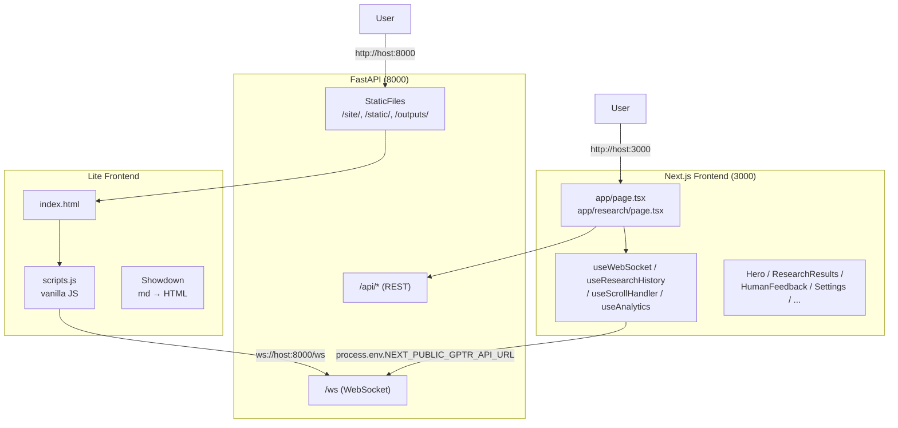
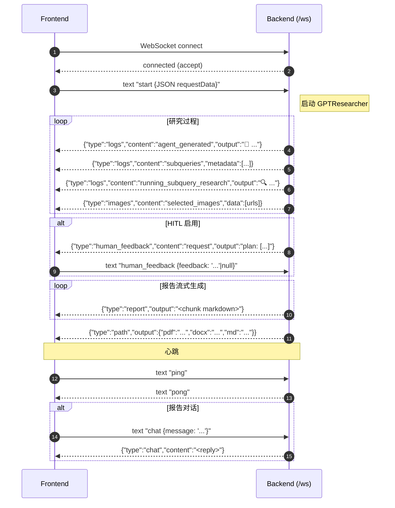

# 12. 前端对接：lite + Next.js 双套 UI、WebSocket 协议与部署

## 模块概述

GPT-Researcher 提供**两套并行前端**——这是 OSS 项目里少见的"全栈完备"安排：

| 形态 | 路径 | 技术栈 | 适用 |
|---|---|---|---|
| **轻量版** | `frontend/index.html` + `scripts.js` + `styles.css` | Vanilla JS + Bootstrap 4 + Showdown | 嵌进 FastAPI 一起跑（`/site/`），单文件部署 |
| **生产版** | `frontend/nextjs/` | Next.js 15 + React + Tailwind + TypeScript | 独立 Vercel/Cloud 部署，SSR/SEO/缓存 |

它们**共享同一套 WebSocket 协议**（连同一个 `/ws` 端点）——因此学懂协议再选 UI 就行。本篇结构：

1. WebSocket "事件协议"完整规范（命令格式、消息类型、HITL）
2. 轻量版的关键流程
3. Next.js 版的目录与状态管理
4. Docker / `Dockerfile.fullstack` / docker-compose / Nginx 部署

---

## 架构 / 流程图

### 双前端并存



### WebSocket 协议总览



### Next.js 状态机

```
useWebSocket
   ↓ 接 message
   ├─ data.type === 'report'          → setAnswer(prev + chunk)
   ├─ data.type === 'report_complete'  → setAnswer(全文，覆盖)
   ├─ data.type === 'human_feedback' && content==='request'
   │                                   → setShowHumanFeedback(true), setQuestionForHuman(data.output)
   ├─ data.type === 'path'             → setLoading(false)
   └─ 其它                             → setOrderedData(prev + data)

页面层 (app/research/page.tsx) 把 orderedData 喂给
ResearchResults → 渲染按时间排序的 logs/images/sources/report 块
```

---

## WebSocket 协议详解

### 1) 客户端 → 服务端：3 种命令

每条都是 **以特定前缀开头的 text frame**，前缀后接空格再接 JSON。

#### `start {requestData}`

启动新研究。

```json
{
  "task": "Is AI in a hype cycle?",
  "report_type": "research_report",      // basic / detailed_report / multi_agents / deep / outline / custom / subtopic
  "report_source": "web",                // web / local / hybrid / azure / langchain_documents / langchain_vectorstore
  "source_urls": [],                     // 用户指定 URL（可选）
  "document_urls": [],                   // 在线文档 URL（可选）
  "tone": "Objective",                   // Tone enum value
  "agent": "Auto Agent",                 // 主页 radio
  "query_domains": ["arxiv.org"],        // 可选域名过滤
  "max_search_results": 5,               // 替代 cfg.MAX_SEARCH_RESULTS_PER_QUERY
  "headers": {"openai_api_key": "..."},  // 可选——客户端塞 API key 不走 server env
  "mcp_enabled": false,
  "mcp_strategy": "fast",
  "mcp_configs": []
}
```

#### `human_feedback {feedback}`

仅在多 Agent 路径下触发，回复 `human_feedback` 节点的 plan 询问。

```json
{"feedback": "Please add a section on Anthropic's MCP"}
// 或者放行
{"feedback": "no"}
```

#### `chat {message}`

研究完成后基于报告对话（见 `backend/chat/chat.py:ChatAgentWithMemory`）。

```json
{"message": "Summarize the conclusion in one sentence"}
```

#### `ping`

心跳。服务端回 `pong`（不是 JSON，是纯字符串）。

### 2) 服务端 → 客户端：消息类型表

服务端**全部以 JSON object 推送**（除 `pong`）。一律带 `type`、`content`、`output` 三字段（部分类型还有 `metadata`/`data`）。

| `type` | `content` | `output` 内容 | 何时触发 |
|---|---|---|---|
| `logs` | `starting_research` | "🔍 Starting the research..." | 进入 conduct_research |
| `logs` | `agent_generated` | agent 名（"💰 Finance Agent"） | choose_agent 完成 |
| `logs` | `planning_research` | "🌐 Browsing the web..." | plan_research_outline 起点 |
| `logs` | `subqueries` | "I will conduct my research based on..."；带 `metadata: List[str]` | sub-queries 生成 |
| `logs` | `running_subquery_research` | 单个 sub-query 开始 | 每个 sub-query |
| `logs` | `added_source_url` | 找到新 URL；带 `data: url` | 每抓到新 URL |
| `logs` | `scraping_urls` / `scraping_content` / `scraping_images` / `scraping_complete` | 进度 | scraper 各阶段 |
| `logs` | `fetching_query_content` | embedding 阶段 | ContextCompressor |
| `logs` | `writing_report` / `report_written` | 写作阶段 | ReportGenerator |
| `logs` | `mcp_init` / `mcp_retrieval` / `mcp_results` / ... | MCP 子阶段 | MCPRetriever（→ 09 篇 MCPStreamer） |
| `images` | `selected_images` | JSON list of image URLs | BrowserManager.select_top_images |
| `report` | n/a | markdown 增量片段 | 流式写报告（每 token-chunk） |
| `report_complete` | n/a | 完整 markdown（含图） | 写完插入插图后（Next.js 用） |
| `path` | n/a | `{pdf, docx, md, json}` 文件路径 | 生成完成 |
| `chat` | n/a | AI 回复文本 | 报告对话回应 |
| `human_feedback` | `request` | 提问文本 | 多 Agent HITL 触发 |
| `error` | n/a | 错误描述 | 异常 |

> **`logs` 是"语义日志"而非"自由文字"**——每条都有稳定的 `content` 标识符，前端可以基于它换图标、滤波、聚合。这是项目可观测性架构里"**事件模型**"的体现。

### 3) Next.js 端如何消费

```typescript
// frontend/nextjs/hooks/useWebSocket.ts:102-130
newSocket.onmessage = (event) => {
  if (event.data === 'pong') return;
  const data = JSON.parse(event.data);

  if (data.type === 'error') {
    console.error(`Server error: ${data.output}`);
  } else if (data.type === 'human_feedback' && data.content === 'request') {
    setQuestionForHuman(data.output);
    setShowHumanFeedback(true);
  } else {
    const contentAndType = `${data.content}-${data.type}`;
    setOrderedData((prevOrder) => [...prevOrder, { ...data, contentAndType }]);

    if (data.type === 'report') {
      setAnswer((prev) => prev + data.output);                  // ← 逐 chunk 拼
    } else if (data.type === 'report_complete') {
      setAnswer(data.output);                                   // ← 整体覆盖
    } else if (data.type === 'path') {
      setLoading(false);
    }
  }
};
```

**关键设计**：

- 把所有事件都塞 `setOrderedData` 数组——按时间排序展示成"研究 Timeline"。
- `data.type === 'report'` 单独走 `setAnswer` 拼接（前端实时渲染 markdown 流）。
- `report_complete` **覆盖式**而非追加——后端在写完最终包含插图的版本后会再发一次完整 markdown，给 Next.js 用。轻量版没这个分支（不显示插图）。
- `report_complete` vs `path`：前者给"渲染需要的最终内容"、后者给"下载链接"。两者都是终点信号。

---

## 核心源码解析

### 1) 轻量版：Vanilla JS 单文件

`frontend/scripts.js` 是 IIFE 模块，约 2400 行。核心是 `listenToSockEvents` + `onmessage` 状态机。

```javascript
// scripts.js:823 (简化)
const listenToSockEvents = () => {
  const { protocol, host, pathname } = window.location;
  const ws_uri = `${protocol === 'https:' ? 'wss:' : 'ws:'}//${host}${pathname}ws`;

  // showdown converter: markdown → HTML
  const converter = new showdown.Converter({
    ghCodeBlocks: true, tables: true, tasklists: true,
    smartIndentationFix: true, simpleLineBreaks: true,
    openLinksInNewWindow: true, parseImgDimensions: true,
  });

  socket = new WebSocket(ws_uri);
  let reportContent = '';

  socket.onmessage = (event) => {
    const data = JSON.parse(event.data);
    messagesReceived++;
    lastActivityTime = Date.now();

    if (data.type === 'logs') {
      if (data.content === 'subqueries' && Array.isArray(data.metadata)) {
        displaySubQuestions(data.metadata);
      }
      addAgentResponse(data);

    } else if (data.type === 'images') {
      displaySelectedImages(data);

    } else if (data.type === 'report') {
      reportContent += data.output;
      const report_type = document.querySelector('select[name="report_type"]').value;
      const isDetailedReport = report_type === 'detailed_report';

      if (isDetailedReport) {
        allReports += data.output;
        // detailed_report 每次都重渲染整篇（因为多章节会跳来跳去）
        writeReport({output: allReports, type: 'report'}, converter, false, false);
      } else {
        // 其它流式追加
        writeReport({output: data.output, type: 'report'}, converter, false, true);
      }

    } else if (data.type === 'path') {
      updateState('finished');
      downloadLinkData = updateDownloadLink(data);
      isResearchActive = false;
      // detailed_report 收到 path 才一次性渲染全文
      if (report_type === 'detailed_report' && allReports) {
        writeReport({output: allReports}, converter, true, false);
      }
      saveToHistory(reportContent, downloadLinkData);

    } else if (data.type === 'chat') {
      // 移除 loading 指示器，加入 AI 消息
      addChatMessage(data.content, false);
    }
  };

  socket.onopen = () => {
    const requestData = {
      task: document.getElementById('task').value,
      report_type: document.querySelector('select[name="report_type"]').value,
      report_source: document.querySelector('select[name="report_source"]').value,
      tone: document.querySelector('select[name="tone"]').value,
      agent: document.querySelector('input[name="agent"]:checked').value,
      source_urls: tags,
      query_domains: query_domains_str.split(',').map(d => d.trim()).filter(Boolean),
      max_search_results: parseInt(document.getElementById('maxSearchResults').value, 10) || 5,
    };

    const mcpData = collectMCPData();
    if (mcpData) Object.assign(requestData, mcpData);

    socket.send(`start ${JSON.stringify(requestData)}`);
  };

  socket.onclose = (event) => {
    if (isResearchActive) reconnectWebSocket();      // 自动重连
  };
};
```

**几个工程细节**：

1. **`detailed_report` 重渲染策略**：因为 detailed_report 每章节都流式写、章节顺序可能颠倒（并行子图先返回的先写），简单 append 会乱——所以用 `allReports` 累积纯 markdown，每次 chunk 来都重新渲染整篇 HTML。其它报告类型用 append 节省渲染开销。
2. **localStorage 存历史**：研究结束后 `saveToHistory` 把 (query, report, downloads) 存 localStorage，刷新不丢。
3. **自动重连**：`socket.onclose` + `isResearchActive` 标记 + 指数退避（5 次）→ 网络抖动友好。

### 2) Next.js 版目录

```
frontend/nextjs/
├─ app/
│  ├─ page.tsx              # 首页
│  ├─ research/page.tsx     # 研究详情/历史
│  ├─ api/                  # 内置 API route（headers token 透传等）
│  ├─ layout.tsx
│  └─ globals.css
├─ components/
│  ├─ Hero.tsx              # 首页表单
│  ├─ ResearchResults.tsx   # 研究 timeline 主容器
│  ├─ HumanFeedback.tsx     # HITL 表单
│  ├─ Header.tsx, Footer.tsx
│  ├─ ResearchSidebar.tsx   # 历史记录面板
│  ├─ Settings/             # 设置页
│  ├─ Task/                 # task block
│  ├─ ResearchBlocks/       # 各类型事件块（log/image/sources/...）
│  ├─ Images/, Langgraph/, layouts/, mobile/, research/
│  ├─ TypeAnimation.tsx     # 打字机效果
│  └─ LoadingDots.tsx
├─ hooks/
│  ├─ useWebSocket.ts            # 主连接 + 协议解析
│  ├─ useResearchHistory.ts      # localStorage 历史
│  ├─ ResearchHistoryContext.tsx
│  ├─ useScrollHandler.ts        # 自动滚到最新
│  └─ useAnalytics.ts            # GA 上报
├─ helpers/
│  └─ getHost.ts            # API URL 获取（5 优先级）
├─ actions/                 # Next.js Server Actions
├─ types/data.ts            # OrderedData / ChatBoxSettings 等接口
├─ public/                  # 静态资源
├─ Dockerfile               # 生产镜像（多阶段）
├─ Dockerfile.dev           # 热重载开发镜像
├─ nginx/                   # Nginx 反代配置
└─ next.config.mjs
```

### 3) `getHost`：5 优先级 API URL

`frontend/nextjs/helpers/getHost.ts`

```typescript
export const getHost = ({ purpose }: GetHostParams = {}): string => {
  if (typeof window !== 'undefined') {
    const { host } = window.location;
    const apiUrlInLocalStorage = localStorage.getItem("GPTR_API_URL");

    const urlParams = new URLSearchParams(window.location.search);
    const apiUrlInUrlParams = urlParams.get("GPTR_API_URL");

    // 优先级（高 → 低）
    if (apiUrlInLocalStorage)            return apiUrlInLocalStorage;            // 1. localStorage
    if (apiUrlInUrlParams)               return apiUrlInUrlParams;               // 2. URL param
    if (process.env.NEXT_PUBLIC_GPTR_API_URL) return process.env.NEXT_PUBLIC_GPTR_API_URL; // 3. build-time env
    if (process.env.REACT_APP_GPTR_API_URL)   return process.env.REACT_APP_GPTR_API_URL;   // 4. CRA 兼容
    if (purpose === 'langgraph-gui') {
      return host.includes('localhost') ? 'http%3A%2F%2F127.0.0.1%3A8123' : `https://${host}`;
    }
    return host.includes('localhost') ? 'http://localhost:8000' : `https://${host}`;        // 5. 同 origin
  }
  return '';
};
```

> **设计意图**：
> - **localStorage 最高**：让用户在浏览器里手动改后端地址（开发便利）。
> - **URL param 次之**：分享链接时 `?GPTR_API_URL=...` 直接覆盖。
> - **build-time env**：生产 Vercel 部署的标准做法。
> - **同 origin 兜底**：单容器 Dockerfile.fullstack 把 backend 和 frontend 部到同一域。

### 4) `useWebSocket`：单 hook 管所有协议

`frontend/nextjs/hooks/useWebSocket.ts`（关键片段已在协议详解部分贴过）。补充几个：

```typescript
const startHeartbeat = (ws: WebSocket) => {
  if (heartbeatInterval.current) clearInterval(heartbeatInterval.current);
  heartbeatInterval.current = window.setInterval(() => {
    if (ws.readyState === WebSocket.OPEN) ws.send('ping');     // 30s 一次心跳
  }, 30000);
};

newSocket.onopen = () => {
  const { report_type, report_source, tone, mcp_enabled, mcp_configs, mcp_strategy } = chatBoxSettings;
  const dataToSend = {
    task: promptValue, report_type, report_source, tone,
    query_domains: domains,
    mcp_enabled: mcp_enabled || false,
    mcp_strategy: mcp_strategy || "fast",
    mcp_configs: mcp_configs || [],
  };
  newSocket.send(`start ${JSON.stringify(dataToSend)}`);
  startHeartbeat(newSocket);
};
```

> **30 秒心跳**对付的是反向代理的 idle timeout（Cloudflare 100s、Nginx 默认 60s）。研究跑得长（5-30 分钟）时如果不心跳，连接早就被中间件 reset 了。

### 5) `HumanFeedback` 组件：HITL 的 UI 实现

`frontend/nextjs/components/HumanFeedback.tsx`

```tsx
const HumanFeedback: React.FC<HumanFeedbackProps> = ({
  questionForHuman, websocket, onFeedbackSubmit
}) => {
  const [userFeedback, setUserFeedback] = useState<string>('');

  const handleSubmit = (e: React.FormEvent) => {
    e.preventDefault();
    onFeedbackSubmit(userFeedback === '' ? null : userFeedback);    // 空 → 视为放行
    setUserFeedback('');
  };

  return (
    <div className="bg-gray-100 p-4 rounded-lg shadow-md">
      <h3>Human Feedback Required</h3>
      <p>{questionForHuman}</p>                                     {/* ← 显示后端发的 plan */}
      <form onSubmit={handleSubmit}>
        <textarea value={userFeedback} onChange={e => setUserFeedback(e.target.value)}
                   placeholder="Enter your feedback (or leave blank for 'no')" />
        <button type="submit">Submit Feedback</button>
      </form>
    </div>
  );
};
```

`onFeedbackSubmit` 在父组件里用 `socket.send(`human_feedback ${JSON.stringify(...)}`)` 把回复发回。

> 这跟 06 篇 `HumanAgent.review_plan` 的 server 侧逻辑完美对应——前端空字符串 → null → server 视为放行 → 主图 `accept` 边走 `researcher`。

### 6) Server Actions：API key 透传

`frontend/nextjs/actions/` 目录里有 Next.js 14+ 的 Server Actions——把用户填的 API key（OPENAI_API_KEY / TAVILY_API_KEY）通过 server-side 透传给 backend，**避免暴露在浏览器 console**。具体地：

```typescript
// frontend/nextjs/types/data.ts (示意)
type ChatBoxSettings = {
  report_type: string;
  report_source: string;
  tone: string;
  mcp_enabled?: boolean;
  mcp_configs?: any[];
  mcp_strategy?: string;
};
```

实际的 API key 转发（举例）：

```typescript
'use server'  // Server Action

export async function forwardToBackend(formData: FormData) {
  const apiKey = formData.get('openaiKey');
  return fetch(`${process.env.GPTR_API_URL}/report`, {
    headers: {
      'Authorization': `Bearer ${apiKey}`,    // ← 不会出现在浏览器
    },
    method: 'POST',
    body: ...,
  });
}
```

> 这是 Next.js 14+ 加 Server Actions 后才能干净做到的——CRA 时代还得自建 BFF。

---

## 部署：4 种形态

### Form A：**纯轻量**（开发/演示最快）

```bash
python -m uvicorn backend.server.app:app --reload --port 8000
# 浏览器开 http://localhost:8000  → 自动加载 /site/index.html
```

`backend/server/app.py` 的 `lifespan` 已经把 `frontend/` 静态目录挂到 `/site/`，访问根路径 `/` 直接 serve `index.html`。**单进程跑通**。

### Form B：**Next.js 独立 dev**

```bash
# 后端
python -m uvicorn backend.server.app:app --reload --port 8000

# 前端
cd frontend/nextjs
nvm use 18.17.0
npm install --legacy-peer-deps
npm run dev
# http://localhost:3000
```

`http://localhost:3000` 直接跑 Next.js，通过 `getHost()` 自动指向 `localhost:8000`（同 host fallback）。

### Form C：**docker-compose**（推荐生产）

```yaml
# docker-compose.yml （摘录）
services:
  gpt-researcher:
    image: gptresearcher/gpt-researcher
    build: ./
    environment:
      OPENAI_API_KEY: ${OPENAI_API_KEY}
      TAVILY_API_KEY: ${TAVILY_API_KEY}
    volumes:
      - ${PWD}/outputs:/usr/src/app/outputs:rw
      - ${PWD}/logs:/usr/src/app/logs:rw
    ports:
      - 8000:8000

  gptr-nextjs:
    build:
      dockerfile: Dockerfile.dev
      context: frontend/nextjs
    environment:
      NEXT_PUBLIC_GPTR_API_URL: ${NEXT_PUBLIC_GPTR_API_URL}
      NEXT_PUBLIC_GA_MEASUREMENT_ID: ${NEXT_PUBLIC_GA_MEASUREMENT_ID}
    volumes:
      - ./frontend/nextjs:/app
      - /app/node_modules
    ports:
      - 3000:3000
```

```bash
export OPENAI_API_KEY=sk-...
export TAVILY_API_KEY=tvly-...
export NEXT_PUBLIC_GPTR_API_URL=http://localhost:8000
docker-compose up
```

两个容器分别跑后端和前端；前端通过 `NEXT_PUBLIC_GPTR_API_URL` 知道后端地址。

### Form D：**单镜像** `Dockerfile.fullstack`

```dockerfile
# Stage 1: 前端 Next.js build
FROM node:slim AS frontend-builder
WORKDIR /app/frontend/nextjs
COPY frontend/nextjs/package.json ...
RUN npm install --legacy-peer-deps
COPY frontend/nextjs/ ./
RUN npm run build

# Stage 2: 浏览器 + Python 工具
FROM python:3.13.3-slim-bookworm AS install-browser
RUN apt-get install -y chromium chromium-driver firefox-esr ...

# Stage 3: Python 依赖
FROM install-browser AS backend-builder
...

# Final: backend + frontend 一体
... (合并 Next.js .next 与 Python venv，单容器跑两个进程)
```

> 这是把 backend 和 Next.js 打成**单容器**的方案——适合 Heroku/Railway 这种"一个 Procfile = 一个 Dyno"的平台。代价是镜像 ~2GB（浏览器 + Node + Python 三大件）。

### Form E：**Nginx 反代生产部署**

`frontend/nextjs/nginx/` 提供配置模板。典型布局：

```
                Internet
                   ↓
                 Nginx (443)
                   ├─ /          → Next.js (3000)
                   ├─ /api/*     → FastAPI (8000)
                   ├─ /ws        → FastAPI (8000)  ← WebSocket upgrade
                   └─ /outputs/* → FastAPI (8000)
```

**WebSocket 反代要点**（Nginx）：

```nginx
location /ws {
    proxy_pass http://backend:8000;
    proxy_http_version 1.1;
    proxy_set_header Upgrade $http_upgrade;       # 必须
    proxy_set_header Connection "upgrade";        # 必须
    proxy_read_timeout 3600s;                     # 长连接，调大
    proxy_send_timeout 3600s;
}
```

否则会出现"开始连得上、跑 60 秒后突然断" → 是 Nginx 默认 60s idle timeout 把 WS 砍了。

---

## 关键设计决策

| 决策 | 取舍 |
|---|---|
| **双前端并存** | 满足"我只想验证 API"和"我要生产部署"两类用户；代价是协议变更要同步两套 |
| **协议放在 WebSocket text frame + JSON** | 简单兼容；丢失了二进制分帧的优势（图片只能传 URL 不能传 bytes） |
| **logs 用 stable `content` 标识符** | 前端能基于它差异化渲染；事件模型胜过自由文本 |
| **Showdown vs `marked` (lite)** | Showdown 配置选项多、对 GH-style 友好；缺点是包大、性能差 |
| **`detailed_report` 重渲染整篇** | 章节并行写完顺序可能乱，简单 append 会失序；牺牲性能换正确性 |
| **30 秒心跳** | 对付 Nginx/Cloudflare idle timeout |
| **`getHost` 5 级优先级** | 兼顾本地开发、URL 分享、生产 build-time env、单容器同 origin 各种场景 |
| **HumanFeedback 空字符串=放行** | 与 server 侧 "no" 文本判断对齐；最少操作即放行 |
| **API key 用 headers/Server Actions 透传** | 不暴露在浏览器；代价是必须同时维护两套（lite 直接传、Next.js 走 server action） |

替代方案：

- 协议用 **MessagePack** 或 **Protobuf**：性能好、二进制能传图，但调试体验和 OSS 友好性下降。
- 用 **SSE（Server-Sent Events）** 替代 WS：单向流够用、兼容更好；但 HITL 需要双向，无法替代。
- 用 **Streaming HTTP**：跟 SSE 类似，但 HTTP/1.1 的 chunked 在某些代理下不可靠。
- Next.js 直接调 LangGraph SDK：项目里已经依赖 `@langchain/langgraph-sdk`，理论上前端能直连 LangGraph Server，但会绕过 backend 的 logs/cost 系统。

---

## 与其他模块的关联

```
本模块依赖：
  ├─ backend/server/app.py:WebSocketManager （→ 10 篇）
  ├─ backend/server/server_utils.py:CustomLogsHandler （事件源头）
  ├─ stream_output 函数（→ 02 篇 ContextManager 等大量调用）
  └─ multi_agents/agents/human.py （HITL 后端对应）

下游：
  ├─ 用户体验
  ├─ 通过 NEXT_PUBLIC_GPTR_API_URL 接外部 SaaS 部署
  └─ 嵌入第三方系统（用 lite 直接 iframe）
```

---

## 实操教程

### 例 1：纯轻量本地跑

```bash
git clone https://github.com/assafelovic/gpt-researcher
cd gpt-researcher
pip install -r requirements.txt

cat > .env <<EOF
OPENAI_API_KEY=sk-...
TAVILY_API_KEY=tvly-...
EOF

python -m uvicorn backend.server.app:app --reload --port 8000

# 浏览器开 http://localhost:8000
```

界面里：
- 输入 query
- 选 report_type / tone
- 点 "Research"
- 看右侧实时事件流 + markdown 流式渲染

### 例 2：自己写一个最小客户端测协议

```python
# scripts/ws_client.py
"""不依赖前端，直接看 WebSocket 协议交互"""
import asyncio, json, websockets

async def main():
    async with websockets.connect("ws://localhost:8000/ws") as ws:
        request = {
            "task": "What is GPT-Researcher?",
            "report_type": "research_report",
            "report_source": "web",
            "tone": "Objective",
            "agent": "Auto Agent",
            "source_urls": [], "document_urls": [],
            "query_domains": [],
            "max_search_results": 5,
        }
        await ws.send(f"start {json.dumps(request)}")

        async for raw in ws:
            if raw == "pong": continue
            try:
                data = json.loads(raw)
                t = data.get("type"); c = data.get("content")
                if t == "report":
                    print(data["output"], end="", flush=True)
                else:
                    snippet = (data.get("output") or "")[:80]
                    print(f"\n[{t}/{c}] {snippet}")
                if t == "path":
                    print("\n=== DONE ===")
                    print(json.dumps(data["output"], indent=2))
                    break
            except Exception:
                pass

asyncio.run(main())
```

### 例 3：Next.js 独立开发

```bash
# 终端 1：后端
python -m uvicorn backend.server.app:app --reload --port 8000

# 终端 2：前端
cd frontend/nextjs
nvm install 18.17.0
nvm use 18.17.0
npm install --legacy-peer-deps

# 可选：覆盖 API URL（默认 localhost:8000）
echo 'NEXT_PUBLIC_GPTR_API_URL=http://localhost:8000' > .env.local

npm run dev
# http://localhost:3000
```

### 例 4：docker-compose 一键起

```bash
cat > .env <<EOF
OPENAI_API_KEY=sk-...
TAVILY_API_KEY=tvly-...
NEXT_PUBLIC_GPTR_API_URL=http://localhost:8000
EOF
docker-compose up
# http://localhost:3000 (Next.js)
# http://localhost:8000 (lite + API)
```

### 例 5：Nginx 反代配置（生产）

```nginx
# /etc/nginx/sites-available/gptr
upstream gptr_backend  { server 127.0.0.1:8000; }
upstream gptr_frontend { server 127.0.0.1:3000; }

server {
    listen 443 ssl http2;
    server_name research.example.com;

    ssl_certificate     /etc/letsencrypt/live/.../fullchain.pem;
    ssl_certificate_key /etc/letsencrypt/live/.../privkey.pem;

    # Next.js 前端
    location / {
        proxy_pass http://gptr_frontend;
        proxy_set_header Host $host;
        proxy_set_header X-Forwarded-For $proxy_add_x_forwarded_for;
        proxy_set_header X-Forwarded-Proto $scheme;
    }

    # WebSocket（关键！）
    location /ws {
        proxy_pass http://gptr_backend;
        proxy_http_version 1.1;
        proxy_set_header Upgrade $http_upgrade;
        proxy_set_header Connection "upgrade";
        proxy_set_header Host $host;
        proxy_read_timeout 3600s;
        proxy_send_timeout 3600s;
    }

    # REST API 与下载
    location ~ ^/(api|outputs|files|upload|report)/ {
        proxy_pass http://gptr_backend;
        proxy_set_header Host $host;
        proxy_read_timeout 600s;
    }
}
```

### 例 6：把 lite 嵌进自家页面（iframe）

```html
<!-- 你的产品某页 -->
<div class="research-widget">
  <iframe
    src="https://your-gptr-host.com/"
    width="100%" height="900"
    style="border: 0;">
  </iframe>
</div>
```

⚠️ 跨域要在 backend 设 `CORS_ALLOW_ORIGINS=https://your.product.com`。

### 常见问题与 Debug 技巧

| 症状 | 排查 |
|---|---|
| WS 连得上但跑 60 秒断 | 中间件 idle timeout；Nginx 改 `proxy_read_timeout 3600s`，Cloudflare 升级 plan 或开 WebSocket |
| Next.js 跑了但请求 localhost:8000 失败 | CORS：env `CORS_ALLOW_ORIGINS=http://localhost:3000` |
| `report_type=detailed_report` 输出顺序乱 | 这是已知行为——detailed_report 会等所有章节都到才一次性渲染（lite 端等到 `path` 才补全；nextjs 端用 `report_complete`） |
| 点 "Research" 没反应 | 浏览器 console 看 WS 是否连上；后端 `/ws` 路由是否在；路径必须包含 `pathname` 例如 `/site/ws` 而非 `/ws`（lite 把 `pathname` 拼进去） |
| `getHost()` 解析错 | 在浏览器 console 设 `localStorage.setItem('GPTR_API_URL', 'http://your-host')` 强制覆盖 |
| 前端拉不到 outputs/*.pdf | `app.mount("/outputs", ...)` 必须在 lifespan 里（已有），用 `pip install` 老版本可能没这行 |
| 历史在 cookie 太大 | 项目有自动 fallback 到 localStorage（见 `scripts.js:checkCookiesEnabled`） |
| HITL textarea 没出现 | 后端是否真的发了 `human_feedback`？要确保 `task["include_human_feedback"]=true` |

调试工具：

- 浏览器 Network 面板 → WS 连接 → 看每条 message 内容（最直接）
- `wscat -c ws://localhost:8000/ws` 直接测协议（不需要前端）
- `python scripts/ws_client.py`（例 2）做长时间稳定性测试

### 进阶练习建议

1. **写一个最小 React 客户端**（不用 Next.js）：用 `useEffect` + `WebSocket` 直接接协议，对 5 种 type 各渲染一种 UI。验证你真的看懂了协议。
2. **加事件回放功能**：从 `outputs/task_*.json` 读历史 events，按时间戳间隔重新 emit 到前端 → 教学/调试场景。
3. **替换 Showdown 为 markdown-it**：性能更好、扩展更多；评估包大小和兼容性。
4. **加进度条**：根据 logs 数量 / sub_queries 完成度估算百分比。
5. **接 Sentry / PostHog**：在 useWebSocket 出错处上报。
6. **改用 SSE 替代 WS**（仅单 Agent 模式，不要 HITL 时）：对比延迟、断线重连、代理友好性。

---

## 延伸阅读

1. [WebSocket 协议规范 RFC 6455](https://datatracker.ietf.org/doc/html/rfc6455) — 理解 close code、idle timeout、心跳。
2. [Next.js Server Actions](https://nextjs.org/docs/app/api-reference/functions/server-actions) — API key 透传的现代做法。
3. [Showdown.js](https://github.com/showdownjs/showdown) — 轻量版用的 markdown 渲染器。
4. [Nginx WebSocket Proxy](https://nginx.org/en/docs/http/websocket.html) — 反代配置的官方示例。
5. [Vercel + WebSocket 限制](https://vercel.com/docs/limits) — Vercel 部署 Next.js 时关于 WS 的注意事项（Vercel 不直接代理 WS，需要把 backend 部署到别处）。
6. [`@langchain/langgraph-sdk`](https://github.com/langchain-ai/langgraphjs/tree/main/libs/sdk-js) — 项目已依赖，未来可能从纯 WS 协议向 LangGraph SDK 迁移。

---

## 13 篇文档完结

到这一篇，整个系列结束。你已经看过：

| 主题 | 篇数 |
|---|---|
| 总览与配置基础 | 00 + 01 |
| 单 Agent 流水线（含 Skills、Prompts、Retrievers、RAG） | 02-05 |
| 多 Agent + LangGraph | 06-07 |
| MCP 协议 + Deep Research | 08-09 |
| Backend + 可观测性 | 10 |
| 评估与 RAGAS | 11 |
| 前端对接与部署（本篇） | 12 |

**整体复盘**：

- 单 Agent 形态（02-05）是项目"主航道"——Skills 模式、retriever/scraper 协议族、ContextCompressor RAG 三胞胎是工程美感最足的部分；
- 多 Agent + MCP（06-09）展示了"Agent 框架的可组合性"——同一套 GPTResearcher 类被反复嵌套、包装、暴露为 MCP server；
- Backend + Eval + Frontend（10-12）补完工程闭环——任何想把 LLM 能力做成产品的人都该看一遍这条链。

**下一步建议**：

1. **挑一个篇目按"实操教程"走一遍**——比 passive 阅读高 5x 收益；
2. **改一个真实需求**：例如把它对接到你公司的内部知识库（→ 04 写 retriever / 08 写 MCP server / 11 跑 RAGAS）；
3. **把改造分享回主仓**：项目对 PR 友好，加新 retriever/prompt_family/eval 的门槛都很低。

文档在 `./devDoc/` 目录，可以从 `00_overview.md` 重新进入。
